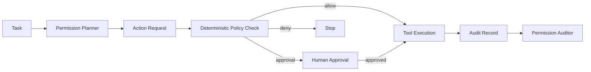

# Agent Tool Permission Firewall

A reusable safety layer for AI coding agents that classifies requested tool actions, applies repository policy, requires human approval for dangerous operations, and records auditable decisions before execution.

## Problem

Coding agents increasingly run shell commands, edit files, call APIs, change infrastructure, inspect credentials, and perform Git operations. A useful agent needs enough autonomy to work efficiently, but unrestricted tool access creates avoidable risk: destructive commands, secret exposure, production changes, dependency drift, permission escalation, and unreviewed data mutation.

This kit separates **semantic intent analysis** from **deterministic policy enforcement**. The AI proposes an action and risk classification; scripts decide whether the action is allowed, denied, or requires human approval.

## When to use

Use this kit when an AI agent can execute commands, write files, call external tools, modify databases, invoke cloud CLIs, manage Git, or interact with production-like environments.

It is especially useful for coding agents, CI repair agents, QA agents, incident responders, MCP-enabled agents, and long-running autonomous workflows.

## Architecture



Components:

- `skills/permission-planning.md`: converts intended tool actions into structured permission requests.
- `rules/tool-safety.md`: enforceable repository safety rules.
- `subagents/permission-planner.md`: prepares requests but cannot approve them.
- `subagents/permission-auditor.md`: independently reviews risky actions and audit output.
- `workflows/tool-permission-gate.md`: full decision lifecycle.
- `hooks/hooks.md`: pre-tool and pre-completion hooks.
- `scripts/check-policy.py`: deterministic allow/approval/deny engine.
- `scripts/write-audit-record.py`: append-only local audit recorder.
- `config/policy.json`: portable default policy.
- `templates/action-request.example.json`: request contract example.

## Package structure

```text
agent-tool-permission-firewall/
├── README.md
├── skills/
│   └── permission-planning.md
├── rules/
│   └── tool-safety.md
├── subagents/
│   ├── permission-planner.md
│   └── permission-auditor.md
├── workflows/
│   └── tool-permission-gate.md
├── hooks/
│   └── hooks.md
├── scripts/
│   ├── check-policy.py
│   └── write-audit-record.py
├── config/
│   └── policy.json
└── templates/
    └── action-request.example.json
```

## Installation

Copy this directory into a repository, for example `.ai/agent-tool-permission-firewall/`.

Requirements:

- Python 3.9+
- a coding agent capable of producing JSON permission requests before risky tool calls
- a human approval channel for actions marked `approval_required`

The core design is product-neutral and can be adapted to Codex, Claude Code, Cursor, GitHub Copilot, ChatGPT, OpenCode, or MCP-based agents.

## Configuration

Edit `config/policy.json` to define:

- always-denied command fragments;
- commands requiring approval;
- protected file/path patterns;
- secret-sensitive patterns;
- network/write boundaries;
- safe read-only prefixes.

Optional environment variables:

- `AGENT_POLICY_PATH`: policy file path.
- `AGENT_AUDIT_PATH`: audit JSONL path; default `.agent-audit/tool-actions.jsonl`.

Do not store secrets in policy files.

## Usage

Create an action request before executing a non-trivial tool action:

```json
{
  "tool": "shell",
  "action": "git push --force-with-lease origin feature-x",
  "target": "origin/feature-x",
  "reason": "rewrite branch after rebase",
  "environment": "development",
  "writes_data": true,
  "touches_secrets": false,
  "touches_production": false
}
```

Run:

```bash
python .ai/agent-tool-permission-firewall/scripts/check-policy.py \
  --policy .ai/agent-tool-permission-firewall/config/policy.json \
  --request action-request.json \
  --output decision.json
```

Possible decisions:

- `allow`
- `approval_required`
- `deny`

After an approved or denied decision, record it:

```bash
python .ai/agent-tool-permission-firewall/scripts/write-audit-record.py \
  --request action-request.json \
  --decision decision.json
```

## Workflow

1. Agent identifies the exact tool action before execution.
2. Permission Planner creates a structured request and risk explanation.
3. Deterministic policy checker evaluates the request.
4. `deny` stops immediately.
5. `approval_required` pauses until explicit human approval exists.
6. `allow` permits exactly the described action, not broader actions.
7. Tool executes.
8. Result and decision are written to the audit log.
9. Permission Auditor checks whether actual behavior stayed within the approved scope.
10. Completion is allowed only if unresolved policy violations are absent.

## Safety

Human approval is mandatory for production changes, schema/data mutation, infrastructure changes, secret or permission changes, destructive file operations, force pushes, history rewrites, and broad dependency upgrades.

The firewall follows least privilege: approval applies only to one explicit action scope. It does not grant blanket permission to similar future actions.

## Failure and recovery

- Invalid request JSON: stop and regenerate once.
- Missing policy file: stop; never default to unrestricted access.
- Policy parse failure: stop and report the invalid rule.
- Ambiguous command classification: fail closed to `approval_required`.
- Audit write failure: retry once; if still failing, report unverified execution history.
- Repeated denied action: do not retry with obfuscated syntax; escalate to the user.

## Verification

A task is **executed** when a tool action runs.

A task is **verified** only when:

- every gated action has a policy decision;
- every approval-required action has explicit approval;
- no denied action was executed;
- actual action scope matches the request;
- audit records were produced;
- no unresolved policy violation remains.

## Customization

Extend the policy with project-specific command families, protected paths, cloud environments, database boundaries, and CI rules. For stronger isolation, connect the same decision model to containers, OS sandboxing, MCP middleware, or CI policy gates.
