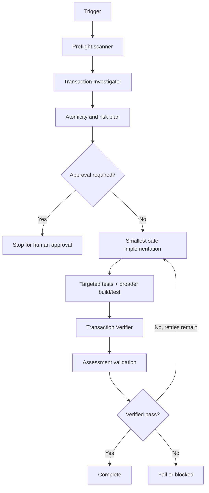

# Agent Transaction Boundary Consistency Gate

Reusable AI engineering kit for reviewing and verifying transaction boundaries across API commands, background jobs, message handlers, persistence operations, retries, and external side effects.

## Problem
Applications often perform several database writes plus external effects such as messages, emails, webhooks, payments, or remote API calls. A transaction can make the database internally consistent while still leaving the overall business operation vulnerable to partial success, duplicate effects, retry amplification, rollback gaps, or concurrency races.

## Purpose
This package gives an AI coding agent a repeatable, evidence-driven process to map business atomicity, trace transaction ownership, identify consistency gaps, implement the smallest safe correction, and independently verify the result.

## When to use
Use it when a change touches multiple writes, `SaveChanges`, explicit/ambient transactions, unit-of-work code, consumers, jobs, external side effects near persistence, retries, outbox/inbox patterns, or concurrency-sensitive state.

## When not to use
Do not use it as a replacement for database design review, distributed consensus design, or production incident response. It is a repository-level engineering gate and must not mutate production systems during verification.

## Architecture



## Package tree

```text
agent-transaction-boundary-consistency-gate/
├── README.md
├── config/
│   └── transaction-gate.yaml
├── examples/
│   └── sample-assessment.json
├── hooks/
│   └── lifecycle-hooks.md
├── rules/
│   └── transaction-safety.md
├── schemas/
│   └── assessment.schema.json
├── scripts/
│   ├── scan-transaction-risk.py
│   └── validate-assessment.py
├── skills/
│   └── review-transaction-boundaries.md
├── subagents/
│   ├── transaction-investigator.md
│   └── transaction-verifier.md
├── tests/
│   └── self-test.py
└── workflows/
    └── transaction-consistency-review.md
```

## Component responsibilities
- `skills/review-transaction-boundaries.md`: reusable investigation/implementation procedure.
- `rules/transaction-safety.md`: mandatory, forbidden, and preferred behavior.
- `subagents/transaction-investigator.md`: read-only evidence gathering and atomicity mapping.
- `subagents/transaction-verifier.md`: independent final verifier; does not implement fixes.
- `workflows/transaction-consistency-review.md`: bounded end-to-end workflow with approval and recovery paths.
- `hooks/lifecycle-hooks.md`: pre-task scan, post-edit checks, final validation, and approval hook.
- `scripts/scan-transaction-risk.py`: deterministic heuristic scanner for transaction/side-effect/retry patterns.
- `scripts/validate-assessment.py`: deterministic contract validator for workflow output.
- `schemas/assessment.schema.json`: structured handoff/output contract.
- `config/transaction-gate.yaml`: risk, retry, approval, and scanner configuration.
- `tests/self-test.py`: verifies the package scanner and assessment validator.
- `examples/sample-assessment.json`: valid example output.

## Installation
Copy this directory into a repository. Python 3.9+ is sufficient for the included scripts; they use only the standard library.

No secret or production credential is required. Run scripts from the package root or provide explicit paths.

## Configuration
Edit `config/transaction-gate.yaml` only when repository policy materially differs. Keep `max_fix_retries` bounded. Add approval categories rather than removing safety boundaries. Scanner extension/exclusion settings may be adjusted for the host repository.

## Permissions
Default operation is read-only repository inspection plus local source/test edits when the task explicitly requires implementation. Use least privilege.

Explicit human approval is required before database schema changes, destructive SQL, data deletion, production configuration changes, breaking API contracts, irreversible migrations, or production deployment.

## Usage
Run the heuristic preflight scanner:

```bash
python scripts/scan-transaction-risk.py /path/to/repository --json
```

Use exit code 2 to gate any heuristic signal when desired:

```bash
python scripts/scan-transaction-risk.py /path/to/repository --json --fail-on-risk
```

After investigation/implementation, produce an assessment matching `schemas/assessment.schema.json`, then validate it:

```bash
python scripts/validate-assessment.py assessment.json
```

Run the package self-test:

```bash
python tests/self-test.py
```

## Example invocation for an AI coding agent

```text
Use this package's workflow to review the transaction consistency of the changed order-processing path. Trace database writes, external effects, retries, rollback behavior, concurrency controls, and any outbox/inbox mechanism. Do not treat scanner hits as confirmed defects without evidence. Implement only the smallest safe change, run relevant tests, and require independent verification before reporting pass.
```

## Workflow
Follow `workflows/transaction-consistency-review.md`:

1. Preflight scanner.
2. Read-only investigation.
3. Atomicity/risk plan.
4. Approval checkpoint.
5. Smallest safe implementation.
6. Targeted and broader tests.
7. Independent verification.
8. Assessment validation.
9. Complete, retry within budget, or stop.

The implementation/test loop is limited to two fix–retest iterations. A transient tool failure may be retried once separately. Evidence from failed attempts must be preserved.

## Approval boundaries
Agents must stop before approval-required actions. They must not silently elevate permissions, run destructive validation, rewrite production data, deploy, or weaken consistency/security controls to make verification pass.

## Failure handling
- **Scanner/tool failure:** retry once; if still failing, mark `blocked` and preserve stderr/output.
- **Validation failure:** correct the assessment; if source behavior also changes, the fix/retest budget applies.
- **Build/test failure:** preserve logs, return to implementation if the two-iteration budget remains.
- **Permission/environment failure:** stop as `blocked`; do not escalate privileges automatically.
- **Business-rule ambiguity:** record the open atomicity question and stop rather than inventing the requirement.
- **Approval-required action:** status `needs-approval` until an explicit human decision exists.

## Verification
A task is executed when the review/change steps have run. It is verified successfully only when relevant tests pass, the final diff has been independently reviewed, high/critical risks are resolved, the structured assessment validates, and no required approval remains unresolved.

The scanner is intentionally heuristic. Its results are leads, not proof. Confirm findings using source code, tests, logs, database behavior, or official technology documentation where necessary.

## Definition of Done
Completion requires all of the following:

- Affected entry points and business atomicity requirements are identified.
- Database writes, commit/rollback boundaries, external effects, retries, and concurrency controls are mapped.
- High/critical findings are resolved or the workflow stops as fail/blocked/needs-approval.
- Relevant rollback/retry/duplicate/concurrency tests pass where applicable.
- The final diff has been independently reviewed.
- The assessment conforms to `schemas/assessment.schema.json` and `scripts/validate-assessment.py` exits 0.
- Required approvals are recorded before dangerous actions.
- Unresolved risks and open questions are explicit.

## Customization
Integrate repository-specific test commands into your agent/tool configuration, not into the portable core workflow. Extend scanner patterns cautiously: static keyword matches can increase false positives. For repositories with established transaction/outbox libraries, teach the investigator how to recognize those abstractions while keeping the same evidence and verification contract.
