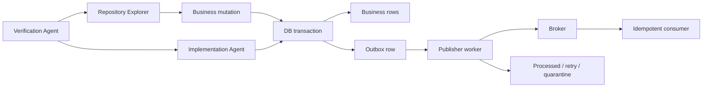

# Agent Transaction Outbox Consistency Gate

Reusable AI engineering kit for investigating and preventing the dual-write failure window between a database transaction and an external message broker.

## Problem
A service can successfully commit business data but lose its integration event when broker publishing fails, or publish an event that describes data later rolled back. Adding an outbox helps only when transaction boundaries, publisher acknowledgement ordering, retries, row claiming, message identity, and consumer duplicate handling are all correct.

## Purpose
Provide a tool-neutral agent workflow plus deterministic scanners/tests that force evidence for four properties: business/outbox atomicity, safe publisher state transitions, consumer idempotency, and bounded retry/recovery.

## When to use
Use when adding/refactoring integration events, changing an outbox dispatcher, broker adapter, retry policy, consumer idempotency, or investigating missing/duplicate events.

## When not to use
Do not use as proof of exactly-once semantics, as a substitute for database/broker documentation, or to perform production/schema/destructive actions without approval.

## Architecture


## Package tree
```text
agent-transaction-outbox-consistency-gate/
├── README.md
├── config/gate.yaml
├── schemas/evidence.schema.json
├── rules/safety-rules.md
├── skills/investigate-outbox.md
├── subagents/repository-explorer.md
├── subagents/implementation-agent.md
├── subagents/verification-agent.md
├── workflows/outbox-consistency-workflow.md
├── hooks/lifecycle-hooks.md
├── scripts/scan-outbox.py
├── scripts/verify-evidence.py
├── examples/outbox-evidence.json
└── tests/test-scripts.py
```

## Components
- Repository Explorer maps the real transaction/publish/consume path without editing.
- Implementation Agent owns the smallest safe code/test change.
- Verification Agent independently decides whether evidence supports completion.
- Static scanner surfaces suspicious publish ordering, processed markers, unstable ids, and unbounded loops; findings are heuristics and require classification.
- Evidence verifier prevents `verified` status unless all required verification dimensions are explicitly true.

## Installation
Copy this directory into the target repository or an agent-instructions directory. Python 3.9+ is sufficient for package scripts; no third-party Python packages are required.

## Configuration
Edit `config/gate.yaml` only when the host project needs different required outbox columns/status naming or approval boundaries. Keep retry loops bounded. The package workflow uses maximum two retries for transient tooling/infrastructure failures.

## Permissions
Default to repository read/search and local build/test execution. Production writes, schema changes, destructive SQL, production deployment/configuration, secret changes, breaking event contracts, and security weakening require explicit human approval. Never increase permissions merely to unblock the agent.

## Usage
From the package directory:

```bash
python scripts/scan-outbox.py /path/to/target-repo --output outbox-evidence.json
python scripts/verify-evidence.py outbox-evidence.json
python -m unittest tests/test-scripts.py
```

The scanner intentionally returns exit code `1` for blocking heuristic findings and `2` for invalid input/environment. A clean scan is not proof of correctness; continue the evidence workflow.

### Example agent invocation
Give the coding agent the change/incident and instruct it to execute `workflows/outbox-consistency-workflow.md`, obey `rules/safety-rules.md`, use `skills/investigate-outbox.md`, and produce evidence matching `schemas/evidence.schema.json`. The implementing agent must hand off final verification to the Verification Agent role.

## Workflow
1. Preflight repository and locate relevant modules.
2. Collect static evidence and trace transaction boundaries.
3. Prove business mutation and outbox insertion commit/rollback together.
4. Trace publisher claiming, acknowledgement, processed/retry transitions, and stable message id.
5. Prove consumer duplicate delivery safety.
6. Implement the smallest required change.
7. Build/format and run focused tests including failure windows.
8. Independently review the diff and rerun checks.
9. Mark `verified` only when all four evidence dimensions are true.

## Required verification scenarios
- Rollback: business mutation and outbox row both roll back.
- Recovery window: business/outbox commit succeeds, first publish attempt fails, later attempt publishes the same logical message id.
- Acknowledgement ordering: processed state is not persisted before required broker acknowledgement.
- Duplicate delivery: delivering the same message id twice does not duplicate the protected business side effect.
- Retry terminal behavior: failures cannot loop forever and eventually reach configured retry/quarantine behavior.
- Concurrency: multiple dispatcher instances cannot corrupt state; row-claim behavior is proven for the chosen database strategy.

## Approval boundaries
Stop before database schema changes, destructive SQL, production deployment/configuration changes, secret changes, breaking event contracts, irreversible migrations, large dependency upgrades, or security weakening. Record the proposed action and evidence, then wait for explicit approval.

## Failure and recovery
Transient test runner/broker emulator/filesystem/tool failures may be retried at most twice while preserving prior output. Validation failures, reproducible build/test failures, permission failures, business-rule ambiguity, and missing approvals are not blind-retry conditions. Stop and report the blocking evidence when the retry limit is reached.

## Evidence contract
`schemas/evidence.schema.json` separates findings from verification. Findings include severity, concrete evidence, affected component, recommendation, and optional confidence. Verification requires booleans for `atomicity`, `publisher_safety`, `consumer_idempotency`, and `retry_bounds`. `scripts/verify-evidence.py` rejects `verified` when any is false or missing.

## Definition of Done
The task is done only when relevant context was gathered; required changes/tests exist; atomic business/outbox commit is proven; publisher acknowledgement ordering and stable message identity are proven; consumer duplicate safety is proven; retry behavior is bounded; build/focused tests pass; evidence contract validates; no blocking finding or unintended change remains; and all required approvals were obtained.

## Customization
Adapt database-specific row claiming and host build/test commands in the consuming repository rather than weakening the core rules. Tool-specific agent syntax for Codex, Claude Code, Cursor, ChatGPT, Copilot, OpenCode, or other agents should remain outside the core package unless it changes an actual capability or permission boundary.
