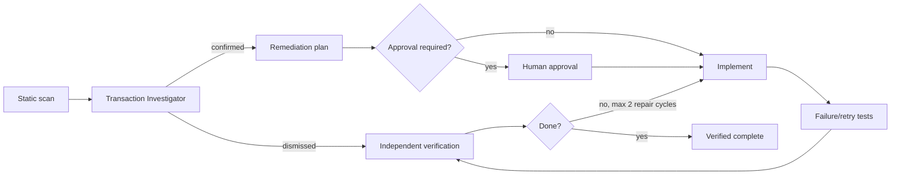

# Agent Transaction Side-Effect Safety Gate

Reusable gate for finding and remediating external side effects that occur inside or near database transactions and retryable execution strategies. The failure mode is subtle: database work can roll back or be replayed while an email, HTTP call, message publication, or storage mutation has already escaped, producing duplicates or inconsistent state.

## Use / do not use
Use for transaction/retry changes, duplicate-delivery incidents, code review, or before enabling database retry strategies. Do not use as proof from static matching alone, or as a substitute for domain-specific consistency analysis.

## Architecture


## Package tree
```text
agent-transaction-side-effect-safety-gate/
├── README.md
├── config/policy.json
├── examples/unsafe-and-safe.cs
├── hooks/final-verification.md
├── hooks/pre-change-scan.md
├── rules/safety-rules.md
├── schemas/finding.schema.json
├── scripts/scan_transaction_side_effects.py
├── scripts/verify_findings.py
├── skills/investigate-transaction-side-effects.md
├── skills/remediate-with-outbox.md
├── subagents/transaction-investigator.md
├── subagents/verification-agent.md
├── tests/test_scanner.py
└── workflows/transaction-side-effect-gate.md
```

## Installation
Requires Python 3.9+ for deterministic tooling. Copy this directory into an agent/tooling area of a repository. Edit `config/policy.json` to add project-specific transaction, external-effect, and safe outbox method names.

## Permissions
Core operation needs repository read/search plus local test/build execution. Editing is limited to the accepted remediation. Schema migrations, infrastructure or production configuration, deployments, destructive operations, breaking contracts, secret changes, and weakened security controls require explicit human approval.

## Usage
From this package directory:

`python scripts/scan_transaction_side_effects.py --root /path/to/repo --policy config/policy.json --output transaction-side-effect-findings.json`

Exit `0` means no high static candidate; `2` means at least one high candidate requiring investigation. Static matches are candidates, not confirmed defects.

Run package tests with:

`python -m unittest tests/test_scanner.py`

After evidence-backed dispositions and remediation, rerun the scanner and repository tests/build. `scripts/verify_findings.py` can enforce that no high finding remains. `--allow-review` is permitted only after review findings have explicit evidence-backed dispositions.

## Workflow
Follow `workflows/transaction-side-effect-gate.md`. The Transaction Investigator owns evidence and classification. The implementer owns the smallest accepted remediation. The Verification Agent independently proves the result. For a confirmed atomicity gap, `skills/remediate-with-outbox.md` describes the preferred local-transaction/outbox pattern while preserving approval boundaries.

## Failure and recovery
Transient tool failures retry once. Change-caused build/test failures allow at most two repair cycles. Scanner findings are investigated rather than blindly retried. Permission, environment, or approval failures stop execution while preserving logs and findings. Baseline failures are kept separate from regressions.

## Verification
Completion requires evidence that every scanner candidate is dispositioned; confirmed unsafe external I/O is removed or safely controlled; rollback/retry behavior is tested where feasible; relevant build/tests pass; final diff is scoped; required approvals exist; and the independent verifier reports no blocking risk.

## Definition of Done
The task is executed only after scan/investigation/implementation stages run. It is verified successfully only when the final scan has no unresolved high finding, relevant tests/build pass, the intended consistency property is demonstrated, approvals are recorded where required, and residual risks are documented.

## Customization
Extend policy patterns for repository naming conventions. Keep deterministic detection in scripts and semantic classification in the investigation skill. Do not broaden scanner matches without tests because false positives weaken the gate.