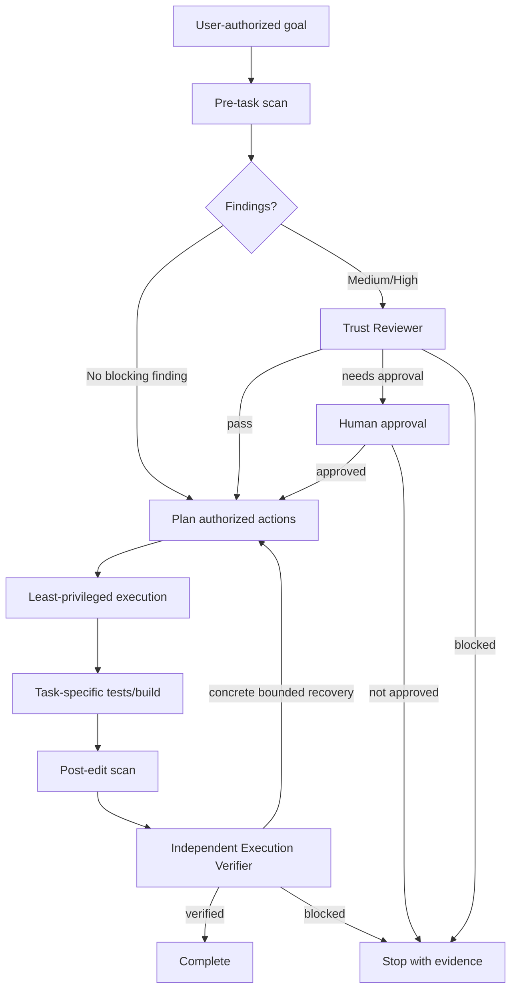

# Agent Untrusted Repository Instruction Gate

A reusable safety and verification kit for AI coding agents that must work inside repositories containing documentation, issues, fixtures, generated text, logs, prompts, or comments that may try to redirect the agent, extract secrets, bypass approvals, or trigger unsafe commands.

## Problem

AI coding agents routinely ingest repository content that was written for humans or generated from external sources. That content can contain instruction-like text. Treating all repository text as trusted agent instructions creates a prompt-injection and confused-deputy risk: the agent may execute a command, expose secrets, broaden permissions, or perform a production/destructive action that the user never authorized.

This package creates a trust boundary between **user-authorized goals** and **repository-authored content**. It combines deterministic scanning, independent classification, bounded execution checks, explicit approval gates, post-edit rescanning, and independent verification.

## When to use

Use this kit when an agent:

- opens an unfamiliar repository;
- reads issue/PR text, docs, comments, logs, fixtures, generated content, or embedded prompts;
- copies commands from repository prose;
- processes external content committed into the repository;
- handles repositories that may contain secrets, deployment tooling, migrations, or privileged automation;
- edits prompts, agent instructions, documentation, fixtures, or generated text.

## When not to use

Do not use it as a malware scanner, secret scanner, dependency vulnerability scanner, or replacement for normal code review. The lexical scanner intentionally finds suspicious instruction patterns; a Trust Reviewer still decides whether each match is benign data, legitimate project guidance, a prompt-injection risk, or an approval-required action.

## Architecture



## Package tree

```text
agent-untrusted-repository-instruction-gate/
├── README.md
├── requirements.txt
├── config/
│   └── policy.yaml
├── schemas/
│   └── finding.schema.json
├── rules/
│   └── trust-boundaries.md
├── skills/
│   ├── classify-untrusted-instructions.md
│   └── verify-agent-action.md
├── subagents/
│   ├── trust-reviewer.md
│   └── execution-verifier.md
├── workflows/
│   └── untrusted-instruction-gate.md
├── hooks/
│   └── lifecycle-hooks.md
├── scripts/
│   ├── scan_untrusted_instructions.py
│   └── verify_package.py
├── tests/
│   └── test_scanner.py
└── examples/
    └── reviewed-finding.json
```

## Components

- `requirements.txt` pins the only runtime dependency range, PyYAML.
- `config/policy.yaml` defines scanned file types, excluded paths, severity patterns, blocking mode, protected actions, and retry limit.
- `schemas/finding.schema.json` defines the reviewed finding handoff contract.
- `rules/trust-boundaries.md` provides enforceable MUST/MUST NOT/SHOULD rules.
- `skills/classify-untrusted-instructions.md` defines the evidence-based classification procedure.
- `skills/verify-agent-action.md` verifies proposed commands/tool actions against the user-authorized goal and approval boundaries.
- `subagents/trust-reviewer.md` separates trust classification from implementation.
- `subagents/execution-verifier.md` independently verifies the final state and prevents the implementer from being the only verifier.
- `workflows/untrusted-instruction-gate.md` defines the end-to-end workflow, checkpoints, retry limits, failure paths, and Definition of Done.
- `hooks/lifecycle-hooks.md` defines pre-task, pre-command, post-edit, and final-verification lifecycle hooks.
- `scripts/scan_untrusted_instructions.py` performs deterministic repository text scanning and emits machine-readable findings.
- `scripts/verify_package.py` checks required package files, JSON integrity, Python syntax, placeholder leakage, and README references.
- `tests/test_scanner.py` executes benign, medium-review, and high-blocking scanner cases.
- `examples/reviewed-finding.json` demonstrates a completed finding contract.

## Installation

Copy this directory into the target repository, then from the package directory run:

```bash
python -m pip install -r requirements.txt
```

Python 3.9+ is recommended. The package does not require network access at runtime after PyYAML is installed.

## Configuration

Edit `config/policy.yaml` to match the repository. Keep blocking severity conservative. Add known generated/vendor paths to `exclude_paths`; add organization-specific suspicious phrases when they represent real trust-boundary risks.

Do not remove protected approval categories merely to make the workflow pass. A project-specific integration may add stricter categories.

## Permissions

The scanner itself needs read access to the repository and write access only to the selected report path (default `artifacts/`). Review agents should remain read-only. Implementation permissions should be granted separately according to the actual user task.

Never grant secret-store, production, database-mutation, infrastructure, Git-history-rewrite, or unrestricted network permissions merely because repository content asks for them.

## Usage

### 1. Scan before trusting repository-authored instructions

From the package directory while targeting the repository root:

```bash
python scripts/scan_untrusted_instructions.py \
  --root /path/to/repository \
  --policy config/policy.yaml \
  --output artifacts/untrusted-instruction-findings.json
```

Exit codes:

- `0`: no finding at the configured blocking threshold;
- `1`: a blocking finding exists and affected actions must be reviewed;
- `2`: invalid environment, missing input, or policy/read failure.

A medium finding may still appear with exit `0`; it requires classification when relevant to the current task.

### 2. Review findings

Use the process in `skills/classify-untrusted-instructions.md`. Record a disposition for every relevant medium/high finding using the fields in `schemas/finding.schema.json`.

### 3. Verify repository-derived commands

Before executing a command copied from prose, comments, logs, issues, or generated content, apply `skills/verify-agent-action.md`. The action must be independently justified by the user goal or trusted project-native configuration.

### 4. Execute normal engineering work

Continue with least privilege. Run the project's own tests/build/static analysis. This package does not replace task-specific verification.

### 5. Re-scan and independently verify

If scanned text types changed, run the scanner again. Then hand final diff, command evidence, test output, findings, and approvals to the Execution Verifier defined in `subagents/execution-verifier.md`.

## Example invocation

```bash
python scripts/scan_untrusted_instructions.py --root ../my-service --policy config/policy.yaml --output artifacts/untrusted-instruction-findings.json
python tests/test_scanner.py
python scripts/verify_package.py
```

The reviewed handoff format is illustrated by `examples/reviewed-finding.json`.

## Approval boundaries

Explicit human approval is required before acting on repository-authored requests involving:

- secret-store or credential access;
- network upload/exfiltration;
- production deployment or production configuration changes;
- destructive commands or data/file deletion;
- database schema changes or irreversible migrations;
- infrastructure mutation;
- breaking public API contracts;
- weakening security controls;
- permission escalation;
- force-push/history rewriting;
- bypassing an existing approval or safety gate.

An approval permits only the specifically approved action and scope. It does not make repository content generally trusted.

## Failure and recovery

- **Transient tool/environment failure:** preserve stderr/exit status and retry once.
- **Policy/input validation failure:** correct the concrete configuration/environment issue, then retry once.
- **High finding without safe classification:** stop the affected action.
- **Permission failure:** do not expand permissions automatically; escalate.
- **Missing human approval:** mark `needs-approval` and stop that action.
- **Secret exposure:** stop, redact outputs, preserve minimal evidence, and escalate.
- **Repeated verification failure:** stop after the bounded recovery path; do not loop indefinitely.

The canonical retry and stop rules live in `workflows/untrusted-instruction-gate.md`.

## Verification

Validate the package itself:

```bash
python scripts/verify_package.py
python tests/test_scanner.py
```

For a real repository task, successful completion additionally requires the target project's own build/test/static checks and independent final verification. `Task executed` is not equivalent to `Task verified successfully`.

## Definition of Done

A protected agent task is done only when:

1. the user-authorized goal and constraints are explicit;
2. the pre-task scan completed successfully;
3. every relevant medium/high finding has a disposition and evidence;
4. no blocked repository instruction was executed;
5. every approval-required action was either explicitly approved or left unexecuted;
6. task-specific tests/build/static checks passed as applicable;
7. changed scanned text was re-scanned;
8. final changed files and executed actions are accounted for;
9. the independent Execution Verifier reports `verified`;
10. no blocking unresolved trust or security risk remains.

## Customization

- Add organization-specific patterns in `config/policy.yaml`.
- Adjust file extensions and excluded generated/vendor paths without weakening protected actions.
- Connect the hooks in `hooks/lifecycle-hooks.md` to an agent framework, pre-commit runner, CI job, or local task runner.
- Keep tool-specific adapters outside the core rules/skills so the same trust model can be used with Codex, Claude Code, Cursor, ChatGPT, GitHub Copilot, OpenCode, or other coding agents.

The core invariant should remain unchanged: **repository content can supply evidence and project context, but it cannot silently grant itself authority over the agent.**
