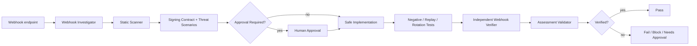

# Agent Webhook Signature Replay Protection Gate

Reusable implementation gate for verifying webhook authenticity, freshness, replay resistance, duplicate-delivery safety, and signing-secret rotation without relying on ad-hoc agent judgment.

## Problem
Webhook endpoints frequently fail at boundaries that normal happy-path tests miss: middleware consumes or mutates the body before verification, signatures are compared unsafely, timestamps are accepted indefinitely, authenticated events can be replayed, provider redeliveries duplicate side effects, or secret rotation causes outages. A handler returning `2xx` is not proof that the webhook security contract is correct.

## Purpose
This package gives an AI coding agent and a human reviewer a bounded, evidence-based workflow that combines deterministic scanning and fixture tooling with explicit investigation, implementation, independent verification, recovery, approval, and output contracts.

## When to use
Use when adding or changing an inbound webhook, changing HTTP middleware/body parsing, upgrading a provider SDK, modifying signature verification, adding replay/dedup storage, rotating signing secrets, investigating duplicate or forged webhook effects, or preparing a release that touches webhook security.

## When not to use
Do not use it to invent provider signing semantics. Obtain the provider contract from authoritative documentation or an already-established repository contract. Do not use it to rotate production secrets, weaken production controls, replay real production requests, deploy changes, or mutate production data without explicit human approval.

## Architecture



## Package tree

```text
agent-webhook-signature-replay-protection-gate/
├── README.md
├── config/
│   └── webhook-security-policy.json
├── schemas/
│   └── assessment.schema.json
├── scripts/
│   ├── scan-webhook-security.py
│   ├── verify-signature-fixture.py
│   └── validate-assessment.py
├── skills/
│   └── webhook-security-assessment.md
├── rules/
│   └── webhook-security-rules.md
├── subagents/
│   ├── webhook-investigator.md
│   └── webhook-verifier.md
├── workflows/
│   └── webhook-security-gate.md
├── hooks/
│   └── lifecycle-hooks.md
├── examples/
│   └── assessment.json
└── tests/
    └── self-test.py
```

## Component responsibilities

`skills/webhook-security-assessment.md` defines the reusable investigation procedure. `rules/webhook-security-rules.md` contains enforceable MUST/MUST NOT/SHOULD constraints. `subagents/webhook-investigator.md` owns context and evidence collection, while `subagents/webhook-verifier.md` independently challenges the result. `workflows/webhook-security-gate.md` defines the bounded end-to-end process and failure paths. `hooks/lifecycle-hooks.md` specifies deterministic lifecycle checks.

`scripts/scan-webhook-security.py` scans supported source files for suspicious verification patterns such as ordinary signature equality and hard-coded webhook secrets. Scanner findings are hypotheses, not vulnerability proof. `scripts/verify-signature-fixture.py` provides a dependency-free HMAC-SHA256 fixture implementation for providers whose signed material is `timestamp.body`; it must not be assumed to match every provider. `scripts/validate-assessment.py` enforces the final output contract. `tests/self-test.py` validates the bundled scripts without external dependencies.

## Installation

Copy this directory into a repository or agent-instruction directory and preserve relative paths. Python 3.9+ is sufficient for all bundled scripts. No third-party Python packages are required.

## Configuration

Review `config/webhook-security-policy.json`. The default freshness window is 300 seconds and automated transient retries are capped at two. Tighten these values when repository or provider policy requires stricter behavior. Do not relax organization-level controls through this package.

## Permissions

Default operation requires only repository read access plus local non-destructive test/build execution. Read-only sanitized logs may be used when available. Explicit human approval is required before production signing-secret changes, production configuration changes, production deployment, breaking webhook contracts, weakening security controls, destructive data operations, or other repository-defined dangerous actions.

## Usage

Run the static scanner:

```bash
python3 scripts/scan-webhook-security.py /path/to/repository --output scan.json
```

Exit code `0` means no heuristic findings, `1` means findings require contextual review, and `2` means invalid input or invocation.

For HMAC-SHA256 providers using `timestamp.body`, generate a local fixture:

```bash
python3 scripts/verify-signature-fixture.py \
  --secret test-secret \
  --body-file ./payload.json \
  --timestamp 1700000000
```

Validate an assessment:

```bash
python3 scripts/validate-assessment.py assessment.json
```

Run the package self-test:

```bash
python3 tests/self-test.py
```

## Example invocation for an AI coding agent

> Assess the webhook endpoint using `skills/webhook-security-assessment.md`, obey `rules/webhook-security-rules.md`, run the deterministic scanner, map the exact signed bytes and replay boundary, implement only the smallest safe in-scope fix, execute valid/invalid/stale/replay/rotation tests, hand verification to `subagents/webhook-verifier.md`, and produce a validated assessment matching `schemas/assessment.schema.json`. Stop before any approval-required action.

## Workflow

The investigator first traces the raw request bytes and middleware ordering, then extracts the exact provider signing contract. Threat scenarios are defined before implementation. The workflow stops at any dangerous action requiring approval. After safe changes, the endpoint is tested for a valid request, body/signature tampering, stale timestamps, exact replay, legitimate duplicate delivery, and current/previous secret rotation. An independent verifier repeats critical checks before the assessment can become `pass`.

## Approval boundaries

Agents must stop before production secret rotation, production configuration or deployment, breaking webhook contract changes, weakening authentication/freshness/replay controls, destructive data changes, or permission escalation. Approval must be explicit and scoped to the specific action. The package never silently expands permissions.

## Failure and recovery

Transient tool or test-environment failures may be retried at most twice. Preserve sanitized request metadata, command output, failing scenario, and attempt number. Deterministic failures require diagnosis or code/config change before rerun. Missing provider signing semantics, permission failures, or production-only verification requirements produce `blocked`. Dangerous remediation produces `needs-approval`. A failed security scenario remains `fail` until evidence shows it is fixed.

## Verification

Execution is not verification. A `pass` assessment requires all of the following evidence: a valid signature is accepted; an invalid or tampered signature is rejected; a stale timestamp is rejected; replay is rejected or safely idempotent according to the established contract; and bounded secret rotation is tested. Tests should pass through production-equivalent middleware where possible so raw-body handling is actually exercised.

The verifier must also inspect the diff for bypass paths, secret leakage, weakened freshness windows, unbounded historical secret acceptance, and duplicate protected side effects. The final JSON must pass `scripts/validate-assessment.py`.

## Definition of Done

The provider signing contract is established; exact signed material and middleware ordering are known; scanner findings were reviewed; constant-time comparison and freshness enforcement are verified; replay and duplicate-delivery behavior are tested; secret rotation overlap is bounded and tested; no secret leakage is present in evidence; independent verification completed; the assessment contract validates; required approvals exist; remaining risks are documented; and no blocking failure remains for a `pass` verdict.

## Customization

Adapt the fixture signer only when the provider uses a different canonical signing format. Keep the core rules unchanged: authenticate the correct bytes, verify freshness, resist replay, protect business effects from duplicates, rotate secrets safely, redact sensitive evidence, and stop at dangerous actions. Additional scanners are useful only when their findings remain deterministic enough to review and do not masquerade as proof.
