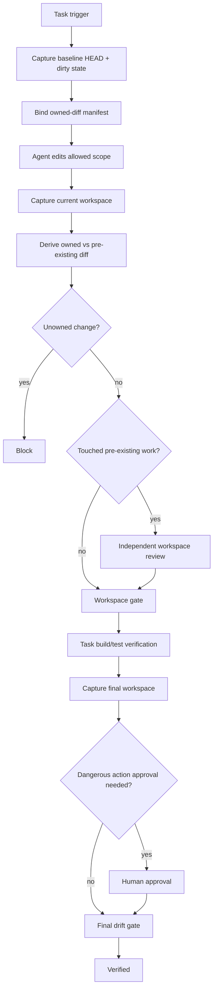

# Agent Workspace Cleanliness Gate

Reusable AI engineering kit for proving which working-tree changes belong to the current agent task and which existed before the task began.

## Problem
AI coding agents often work in repositories that are already dirty. Without an explicit baseline, an agent can accidentally edit, delete, stage, commit, or claim verification over changes created by a developer, another agent, a formatter, a generator, or an earlier task. A simple `git status` at the end cannot prove ownership because it does not show what existed before the agent started.

This package makes workspace ownership evidence explicit and deterministic.

## Purpose
The kit captures a pre-edit baseline, binds the task to an immutable HEAD and status fingerprint, compares later snapshots, classifies each changed path, blocks out-of-scope changes, requires independent review before touching pre-existing work, and rechecks the workspace immediately before completion so stale reviews cannot authorize a later diff.

It distinguishes:

- `agent-created`: path was clean/not dirty at baseline and is dirty now.
- `preexisting-unchanged`: dirty path existed before the task and has not changed since baseline.
- `touched-preexisting`: path was already dirty and its status/content changed during the task.
- `resolved-preexisting`: a baseline-dirty path disappeared from dirty status during the task; this may mean the agent overwrote, restored, staged, committed, or otherwise resolved someone else's work and therefore requires review.

## When to use
Use before feature implementation, bug fixes, refactoring, generated-code work, test changes, dependency edits, migration preparation, or any AI-assisted task in a shared or potentially dirty Git worktree.

It is especially useful for long-running agents, parallel agents, IDE + agent collaboration, repositories with code generators, and tasks where users expect unrelated local changes to remain untouched.

## When not to use
Do not use this as a substitute for OS-level locking, branch-base drift protection across remote repositories, distributed leases, or Git authorization. It proves workspace ownership boundaries for one task epoch; it does not serialize multiple writers by itself.

## Architecture



## Package tree

```text
agent-workspace-cleanliness-gate/
├── README.md
├── config/
│   └── workspace-policy.json
├── schemas/
│   ├── owned-diff-manifest.schema.json
│   ├── workspace-approval.schema.json
│   ├── workspace-review.schema.json
│   └── workspace-snapshot.schema.json
├── scripts/
│   ├── capture-workspace.py
│   ├── derive-owned-diff.py
│   ├── evaluate-final-gate.py
│   └── evaluate-workspace-gate.py
├── skills/
│   ├── establish-workspace-baseline.md
│   └── verify-owned-diff.md
├── rules/
│   └── workspace-governance.md
├── subagents/
│   ├── workspace-curator.md
│   └── workspace-reviewer.md
├── workflows/
│   └── owned-diff-workflow.md
├── hooks/
│   └── workspace-lifecycle-hooks.md
├── templates/
│   └── owned-diff-manifest.example.json
├── examples/
│   ├── workspace-approval.example.json
│   └── workspace-review.example.json
└── tests/
    └── smoke-test.py
```

## Dependencies
- Python 3.9+ standard library.
- Git command-line client.
- A Git worktree.

No Python packages are required.

## Installation
Copy the directory into a repository or shared agent-tooling workspace. Keep relative paths intact or update hook/workflow commands consistently.

## Configuration
`config/workspace-policy.json` controls fail-closed behavior. Defaults intentionally:

- allow a dirty baseline,
- block unowned agent changes,
- block HEAD drift,
- block post-review/post-gate drift,
- require independent review for touched/resolved pre-existing work,
- allow only one transient Git/process retry,
- require human approval for destructive or otherwise dangerous actions.

`hash_max_file_bytes` bounds content hashing for dirty files. Files larger than the limit retain path/status evidence but use `null` for `content_sha256`; teams with large generated artifacts can raise this deliberately.

## Permissions
The baseline/verification scripts need only read access to Git metadata and working-tree files, plus permission to write their JSON evidence files wherever the caller chooses.

The package never needs force push, reset, clean, checkout, stash, deletion, deployment, database, infrastructure, or secret permissions. Those remain external actions and require explicit human approval when dangerous.

## Usage

### 1. Capture the baseline before editing

```bash
python scripts/capture-workspace.py \
  --repo . \
  --output workspace-baseline.json
```

Record `head` and `status_fingerprint` in a copy of `templates/owned-diff-manifest.example.json`.

Example scope:

```json
{
  "allowed_paths": ["src/payments/**", "tests/payments/**"],
  "forbidden_paths": ["infra/**", ".github/**"]
}
```

Do not expand scope simply because an unexpected file becomes dirty.

### 2. Perform the task
Edit only the intended files. Build, test, and formatting tools are allowed, but tools that write files must be followed by a new workspace capture.

### 3. Capture and classify

```bash
python scripts/capture-workspace.py --repo . --output workspace-current.json

python scripts/derive-owned-diff.py \
  --baseline workspace-baseline.json \
  --current workspace-current.json \
  --manifest owned-diff-manifest.json \
  --output owned-diff.json
```

`owned-diff.json` contains:

- `owned_paths`
- `unowned_paths`
- `preexisting_touched_paths`
- per-path before/after evidence
- an `owned_diff_fingerprint` used by review and approval contracts

### 4. Evaluate workspace ownership

Without pre-existing touch:

```bash
python scripts/evaluate-workspace-gate.py \
  --diff owned-diff.json \
  --manifest owned-diff-manifest.json \
  --policy config/workspace-policy.json \
  --output workspace-gate.json
```

When pre-existing work was touched, obtain an independent review matching `schemas/workspace-review.schema.json` and run:

```bash
python scripts/evaluate-workspace-gate.py \
  --diff owned-diff.json \
  --manifest owned-diff-manifest.json \
  --policy config/workspace-policy.json \
  --review workspace-review.json \
  --output workspace-gate.json
```

The reviewer must explicitly list every approved pre-existing exception path and must not be the implementation owner.

### 5. Run behavior verification
Run repository-specific build, tests, formatting, static analysis, or E2E checks. A green test suite proves behavior, not ownership. If any verification tool changes files, recapture and rerun ownership classification/gate.

### 6. Final drift gate
Capture again immediately before completion:

```bash
python scripts/capture-workspace.py --repo . --output workspace-final.json

python scripts/evaluate-final-gate.py \
  --gate workspace-gate.json \
  --current workspace-final.json \
  --manifest owned-diff-manifest.json \
  --output final-gate.json
```

If `approval_actions` is non-empty, supply a human approval record matching `schemas/workspace-approval.schema.json` with `--approval workspace-approval.json`.

Only `status=verified` and exit code 0 permit completion.

## Input/output contracts

### Workspace snapshot
Produced by `capture-workspace.py`. It binds HEAD, dirty path/status state, bounded content hashes, capture time, and a deterministic SHA-256 fingerprint.

### Owned-diff manifest
Defines task owner and scope before later changes are classified. It binds to baseline HEAD/fingerprint.

### Owned-diff result
Produced by `derive-owned-diff.py`. It is the deterministic comparison artifact consumed by the gate.

### Workspace review
Independent approval for specific touched/resolved pre-existing paths. It binds to baseline, current, and owned-diff fingerprints. Any later workspace change invalidates it.

### Workspace approval
Human authorization for explicitly dangerous actions. It is not equivalent to workspace review and binds to the exact owned-diff fingerprint.

## Safety boundaries
The workflow never automatically executes cleanup operations to make a worktree appear clean.

Explicit human approval is required before:

- deleting or discarding pre-existing work,
- `git reset --hard`, destructive checkout/restore, `git clean`, or equivalent data loss,
- force push or history rewriting,
- production deployment,
- destructive SQL/data changes,
- schema changes,
- infrastructure/secret/production-config changes,
- breaking public API contracts,
- weakening security controls.

A permission failure is not permission to elevate privileges.

## Failure and recovery

- **Transient Git/process capture failure:** retry at most once and preserve the initial error.
- **Invalid repository / permission failure:** stop; do not invent a snapshot.
- **Baseline unavailable after edits:** stop. Ownership history cannot be reconstructed reliably from the final status alone.
- **Unowned path appears:** fail closed. Remove only clearly agent-created unintended output, or legitimately replan before further mutation. Never delete pre-existing work automatically.
- **Pre-existing path touched/resolved:** obtain independent review bound to exact fingerprints.
- **HEAD drift:** stop the task epoch; after understanding the change, take a new baseline and replan.
- **Post-review/post-gate drift:** invalidate old review/gate and rerun classification.
- **Dangerous action:** stop until explicit human approval exists.

There is no infinite retry loop.

## Verification
A task is not verified merely because code was generated or tests passed. Workspace verification proves:

1. Baseline existed before edits.
2. Manifest matches baseline fingerprint and HEAD.
3. Every dirty path is classified relative to that baseline.
4. No out-of-scope/unowned task change remains.
5. Touched/resolved pre-existing work has independent review.
6. HEAD did not change during the task epoch.
7. Review is not stale.
8. Required human approval is bound to the same owned diff.
9. Final workspace fingerprint equals the one already evaluated by the workspace gate.
10. Task-specific build/tests are separately successful.

## Smoke test

```bash
python tests/smoke-test.py
```

The smoke test creates a temporary Git repository and exercises:

- dirty pre-existing file preserved unchanged,
- allowed agent-owned edit verified,
- final no-drift gate verified,
- agent modification of a forbidden pre-existing file detected and blocked.

The test uses only Python stdlib and Git.

## Definition of Done
- Baseline was captured before mutation.
- Task scope is explicit and baseline-bound.
- All changed paths are classified.
- No unowned agent changes remain.
- No forbidden path was silently absorbed into scope.
- All touched/resolved pre-existing changes have fresh independent review.
- HEAD has not drifted within the active task epoch.
- Required build/tests/verification passed.
- Required dangerous-action approvals exist.
- Final workspace has not drifted after ownership review/gating.
- Final gate returns `verified`.
- Remaining non-blocking risk is recorded separately from the success claim.

## Portability
The logic is tool-neutral and can be used with Codex, Claude Code, Cursor, ChatGPT, GitHub Copilot, OpenCode, CI jobs, or custom agent runtimes. Platform adapters only need to call the scripts and preserve the JSON contracts.

## Customization
Adjust path scopes, hash limits, and approval action names to repository policy. If your repository has custom generated-file ownership rules, add them as a separate deterministic adapter before `derive-owned-diff.py`; do not teach the core gate to infer ownership from filenames or LLM judgment alone.
