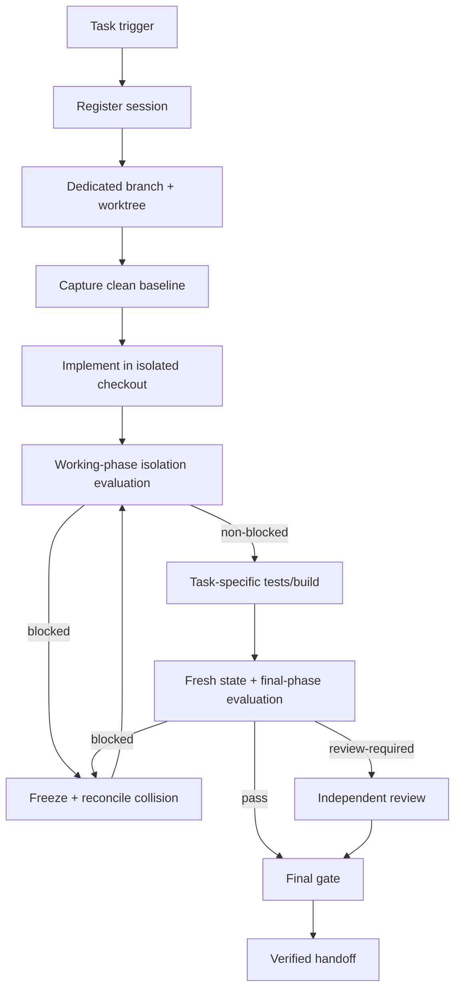

# Agent Worktree Isolation Gate

A reusable, tool-neutral AI engineering kit for preventing concurrent coding agents, automations, or human tasks from contaminating one another through a shared Git checkout, branch, uncommitted state, test evidence, or overlapping file ownership.

## Problem

Parallel AI-assisted development can fail before merge time. Two tasks may mutate the same checkout, tests may accidentally include another task's uncommitted changes, a verifier may trust evidence from a different revision/worktree, or cleanup may discard changes whose owner was never established. Git branches alone do not isolate uncommitted filesystem state.

## Purpose

Bind every mutating session to one immutable base revision, dedicated branch, dedicated worktree path, explicit path scope, risk level, and actor. Detect shared branch/worktree/path ownership deterministically, require fresh final-phase evidence, reject report/session/policy drift, and hand off only verified isolated work.

## When to use

Use for parallel features, bug fixes, refactors, test generation, QA, migrations, release preparation, long-running coding agents, or any repository mutation that can overlap another agent/human/automation.

Do not use this as a replacement for application transactions, external-system locks, or merge/rebase strategy. Read-only analysis does not require a mutating worktree session.

## Architecture



## Package tree

```text
agent-worktree-isolation-gate/
├── README.md
├── config/
│   └── worktree-policy.json
├── schemas/
│   ├── worktree-session.schema.json
│   ├── isolation-report.schema.json
│   └── isolation-review.schema.json
├── scripts/
│   ├── capture-worktree-state.py
│   ├── evaluate-isolation.py
│   └── verify-final-gate.py
├── skills/
│   ├── prepare-isolated-worktree.md
│   └── reconcile-cross-worktree-collision.md
├── rules/
│   └── worktree-isolation-governance.md
├── subagents/
│   ├── worktree-coordinator.md
│   └── isolation-verifier.md
├── workflows/
│   └── worktree-isolation-workflow.md
├── hooks/
│   └── worktree-isolation-hooks.md
├── templates/
│   └── worktree-session.example.json
├── examples/
│   ├── active-sessions.example.json
│   └── isolation-review.example.json
└── tests/
    └── smoke-test.py
```

## Components

- `config/worktree-policy.json` defines dedicated branch/worktree, clean-start/final-handoff, collision, high-risk path, review, and bounded retry policy.
- `schemas/worktree-session.schema.json` defines session identity, actor, immutable base revision, branch, worktree path, path scope, clean-start state, and risk.
- `schemas/isolation-report.schema.json` defines `working|final` phase, deterministic status, exact HEAD/path, blockers/collisions/warnings, and fingerprints binding report to session and policy.
- `schemas/isolation-review.schema.json` binds an independent decision to one exact report fingerprint.
- `scripts/capture-worktree-state.py` captures branch, HEAD, status, current resolved path, and `git worktree list --porcelain`.
- `scripts/evaluate-isolation.py` checks branch/path alignment, clean start, final clean handoff, allowed paths, high-risk paths, shared branch/worktree, and changed-path collisions. It emits `pass`, `review-required`, or `blocked`.
- `scripts/verify-final-gate.py` requires a `final` report, checks report self-integrity, recomputes session/policy fingerprints, enforces review binding, and rejects high-risk self-review when disabled.
- Skills, rules, subagents, workflow, and hooks define reusable operational behavior around those deterministic contracts.

## Dependencies

- Python 3, standard library only for deterministic evaluators/tests.
- Git for `capture-worktree-state.py` and the host repository workflow.

Recommended runtime evidence location:

```gitignore
.agent-evidence/
```

The package never deletes/reset/cleans worktrees automatically.

## Configuration

Adjust `config/worktree-policy.json` only for repository-specific needs such as high-risk path globs. Per-task ownership belongs in `allowed_paths` inside the session record. Do not weaken policy during an active run merely to make the gate pass.

## Permissions

Default to read-only Git inspection plus evidence writes. Optionally allow non-destructive dedicated branch/worktree creation. Do not grant force push, destructive cleanup, deployment, database mutation, infrastructure/secret mutation, or worktree deletion simply to run this kit.

## Usage

### 1. Create an isolated session

Start from `templates/worktree-session.example.json`. Resolve an immutable base revision and, when permitted, create a dedicated branch/worktree:

```bash
BASE=$(git rev-parse HEAD)
git worktree add -b agent/feature-orders-20260817-01 ../service-wt-feature-orders "$BASE"
```

Never reuse a dirty shared checkout just to avoid creating isolation.

### 2. Capture state

Run from the isolated worktree:

```bash
mkdir -p .agent-evidence
python path/to/agent-worktree-isolation-gate/scripts/capture-worktree-state.py \
  --output .agent-evidence/worktree-current.json
```

### 3. Inventory changed paths

Generate a complete path list for the session's current relevant state. For committed changes:

```bash
git diff --name-only <base-revision>...HEAD > .agent-evidence/changed-paths.txt
```

Include intentional uncommitted changed paths when they exist; never silently exclude them.

### 4. Working-phase evaluation

```bash
python path/to/agent-worktree-isolation-gate/scripts/evaluate-isolation.py \
  --session .agent-evidence/worktree-session.json \
  --state .agent-evidence/worktree-current.json \
  --policy path/to/agent-worktree-isolation-gate/config/worktree-policy.json \
  --changed-paths .agent-evidence/changed-paths.txt \
  --active-sessions .agent-evidence/active-sessions.json \
  --phase working \
  --output .agent-evidence/isolation-report.json
```

Exit codes: `0=pass`, `3=review-required`, `2=blocked`, `1=runtime/input error`.

A deterministic blocker cannot be overridden by review. Freeze mutations, preserve evidence, remediate safely, and rerun.

### 5. Run task-specific verification

Run repository-specific build/tests in this exact worktree. Examples: `dotnet test`, `pytest`, `npm test`, `npx playwright test`. Preserve commands, result, and exact relevant HEAD/state. Green results from another worktree/revision are not final evidence.

### 6. Final-phase evaluation

Immediately before final verification, recapture state and changed paths. Then run:

```bash
python path/to/agent-worktree-isolation-gate/scripts/evaluate-isolation.py \
  --session .agent-evidence/worktree-session.json \
  --state .agent-evidence/worktree-current.json \
  --policy path/to/agent-worktree-isolation-gate/config/worktree-policy.json \
  --changed-paths .agent-evidence/changed-paths.txt \
  --active-sessions .agent-evidence/active-sessions.json \
  --phase final \
  --output .agent-evidence/isolation-report.json
```

`require_clean_handoff` is enforced only in `final` phase so working-phase evaluations can occur while the task still has intentional work in progress. The final gate refuses working-phase reports.

### 7. Review when required

For warning-bearing or high/critical sessions, create a review matching `schemas/isolation-review.schema.json`. Replace the placeholder fingerprint in `examples/isolation-review.example.json` with the exact current **final report** fingerprint. When policy forbids self-review, a high/critical implementation actor cannot approve its own isolation evidence.

### 8. Final gate

```bash
python path/to/agent-worktree-isolation-gate/scripts/verify-final-gate.py \
  --report .agent-evidence/isolation-report.json \
  --session .agent-evidence/worktree-session.json \
  --policy path/to/agent-worktree-isolation-gate/config/worktree-policy.json \
  --review .agent-evidence/isolation-review.json
```

Omit `--review` only when report/risk/policy do not require one.

The final gate verifies:

1. report fingerprint matches the report contents,
2. report phase is `final`,
3. report/session ID matches,
4. current session fingerprint matches the evaluated session,
5. current policy fingerprint matches the evaluated policy,
6. no deterministic blocker exists,
7. required review is approved and bound to the exact report,
8. forbidden high-risk self-review does not occur.

Changing session scope, risk, actor, policy, or report content invalidates prior final evidence automatically.

## Active-session registry

`examples/active-sessions.example.json` shows the minimal external registry consumed by the evaluator: `session_id`, `actor_id`, `branch`, `worktree_path`, and `changed_paths`. Keep it fresh and secret-free. If active ownership cannot be enumerated reliably, treat that as an evidence gap rather than assuming isolation.

## Collision semantics

Deterministic blockers include:

- current branch differs from session branch,
- current worktree path differs from session worktree path,
- dirty start when clean start is required,
- dirty final handoff when clean handoff is required,
- changed file outside `allowed_paths`,
- another active session shares the dedicated branch,
- another active session shares the worktree path,
- exact changed-path overlap with another active session.

High-risk paths and high/critical session risk produce `review-required` when no blocker exists.

## Failure and recovery

- **Transient read-only Git/tool failure:** retry at most once; preserve first error.
- **Dirty start:** allocate a fresh worktree or establish ownership; do not clean/reset/stash automatically.
- **Dirty final handoff:** resolve/commit only clearly session-owned intended changes via the normal repository workflow; never discard unrelated changes automatically.
- **Shared branch/worktree:** freeze affected sessions, preserve state, then reassign isolation safely.
- **Overlapping paths:** preserve both diffs and request explicit ownership/integration decision. Textual mergeability is not ownership proof.
- **Scope drift:** do not silently broaden scope; safely remove only proven agent-owned unintended work or obtain an explicit scope change, then regenerate evidence.
- **Session/policy/report drift:** regenerate report/review; never patch fingerprints manually.
- **Build/test failure:** preserve result and return to implementation workflow; isolation retries do not fix implementation failures.

## Approval boundaries

This gate never authorizes dangerous actions. Explicit human approval is required before production deployment, destructive SQL, DB schema change, data/file deletion, force push/history rewrite, deletion of changed worktrees, infrastructure changes, secret changes, production configuration changes, breaking API changes, security weakening, irreversible migrations, or large dependency upgrades.

## Verification model

**Task executed** means repository work/build/tests were attempted in an isolated checkout.

**Task verified successfully** requires exact session/worktree identity, in-scope diff, no collision, fresh task-specific verification from the same relevant state, a non-blocked final report, required fingerprint-bound independent review, and final gate exit code `0`. Separate approval is still required for dangerous actions.

## Definition of Done

- Complete session contract exists.
- Dedicated branch/worktree identity is proven.
- Clean-start policy is satisfied.
- Changed-path inventory is complete and in scope.
- No shared branch/worktree/path collision remains.
- Final handoff cleanliness satisfies policy.
- Task-specific tests/build are fresh for the final relevant state.
- Final report is self-integrity-valid and bound to the current session/policy.
- Required independent review is current and approved.
- `verify-final-gate.py` returns `verified`.
- Remaining risks are documented in handoff.
- No approval-required action was silently executed.

## Testing the kit

Run:

```bash
python tests/smoke-test.py
```

The stdlib-only smoke test covers clean final verification, rejection of working-phase evidence at final gate, dirty final-handoff blocking, out-of-scope changes, shared-branch collision, high-risk self-review rejection, valid independent approval, policy-drift invalidation, and report-tampering detection. `capture-worktree-state.py` itself requires a real Git worktree and is intentionally not mocked.

## Portability

The core contracts and procedures work with Codex, Claude Code, Cursor, ChatGPT, GitHub Copilot, OpenCode, or other coding agents. Tool-specific adapters should only translate lifecycle events; they should not weaken the deterministic isolation contracts.

## Customization

Useful extensions include deriving `allowed_paths` from an approved task plan, storing active sessions in a shared registry, adding organization-specific high-risk globs, binding CI evidence to the isolated revision, and creating a separate integration-owner workflow for combining already-verified session branches.

Central invariant: **one mutating session has one provable isolated workspace identity, and final evidence must belong to that exact identity.**
