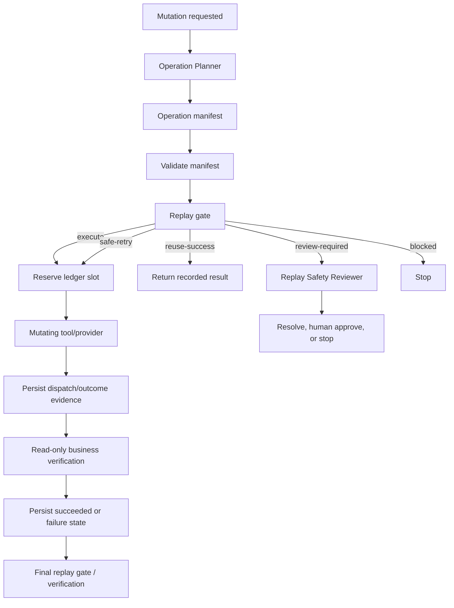

# AI Agent Idempotency Replay Guard

A reusable safety kit for AI agents, background jobs, tool-calling workflows, and resumable automations that may repeat mutating actions after retries, crashes, timeouts, duplicate events, or workflow resumes.

## Problem

An agent can successfully create/send/update something but lose the response. If it retries blindly, the same logical action may happen twice: duplicate emails, duplicate queue jobs, repeated SaaS mutations, duplicated resources, or double financial effects. A new request ID is not enough; the workflow needs a stable business-operation identity, deterministic intent fingerprint, durable execution evidence, and a replay decision before every mutation.

## Purpose

This package provides a tool-neutral contract and deterministic gate that turns a mutating agent step into an idempotent operation lifecycle:

```text
business intent
   ↓
operation key + canonical payload fingerprint
   ↓
ledger lookup / replay gate
   ├─ no prior record ─────────→ execute once
   ├─ prior success ───────────→ reuse result
   ├─ proven no-effect failure → bounded retry
   └─ ambiguous/conflict ──────→ review / block
```

## When to use

Use it for agent/tool operations that create, send, publish, enqueue, charge, provision, update, delete, or otherwise persist external state—especially when the caller can retry, resume from checkpoints, receive duplicate events, or lose responses.

Typical examples include sending notification email, creating tickets, provisioning cloud/SaaS resources, starting background jobs, applying external updates, billing actions, publishing releases/content, and webhook/event consumers.

## When not to use

Pure read-only operations generally do not require an idempotency ledger. Do not use this package as a substitute for transaction design, distributed locking, provider-specific safety guarantees, or business reconciliation. It complements those mechanisms.

## Architecture



## Package tree

```text
ai-agent-idempotency-replay-guard/
├── README.md
├── config/
│   └── replay-policy.json
├── examples/
│   └── execution-ledger.json
├── hooks/
│   └── idempotency-replay-hooks.md
├── rules/
│   └── idempotency-replay-governance.md
├── schemas/
│   └── operation-manifest.schema.json
├── scripts/
│   ├── evaluate_replay_gate.py
│   ├── fingerprint_operation.py
│   └── validate_operation_manifest.py
├── skills/
│   ├── design-idempotent-operation.md
│   └── recover-ambiguous-operation.md
├── subagents/
│   ├── operation-planner.md
│   └── replay-safety-reviewer.md
├── templates/
│   └── operation-manifest.example.json
├── tests/
│   └── smoke-test.py
└── workflows/
    └── idempotent-mutation-workflow.md
```

## Component responsibilities

- `skills/design-idempotent-operation.md` defines how to derive stable business identity, operation key, canonical intent fingerprint, provider idempotency usage, verification, retry and compensation boundaries.
- `skills/recover-ambiguous-operation.md` defines safe recovery after timeout/crash/lost response without blind replay.
- `rules/idempotency-replay-governance.md` contains enforceable MUST/MUST NOT/SHOULD rules.
- `subagents/operation-planner.md` owns pre-execution idempotency design.
- `subagents/replay-safety-reviewer.md` independently evaluates high-risk ambiguous outcomes and replay evidence.
- `workflows/idempotent-mutation-workflow.md` is the complete execution/retry/resume lifecycle.
- `hooks/idempotency-replay-hooks.md` defines deterministic pre-mutation, post-dispatch, and completion hooks.
- `config/replay-policy.json` configures retry budgets, high-risk categories, volatile fingerprint fields, and review/approval requirements.
- `schemas/operation-manifest.schema.json` documents the structured operation contract.
- `scripts/fingerprint_operation.py` computes a SHA-256 fingerprint from canonical JSON intent while excluding configured volatile fields.
- `scripts/validate_operation_manifest.py` validates required fields, recomputes the fingerprint, enforces retry policy, and requires reconciliation strategy for risky providers without native idempotency.
- `scripts/evaluate_replay_gate.py` decides whether the current operation may execute, reuse prior success, safely retry, require review, or block.
- `templates/operation-manifest.example.json` is a ready-to-copy manifest example.
- `examples/execution-ledger.json` shows the append-only evidence shape expected by the gate.
- `tests/smoke-test.py` exercises the main safety branches without external dependencies.

## Dependencies

Python 3.9+ and the Python standard library only. The scripts do not call external services and do not require secrets.

For production use, the host application must provide a durable ledger implementation. A JSON array is supported by the reference gate for local/CI usage; concurrent production workers should use storage with uniqueness/atomic reservation such as a database unique constraint, transactional key-value store, or provider-native idempotency mechanism plus local evidence.

## Installation

Copy this directory into the repository. Customize `config/replay-policy.json`, then create one operation manifest per mutating business action using `templates/operation-manifest.example.json` as a starting point.

For a payload file:

```bash
python scripts/fingerprint_operation.py \
  --payload payload.json \
  --policy config/replay-policy.json
```

Place the result in `payload_fingerprint`, then validate:

```bash
python scripts/validate_operation_manifest.py \
  --manifest operation.json \
  --policy config/replay-policy.json
```

Before **every** initial call, retry, or resumed mutation:

```bash
python scripts/evaluate_replay_gate.py \
  --manifest operation.json \
  --ledger execution-ledger.json \
  --policy config/replay-policy.json
```

## Replay-gate decisions

- `execute`: no prior operation exists; reserve and dispatch exactly once.
- `reuse-success`: the same operation/fingerprint already succeeded; reuse the recorded result instead of mutating again.
- `safe-retry`: prior evidence proves no side effect occurred and retry budget remains; retry using the **same** operation/provider idempotency key.
- `review-required`: prior outcome may exist or remains ambiguous; automatic mutation must stop.
- `blocked`: key/payload conflict, invalid/terminal state, exhausted retry budget, or other unsafe state.

`evaluate_replay_gate.py` uses exit code `0` for executable/reusable safe decisions, `2` for blocked decisions, and `3` for review-required decisions.

## Operation-key design

A good key identifies the *business operation*, not the process attempt. Example:

```text
messaging:send-order-confirmation:order-123:v1
```

A retry, resumed agent, second worker, or duplicated queue event must resolve to the same key for the same business intent. If the intended payload changes materially, either the fingerprint conflict must block it or the business intent version/key must explicitly change.

Do not add timestamps, random UUIDs, trace IDs, or attempt numbers to the operation key merely to bypass an existing record.

## Provider-native idempotency

When a provider supports an idempotency key, pass the stable operation key (or a deterministic mapped value) through its supported field/header. Keep the local ledger anyway so the agent can reason about business state, retention windows, verification evidence, and resume behavior.

If a provider lacks native idempotency, high-risk actions require a read-only lookup/reconciliation strategy. Examples: query by business metadata, provider request ID, unique external reference, invoice/order key, or target-state verification.

## Handling ambiguous outcomes

A timeout after dispatch does **not** mean the action failed. Record `failed-unknown-outcome`, preserve the original evidence, perform read-only reconciliation, and use `skills/recover-ambiguous-operation.md`.

Only transition to `failed-safe-to-retry` when evidence proves the side effect did not occur. If evidence remains ambiguous, stop automatic execution and hand off to `subagents/replay-safety-reviewer.md`.

## Ledger states

The package uses these states consistently:

- `reserved`
- `in-progress`
- `succeeded`
- `failed-safe-to-retry`
- `failed-unknown-outcome`
- `blocked`
- `compensated`

Do not overwrite history to change the meaning of a prior attempt. Preserve chronological evidence; production stores should model immutable events or append-only attempt records where practical.

## Safety and approvals

Human approval is required before destructive, financial, security-sensitive, or production compensation; before intentionally replaying a high-risk ambiguous effect when duplicate execution cannot be ruled out; and before increasing permissions to reconcile or compensate an operation.

The implementing/executing agent must not be the sole verifier for high-risk ambiguous outcomes. Approval does not authorize changing the operation key or fingerprint to conceal a conflict.

## Failure and recovery

- **Validation failure:** do not execute; fix the manifest or policy mismatch.
- **Pre-dispatch transient failure:** may retry within configured budget.
- **Post-dispatch timeout/lost response:** mark unknown; reconcile before retry.
- **Provider 429/5xx:** automatic retry is safe only if dispatch did not happen or provider-native idempotency protects the repeated request.
- **Permission failure:** stop; do not increase privileges silently.
- **Payload conflict:** block; investigate whether this is a new business intent/version.
- **Ledger persistence failure:** stop further mutation because replay safety cannot be proven.
- **Retry budget exhausted:** preserve all evidence and escalate; never loop until success.

## Verification

A task is **executed** when a mutating tool call was dispatched. It is **verified successfully** only when the intended business effect is confirmed, the ledger records `succeeded` (or an approved compensation outcome), the operation key/fingerprint remain consistent, and no unresolved duplicate-risk remains.

Recommended evidence includes provider resource/request IDs, read-after-write state, receipt/status query, queue/job identity, response fingerprint, timestamps, and reviewer evidence for high-risk ambiguity. Never store secrets solely for replay verification.

Run the package smoke test:

```bash
python tests/smoke-test.py
```

Expected output:

```text
smoke-test: PASS
```

## Definition of Done

The operation is complete only when all applicable conditions hold:

- a stable operation key represents the business intent;
- the canonical payload fingerprint validates;
- the replay gate was evaluated before every mutation/retry/resume;
- mutation retries did not exceed policy;
- a prior success was reused rather than duplicated when applicable;
- ambiguous outcomes were reconciled or explicitly blocked/reviewed;
- provider/business success evidence exists;
- high-risk independent review and human approval exist where required;
- ledger evidence is preserved and contains no unresolved key/fingerprint conflict;
- final status distinguishes execution from verified success.

## Customization

Customize volatile payload fields, risk categories, retry budgets, provider lookup strategies, ledger storage, and business verification rules. Keep the core invariants unchanged: stable operation identity, deterministic intent binding, check-before-replay, bounded retry, evidence-based outcome, and fail-closed handling of ambiguity.

## Portability

The package is intentionally tool-neutral. It can be used with OpenAI Codex, Claude Code, Cursor, ChatGPT tool workflows, GitHub Copilot agents, OpenCode, queue workers, CI jobs, or custom orchestration. Tool-specific idempotency headers/adapters should live in integration code; the operation contract and replay gate remain reusable.
