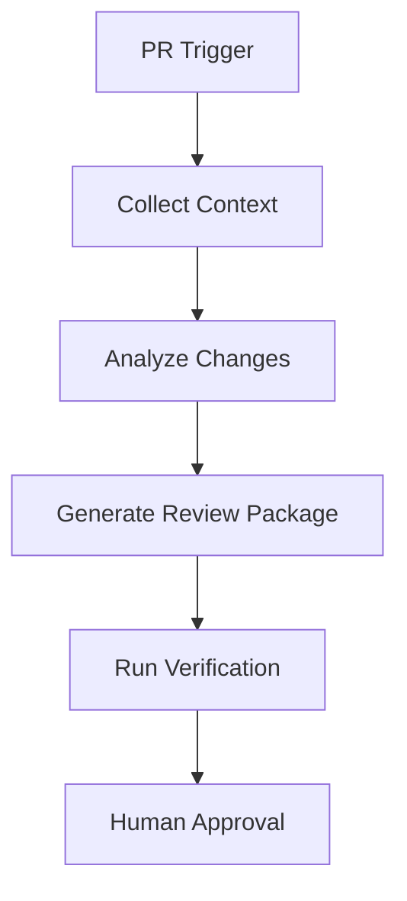

# AI Assisted PR Preparation Agent

Reusable AI engineering kit for preparing pull requests with structured evidence, review readiness, and bounded agent workflows.

## Problem
Developers often create PRs with missing context, incomplete tests, unclear risk, or inconsistent descriptions.

## Purpose
Automate preparation work before human review while keeping final approval with developers.

## Workflow

## Structure
- skills: reusable PR preparation procedures
- rules: safety constraints
- subagents: specialized analysis roles
- workflows: bounded execution lifecycle
- hooks: deterministic checks
- scripts: validation helpers

## Safety
No automatic merge, deployment, secret modification, or destructive action is allowed.
