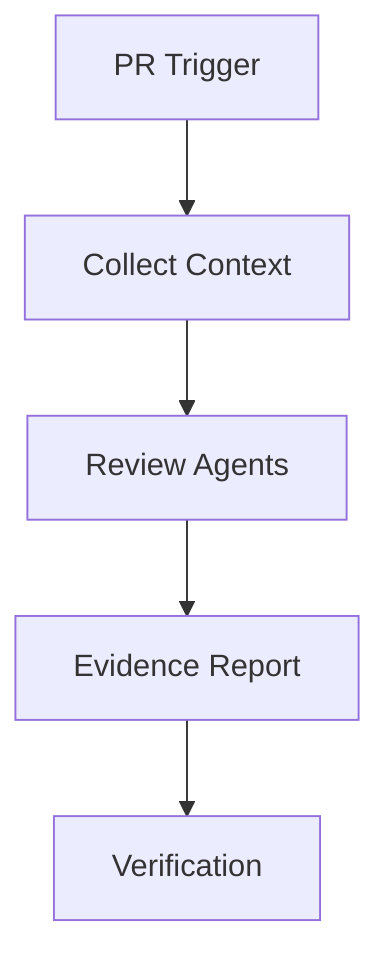

# AI Code Review Agent Kit

Reusable workflow for AI-assisted pull request review with evidence-based findings.

## Purpose
Reduce missed defects by combining repository context, deterministic checks, and specialized review agents.

## Workflow

Components:
- skills: review procedures
- rules: safety boundaries
- subagents: specialized reviewers
- workflows: execution lifecycle
- scripts: deterministic validation

Approval is required for any automatic code modification or merge decision.
