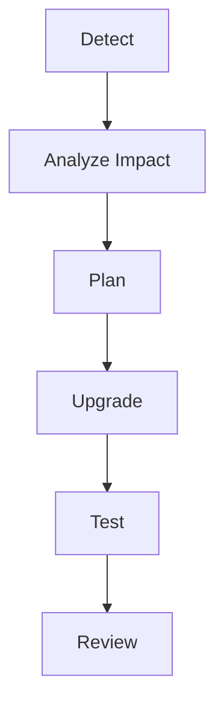

# AI Dependency Upgrade Agent

Reusable AI engineering kit for safe dependency upgrade workflows.

## Problem
Dependency upgrades often create hidden breaking changes, security regressions, and unnecessary code churn.

## Use when
- A package has a new major/minor release
- Security advisories require upgrades
- Framework upgrades are planned

## Workflow

The agent separates research, implementation, and verification.

## Safety
Human approval is required for major upgrades, breaking API changes, and production releases.
