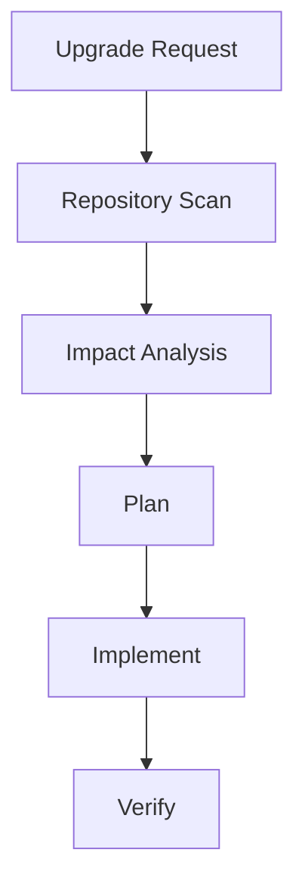

# AI Dependency Upgrade Review Agent

Reusable agent package for safely investigating and planning dependency upgrades.

## Problem
Dependency upgrades often fail because agents change versions without understanding compatibility, security impact, runtime behavior, or migration requirements.

## Workflow

## Components
- skills: repeatable procedures
- rules: safety boundaries
- subagents: separated responsibilities
- workflows: execution lifecycle
- hooks: deterministic checks
- scripts: automation helpers

## Safety
Production changes, lockfile changes with major impact, breaking API migrations, and deployment actions require human approval.

## Definition of Done
- Upgrade reason documented
- Compatibility risks identified
- Tests/build verification completed
- Remaining risks recorded
