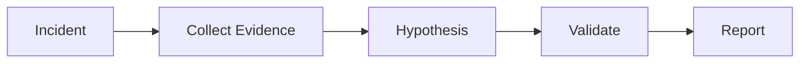

# AI Incident Root Cause Agent Kit

Reusable agent workflow for production incident investigation.

## Problem
Reduce slow, inconsistent debugging by forcing evidence-driven investigation.

## Usage
Trigger when production errors, alerts, or abnormal metrics require investigation.

Workflow:

## Components
- skills: investigation procedures
- rules: safety boundaries
- subagents: specialized roles
- workflows: bounded execution
- scripts: deterministic collection

## Verification
Success requires collected evidence, validated root cause, reproducible findings, and documented risks.
