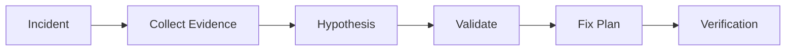

# AI Production Incident Investigator

Reusable AI agent package for investigating production incidents with evidence-first workflows.

## Problem
Reduce unreliable AI debugging by forcing agents to collect evidence, form hypotheses, validate changes, and stop before dangerous actions.

## Use when
- Production errors appear
- Logs, traces, metrics, and code need correlation
- Root cause is unknown

## Workflow

## Package
- skills: investigation procedures
- rules: safety boundaries
- subagents: separated responsibilities
- workflows: bounded execution
- hooks: deterministic checks
- scripts: evidence collection

## Safety
No production changes, database mutations, deployments, or configuration changes without approval.

## Definition of Done
- Evidence collected
- Root cause supported by facts
- Verification completed
- Risks documented
