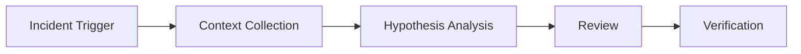

# AI Production Incident Triage Agent Kit

## Problem
Production incidents require fast diagnosis but agents can produce unsafe guesses without evidence discipline.

## Purpose
A reusable AI engineering package for incident investigation using context collection, bounded reasoning, specialist review, and verification.

## Workflow

## Usage
Use for API failures, background jobs, database issues, performance regressions, and service outages.

## Safety
Agents must not deploy, delete data, change production configuration, or execute destructive operations without approval.

## Done Criteria
- Evidence collected
- Findings separated from assumptions
- Root cause validated
- Verification evidence recorded
