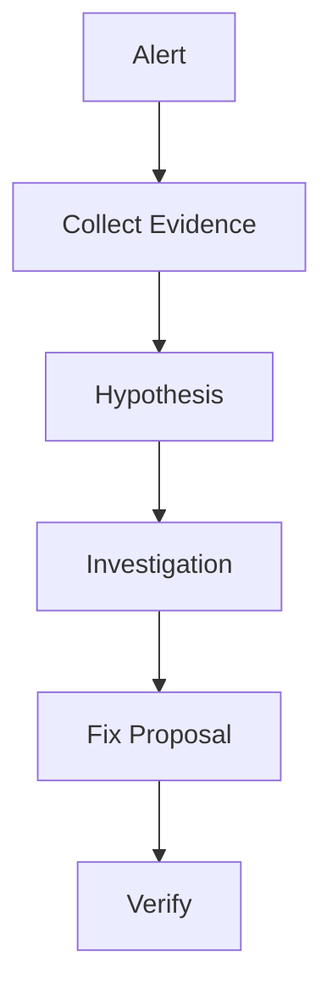

# AI Production Incident Triage Loop

Reusable agent kit for investigating production incidents with evidence, bounded recovery, and human approval.

## Use when
- Production alert fires
- Error rate increases
- Latency/regression appears

## Flow

Components:
- skills: repeatable investigation procedures
- rules: safety boundaries
- subagents: separated responsibilities
- workflow: bounded execution
- scripts: deterministic collection

Done means evidence collected, risk assessed, verification completed, and approvals obtained.
