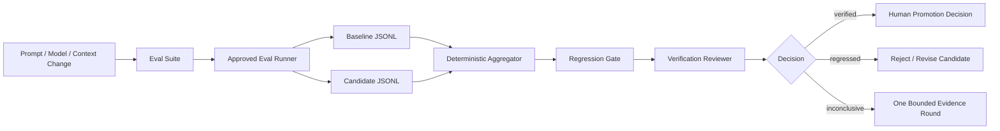

# AI Prompt Regression Evaluator

## Problem
Prompt, model, context, and tool-instruction changes are code-like behavior changes, but teams often validate them with a few manual examples. Nondeterministic outputs make this especially dangerous: one good run can hide a critical failure, while aggregate averages can hide a severe worst-case regression. This kit creates a repeatable evidence gate for comparing a baseline against a candidate across quality, deterministic assertions, critical worst-run behavior, cost, and latency.

## Purpose
Use structured eval cases, repeated normalized runs, deterministic aggregation, bounded retries, and independent semantic review to decide whether a candidate AI behavior is safe enough to proceed to a separate human promotion/deployment decision.

## When to use
- Prompt or system instruction changes
- Model/provider/settings changes
- Context/RAG assembly changes
- Tool descriptions or tool-use instructions
- Agent rules or safety-policy changes
- Output schema or response-format changes
- Cost/latency optimization changes that may affect quality

## When not to use
- As the only authorization for production deployment
- When expected behavior cannot yet be defined or measured
- When fixtures require unsafe exposure of secrets or production-sensitive data
- As a replacement for domain-specific security, integration, or end-to-end tests

## Architecture



The kit intentionally does not hard-code a model API. Any runner may be used if it writes records matching `schemas/run-record.schema.json`. This keeps the core portable across Codex, Claude Code, Cursor, ChatGPT-based workflows, GitHub Copilot, OpenCode, CI jobs, and custom evaluation harnesses.

## Component responsibilities
- `skills/eval-suite-design.md`: designs measurable cases and rubric dimensions.
- `skills/regression-decision.md`: compares baseline/candidate evidence safely.
- `rules/eval-governance.md`: enforceable rules preventing cherry-picking, threshold drift, and unsafe promotion.
- `subagents/eval-analyst.md`: owns suite design and first-pass analysis.
- `subagents/verification-reviewer.md`: independently reviews high-impact or borderline evidence.
- `workflows/prompt-regression-workflow.md`: end-to-end execution lifecycle with bounded retries.
- `hooks/hooks.md`: deterministic lifecycle commands.
- `scripts/validate-suite.py`: validates suite semantics and policy consistency.
- `scripts/aggregate-results.py`: aggregates repeated JSONL runs per case.
- `scripts/evaluate-regression.py`: applies deterministic quality/cost/latency/critical-case gates.
- `tests/test-evaluator.py`: smoke test for the deterministic pipeline.
- `config/eval-policy.json`: default thresholds and retry/review policy.
- `schemas/*.json`: suite, run-record, and regression-report contracts.
- `templates/eval-suite.json`: copyable starter suite.
- `examples/*.jsonl`: complete baseline/candidate example evidence.

## Package tree

```text
ai-prompt-regression-evaluator/
├── README.md
├── skills/
│   ├── eval-suite-design.md
│   └── regression-decision.md
├── rules/
│   └── eval-governance.md
├── subagents/
│   ├── eval-analyst.md
│   └── verification-reviewer.md
├── workflows/
│   └── prompt-regression-workflow.md
├── hooks/
│   └── hooks.md
├── scripts/
│   ├── validate-suite.py
│   ├── aggregate-results.py
│   └── evaluate-regression.py
├── tests/
│   └── test-evaluator.py
├── config/
│   └── eval-policy.json
├── schemas/
│   ├── eval-suite.schema.json
│   ├── run-record.schema.json
│   └── regression-report.schema.json
├── templates/
│   └── eval-suite.json
└── examples/
    ├── baseline-runs.jsonl
    └── candidate-runs.jsonl
```

## Installation
Copy this folder into the target repository. Python 3.9+ is sufficient for the deterministic scripts; no third-party Python package is required.

Create working directories for your repository-specific suite and generated results, for example:

```bash
mkdir -p evals results
cp templates/eval-suite.json evals/suite.json
```

Then replace the example cases with real protected behaviors from your system.

## Configuration
Edit `config/eval-policy.json`:
- `minimum_repetitions`: minimum runs for normal cases.
- `critical_minimum_repetitions`: minimum runs for critical cases.
- `minimum_candidate_quality`: absolute candidate quality floor.
- `maximum_quality_drop`: maximum tolerated baseline-to-candidate quality loss.
- `maximum_critical_worst_run_drop`: protects against rare critical failures hidden by averages.
- `maximum_cost_increase_ratio`: maximum allowed mean cost growth.
- `maximum_latency_increase_ratio`: maximum allowed mean latency growth.
- `transient_retry_per_run`: bounded retry count; default 1.
- `max_additional_evidence_rounds`: one extra evidence round for inconclusive review.
- `require_independent_review_for_high_impact`: prevents the author/analyst from being the only verifier.

## Runner contract
This package evaluates normalized result records rather than calling a specific AI API. Your runner must emit one JSON object per execution, one object per line, matching `schemas/run-record.schema.json`.

Required fields include:
- `suite_id`, `suite_version`
- `case_id`
- `side`: `baseline` or `candidate`
- `run_id`
- `assertions_passed`
- `rubric_scores` using the dimensions defined by that case
- `error`

Optional but recommended: `cost`, `latency_ms`, and `output_ref`.

The external runner is responsible for executing deterministic assertions and semantic scoring. Semantic scoring may use a human reviewer, a reviewed judge model, or another domain-specific evaluator, but rubric dimensions and score scale must remain fixed during a comparison.

## Usage
Validate the suite:

```bash
python scripts/validate-suite.py \
  --suite evals/suite.json \
  --policy config/eval-policy.json
```

Run your approved evaluation runner for both baseline and candidate and save normalized records to `results/baseline.jsonl` and `results/candidate.jsonl`.

Aggregate both sides:

```bash
python scripts/aggregate-results.py \
  --suite evals/suite.json \
  --runs results/baseline.jsonl \
  --side baseline \
  --output results/baseline-aggregate.json

python scripts/aggregate-results.py \
  --suite evals/suite.json \
  --runs results/candidate.jsonl \
  --side candidate \
  --output results/candidate-aggregate.json
```

Evaluate regression:

```bash
python scripts/evaluate-regression.py \
  --suite evals/suite.json \
  --policy config/eval-policy.json \
  --baseline results/baseline-aggregate.json \
  --candidate results/candidate-aggregate.json \
  --output results/regression-report.json
```

Run the included deterministic smoke test:

```bash
python tests/test-evaluator.py
```

The included high-impact example intentionally returns `inconclusive` from the deterministic gate because independent review is required. That demonstrates the distinction between machine checks passing and the overall candidate being verified.

## Status semantics
- `verified`: deterministic gate passed and no outstanding independent review is required.
- `regressed`: one or more blocking quality, assertion, cost, latency, or critical worst-run thresholds failed.
- `inconclusive`: deterministic evidence is acceptable but an independent semantic/high-impact review is still required.
- `blocked`: evidence is invalid or incomplete, such as missing runs or mismatched suite identities.

Independent review may convert an `inconclusive` candidate into an approved evaluation decision in the surrounding workflow. It must not silently rewrite the deterministic report or its thresholds.

## Workflow
1. Define protected behaviors and create the suite.
2. Validate the suite before running models.
3. Execute identical cases for baseline and candidate.
4. Retry transient runner failures at most once per affected run and preserve the first failed attempt.
5. Aggregate repeated evidence.
6. Apply deterministic regression thresholds.
7. Route high-impact/borderline cases to the independent Verification Reviewer.
8. If more evidence is required, permit at most one additional evidence round without changing the suite/rubric.
9. Declare evaluation `verified` only after all blocking checks and required review pass.
10. Treat production promotion/deployment as a separate human-approved action.

## Approval boundaries
Explicit human approval is required before:
- Production rollout/deployment
- A materially more expensive model/provider change when cost policy is overridden
- Weakening safety behavior or permission boundaries
- Changing production secrets/configuration
- Breaking external output/API contracts
- Accepting a critical regression as intentional

The evaluator must never silently increase permissions, change thresholds after seeing results, or deploy a candidate itself.

## Failure handling
- **Malformed suite/result:** block immediately; fix structure and rerun validation.
- **Transient runner failure:** retry the affected run once; preserve both attempts.
- **Repeated runner failure:** stop and report evidence.
- **Missing repetitions:** block; do not extrapolate.
- **Critical deterministic failure:** regression; do not average it away.
- **High-impact semantic ambiguity:** independent review; at most one additional evidence round.
- **Baseline/candidate suite mismatch:** block and regenerate comparable evidence.

## Verification
A task is **executed** when runs and aggregates exist. It is **verified successfully** only when:
- Suite identity is consistent.
- Required repetitions exist for every case.
- Candidate aggregate quality meets the absolute floor.
- Aggregate quality drop stays within policy.
- No critical deterministic assertion fails.
- Critical worst-run degradation stays within policy.
- Cost/latency limits pass when evidence is available/required.
- Required independent review is approved.
- No blocking evidence gap remains.

## Definition of Done
- Repository-specific eval suite exists and validates.
- Baseline and candidate evidence are comparable.
- Required repeated runs are preserved.
- Aggregates exist for both sides.
- Regression report exists.
- Critical failures are not hidden by averages.
- Required independent review is complete.
- Remaining non-blocking risks are documented by the surrounding workflow.
- Final evaluation status is verified.
- Any production promotion has separate explicit human approval.

## Customization
The easiest extension points are:
- Add deterministic assertion types in the external runner and document them in the suite schema.
- Adjust policy thresholds for your domain.
- Add rubric dimensions such as citation correctness, tool-selection accuracy, security, groundedness, or style compliance.
- Store raw outputs behind `output_ref` for reviewer traceability.
- Wrap the scripts in CI without changing their core contracts.
- Add a provider-specific runner adapter outside this core package while keeping normalized JSONL stable.
