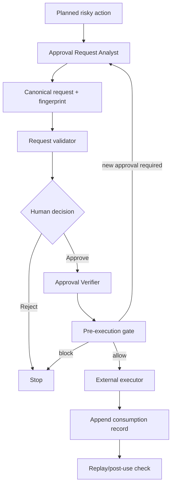

# Approval Expiry and Scope Ledger

A reusable guardrail for AI-assisted development and operations that makes human approvals precise, time-bounded, scope-bounded, replay-resistant, and auditable.

## Problem
Human approval is often represented as free-form chat or ticket text. Agents can accidentally reuse stale approval after the action changes, expand scope after approval, replay a one-time approval, or treat an expired approval as permission. This package binds approval to a deterministic action fingerprint and records each consumption.

## Purpose
Use this kit to place a deterministic gate between planning and any approval-required side effect. It does not execute production actions itself; it validates authorization state immediately before execution and records post-use evidence.

## When to use
Use for production deployments, destructive data operations, database schema changes, infrastructure or secret changes, breaking API changes, security-control weakening, irreversible migrations, large dependency upgrades, force pushes, high-impact external mutations, and any repository-defined protected action.

## When not to use
Do not require human approval for ordinary read-only analysis or low-risk local edits unless repository policy says otherwise. This package is not a replacement for IAM, branch protection, deployment controls, or provider-native authorization.

## Architecture



## Package tree

```text
approval-expiry-and-scope-ledger/
├── README.md
├── config/
│   └── approval-policy.json
├── examples/
│   └── approval-record.json
├── hooks/
│   └── approval-hooks.md
├── rules/
│   └── approval-governance.md
├── schemas/
│   └── approval-request.schema.json
├── scripts/
│   ├── append-consumption.py
│   ├── evaluate-approval-gate.py
│   └── validate-approval-request.py
├── skills/
│   ├── approval-request-capture.md
│   └── approval-use-verification.md
├── subagents/
│   ├── approval-request-analyst.md
│   └── approval-verifier.md
├── templates/
│   └── approval-request.json
├── tests/
│   └── smoke-test.py
└── workflows/
    └── approval-bound-execution-workflow.md
```

## Dependencies
- Python 3.9+
- Python standard library only
- A trusted UTC clock on the machine running the gate
- A durable location for approval artifacts and the append-only JSONL consumption ledger

## Installation
Copy this directory into your repository, then customize `config/approval-policy.json` for your risk categories, TTLs, approver roles, and bounded-reuse policy.

## Configuration
`config/approval-policy.json` controls:
- default and maximum approval TTL
- single-use vs bounded reusable approvals
- maximum reusable uses
- risk categories requiring independent approval
- categories permitted to use bounded reuse
- fail-closed behavior

Core default behavior is `single-use`, 30-minute TTL, maximum 240-minute TTL, and independent approval for production/destructive/security/infrastructure/breaking/irreversible actions.

## Input contracts
An approval request binds:
- `request_id`
- `revision`
- action and risk category
- target and environment
- normalized scope
- payload fingerprint
- policy version
- reuse mode
- approval window
- required approver role

The `action_fingerprint` is SHA-256 over the canonical request identity, action, risk, target, environment, scope, payload fingerprint, and policy version. Any approval-visible change requires a new revision and approval.

## Usage

### 1. Prepare and validate a request
Start from `templates/approval-request.json`, populate the action, normalize the scope, fingerprint the payload, compute the action fingerprint, then run:

```bash
python scripts/validate-approval-request.py \
  --request path/to/request.json \
  --policy config/approval-policy.json
```

### 2. Capture human approval
Store the human decision separately from the request. The approval record must reference the same `request_id`, `revision`, and `action_fingerprint`. `examples/approval-record.json` shows the shape.

### 3. Build current execution intent and independent review
The intent must contain the same canonical action fields plus `executor_id`. The reviewer produces a record containing:

```json
{
  "reviewed_fingerprint": "<same action fingerprint>",
  "verdict": "approved-for-execution",
  "reviewer_id": "independent-reviewer"
}
```

### 4. Run the gate immediately before execution

```bash
python scripts/evaluate-approval-gate.py \
  --request request.json \
  --approval approval.json \
  --intent intent.json \
  --review review.json \
  --ledger approval-ledger.jsonl \
  --policy config/approval-policy.json \
  --phase pre-execution
```

Decisions:
- `allow` — exact intent is currently authorized.
- `human-approval-required` — approval is stale/consumed or intent changed; request a new approval.
- `block` — invalid or unsafe authorization state.

Only `allow` permits the external executor to proceed.

### 5. Record consumption
Immediately after the protected action attempt:

```bash
python scripts/append-consumption.py \
  --ledger approval-ledger.jsonl \
  --request request.json \
  --executor agent-or-human-id \
  --result succeeded \
  --evidence deploy://run/123
```

The script updates the ledger atomically. For a single-use approval, another pre-execution gate on the same fingerprint must fail.

## Hooks
`hooks/approval-hooks.md` defines four lifecycle checks: request validation, pre-execution gate, post-execution consumption, and replay verification. These can be mapped to coding-agent hooks, CI checks, deployment wrappers, or MCP/tool interceptors.

## Agent responsibilities
- **Approval Request Analyst:** constructs exact request boundaries and fingerprints; cannot approve or execute.
- **Approval Verifier:** independently validates approval freshness/scope/replay state; cannot mutate request/approval or execute.
- **Human approver:** owns the actual authorization decision.
- **Executor:** may act only after deterministic gate returns `allow`.

## Approval boundaries
A new approval is mandatory when any of these change:
- action type
- risk category
- target or environment
- scope/resources
- payload fingerprint
- policy version
- approval-visible rollback assumptions

Approval is never extended automatically. Production, destructive, security, secret, infrastructure, breaking API, irreversible migration, and large-upgrade categories require an approver independent from executor/reviewer under the default policy.

## Failure and recovery
- Transient file/tool read error: retry once, preserving first error.
- Invalid request/policy/fingerprint: stop; correct request and increment revision when approval-visible content changed.
- Expired/revoked/consumed approval: create a new approval request.
- Ledger unavailable/corrupted: fail closed; reconcile before further protected execution.
- Intent mismatch: do not edit the old approval; create a new request revision.
- Permission failure: do not increase permissions silently; escalate to an authorized operator.

## Verification
Run the smoke test:

```bash
python tests/smoke-test.py
```

It verifies:
1. a valid request passes validation;
2. exact approved intent returns `allow`;
3. consumption is appended;
4. replay of a single-use approval requires new approval;
5. expanded scope changes the fingerprint and requires new approval.

For production adoption, also integrate the gate into the final wrapper around the actual mutating tool so an agent cannot bypass it by calling the tool directly.

## Security
- Do not store raw secrets in requests, approvals, intent, review, or ledger artifacts.
- Fingerprint sensitive payloads or reference a trusted secret/version identifier.
- Treat ledger and approval files as audit-sensitive data.
- This kit enforces logical approval binding; protect its files and execution path with repository/IAM controls.

## Definition of Done
The workflow is complete only when:
- the request is schema/policy valid;
- human approval is captured for the exact revision/fingerprint;
- approval is unexpired and unrevoked;
- current intent fingerprint matches the approved fingerprint;
- independent review requirements are satisfied;
- use count/reuse policy is valid;
- the pre-execution gate returned `allow`;
- the protected action result is recorded in the ledger;
- replay rules are verified;
- unresolved authorization or audit failures are absent.

## Customization
Keep core fingerprinting and replay semantics stable. Adapt risk categories, TTLs, approver roles, ticket references, and tool wrappers in configuration/integration code rather than weakening the core governance rules.