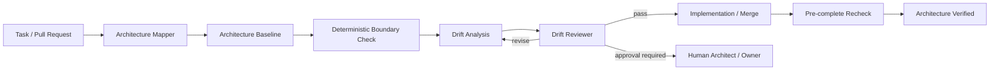

# Architecture Drift Detection Gate

A reusable, tool-neutral framework for detecting when code changes silently violate an agreed architecture: module boundaries, layering rules, dependency direction, ownership constraints, or Architecture Decision Records (ADRs).

## Problem

Architecture usually degrades through small, locally reasonable changes rather than one explicit redesign. Typical drift includes:

- application code importing infrastructure details directly;
- domain modules depending on UI, persistence, or transport layers;
- one bounded context reaching into another context's internals;
- cross-module shortcuts that bypass published interfaces;
- new dependencies that contradict an ADR;
- generated or test code leaking into production modules;
- package moves that invalidate documented ownership boundaries;
- architectural exceptions that are introduced without a decision record or expiry condition.

A normal build can still pass while these problems accumulate. Code review is also unreliable if reviewers must reconstruct the architecture from memory every time.

This kit creates an explicit architecture baseline, checks deterministic boundaries automatically, asks agents to investigate semantic drift, and requires independent verification before a change is considered architecturally verified.

## When to use

Use this kit when a repository has one or more of the following:

- layered, hexagonal, onion, clean, modular-monolith, plugin, or bounded-context architecture;
- ADRs or explicit dependency-direction decisions;
- multiple teams or modules with ownership boundaries;
- recurring review comments about coupling, leakage, or layering;
- refactoring that moves responsibilities between modules;
- pull requests that add new project/package/module dependencies;
- migrations from a legacy structure toward a target architecture;
- AI coding agents that may optimize locally without remembering global architecture constraints.

Do not use it to invent architecture for a repository that has none. Establish or approve the baseline first.

## Architecture



The package separates responsibilities deliberately:

- **Skills** define how to extract a baseline and analyze drift.
- **Rules** define enforceable architectural behavior and approval boundaries.
- **Architecture Mapper** reconstructs the current/declared architecture and produces the baseline.
- **Drift Reviewer** independently challenges proposed violations and evidence.
- **Workflow** gates implementation and completion on explicit architecture checks.
- **Hooks** attach deterministic checks to predictable lifecycle points.
- **Scripts** validate policy structure and detect forbidden dependency/import patterns without LLM judgment.
- **Config/schema/templates** make the package portable across repositories and AI tools.

The deterministic scripts do not try to understand architecture semantically. They enforce rules that can be stated mechanically; semantic interpretation remains with agents and humans.

## Package structure

```text
architecture-drift-detection-gate/
├── README.md
├── skills/
│   ├── architecture-baseline-extraction.md
│   └── drift-analysis.md
├── rules/
│   └── architecture-governance.md
├── subagents/
│   ├── architecture-mapper.md
│   └── drift-reviewer.md
├── workflows/
│   └── architecture-drift-gate.md
├── hooks/
│   └── architecture-hooks.md
├── scripts/
│   ├── validate-architecture-policy.py
│   └── check-import-boundaries.py
├── config/
│   └── architecture-policy.example.json
├── schemas/
│   └── architecture-policy.schema.json
└── templates/
    └── drift-report.example.json
```

## Installation

Copy this directory into your repository, for example:

```text
.ai/architecture-drift-detection-gate/
```

Requirements:

- Python 3.9+
- Git is recommended for diff-based workflows, but the scripts themselves only require filesystem access.
- No third-party Python packages are required.

Start by copying the example policy to a repository-owned location:

```bash
cp .ai/architecture-drift-detection-gate/config/architecture-policy.example.json .architecture-policy.json
```

Then edit the module paths, allowed dependency directions, forbidden patterns, and approved exceptions.

## Configuration

The default policy path can be supplied by environment variable:

```text
ARCHITECTURE_POLICY=.architecture-policy.json
```

The policy contains:

- `modules`: named architectural modules and their path prefixes;
- `allowed_dependencies`: source module -> modules it may depend on;
- `forbidden_patterns`: deterministic text/import patterns that must not appear in selected modules;
- `ignored_paths`: generated/vendor/build paths to exclude;
- `exceptions`: temporary, explicitly documented exceptions with owner and expiry date;
- `decision_records`: ADR identifiers or paths that justify important boundaries.

The example configuration is intentionally generic. Adapt its path prefixes and patterns before treating it as a gate.

Validate configuration:

```bash
python .ai/architecture-drift-detection-gate/scripts/validate-architecture-policy.py \
  --policy .architecture-policy.json
```

Check deterministic boundaries:

```bash
python .ai/architecture-drift-detection-gate/scripts/check-import-boundaries.py \
  --policy .architecture-policy.json \
  --root .
```

Optionally restrict the scan to changed files by providing paths explicitly:

```bash
python .ai/architecture-drift-detection-gate/scripts/check-import-boundaries.py \
  --policy .architecture-policy.json \
  --root . \
  --files src/domain/order.py src/api/orders.py
```

## Usage

### Example: feature introduces a direct infrastructure dependency

Task:

> Add order-export support. The proposed implementation makes the domain service call the SQL repository implementation directly because it is already available.

Run the workflow:

1. Architecture Mapper reads repository structure, ADRs, dependency/project files, and existing interfaces.
2. It confirms that the domain layer may depend on abstractions but not infrastructure implementations.
3. The deterministic checker detects an import/pattern from `domain` into an infrastructure namespace.
4. Drift Analysis classifies the change as an **unapproved dependency-direction violation**.
5. The implementation is revised to depend on an application/domain interface instead.
6. Relevant build/tests run.
7. Drift Reviewer confirms the final dependency graph matches the approved baseline.
8. Pre-complete hook reruns deterministic checks.

The code may be functionally complete before step 7, but it is not **architecture verified** until the architecture gate passes.

## Workflow

The primary lifecycle is:

```text
Trigger
  ↓
Extract / Load Architecture Baseline
  ↓
Validate Policy
  ↓
Map Change Surface
  ↓
Run Deterministic Boundary Checks
  ↓
Analyze Semantic Drift
  ↓
Drift Found?
  ├─ No → Implement / Continue
  └─ Yes
       ├─ Fix within existing architecture → Recheck
       ├─ Approved temporary exception → Record + Recheck
       └─ Architecture change required → Human approval + ADR/update
  ↓
Build / Tests / Review
  ↓
Independent Drift Review
  ↓
Pre-complete Recheck
  ↓
Architecture Verified
```

Important lifecycle states:

- **Task completed**: requested code or change exists.
- **Task technically verified**: build/tests/acceptance checks pass.
- **Architecture verified**: deterministic checks pass, semantic drift is reviewed, and any architecture-changing exception has explicit approval/evidence.

These states must not be collapsed into one success claim.

## Safety

This package is read-mostly by default. It does not authorize changes simply because they improve architecture.

Explicit human approval is required before:

- changing an established dependency direction or public module contract;
- modifying or superseding an ADR that affects other teams/modules;
- deleting modules or large groups of files;
- introducing a large dependency upgrade as part of an architecture fix;
- changing database schema, infrastructure, production configuration, secrets, or security controls;
- force pushing or rewriting Git history;
- accepting a long-lived architecture exception without an owner and review/expiry condition.

Agents may recommend an architecture change but must not self-approve it.

## Verification

A run is architecture verified only when all applicable checks pass:

1. Architecture policy validates structurally.
2. Deterministic boundary checker reports no unapproved violations.
3. Changed modules and new dependencies are accounted for in the drift analysis.
4. Existing ADRs/architecture documents that constrain the change were considered.
5. Any exception is explicit, scoped, owned, and not expired.
6. Relevant build/tests/static analysis pass separately from the architecture gate.
7. Drift Reviewer returns `pass` rather than merely accepting the implementation agent's reasoning.
8. Pre-complete checks run against the final file state, not an earlier draft.

A green build does not prove architecture compliance.

## Failure and recovery

- **Invalid policy**: fix once and rerun validation. If still invalid, stop; do not guess rules.
- **Unknown module/path**: Architecture Mapper gets one targeted discovery pass. If ownership remains unclear, mark blocked and request human clarification.
- **Deterministic false positive**: document evidence and narrow the policy rule; do not blanket-disable the checker.
- **Semantic disagreement**: Drift Reviewer may request at most two revision rounds. If disagreement remains, escalate to a human architect/owner.
- **Architecture change required**: stop automatic implementation at the approval checkpoint until the decision is approved and recorded.
- **Expired exception**: fail closed; renew through explicit human review or remove the exception.

No loop retries indefinitely.

## Customization

The easiest extension points are:

- edit `config/architecture-policy.example.json` for repository-specific modules and dependency direction;
- add language-specific forbidden patterns for namespaces/imports/references;
- adapt hooks to your AI tool or CI system;
- add project-file or package-graph checks for your ecosystem;
- add ADR metadata conventions to the policy;
- extend the drift report template with team ownership, risk score, or migration milestones;
- replace the generic text scanner with a language-aware parser while preserving the same workflow and verification contract.

The core architecture remains portable across Claude Code, OpenAI Codex, ChatGPT, Cursor, GitHub Copilot, OpenCode, and other coding agents because the package defines behavior and artifacts rather than relying on one agent product's proprietary syntax.
