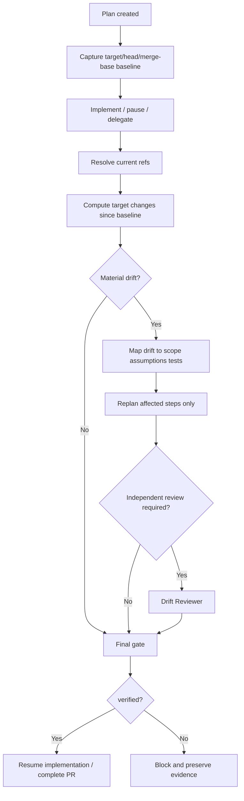

# Branch Base Drift Replan Gate

A reusable AI-engineering package for preventing coding agents from continuing implementation, review, or PR completion from a plan whose target-branch assumptions were derived from an older merge base.

## Problem

Long-running or delegated coding work can begin from a valid plan and later become unsafe when the target branch advances. The working branch may still contain the intended edits, but the original plan can now be wrong because nearby code, shared dependencies, contracts, CI, configuration, migrations, or tests changed after planning.

This package binds a plan to target/head/merge-base SHAs, detects target-branch drift deterministically, maps drift to plan scope and risk surfaces, requires focused replanning, and blocks continuation until current evidence is verified.

## Purpose

Use this kit to answer four questions before an agent resumes or completes work:

1. Is the plan still bound to the repository state it was created from?
2. What changed on the target branch since that baseline?
3. Which plan steps, assumptions, and tests must be revalidated or replanned?
4. Is there enough current, independently reviewed evidence to continue safely?

## When to use

- Feature or bug-fix work that spans hours/days while `main`/`develop` continues moving.
- Long-running agents, resumable agents, multi-agent delegation, or queued coding tasks.
- PRs prepared from a plan created before substantial target-branch activity.
- Repositories with shared libraries, contracts, migrations, deployment/config, or CI surfaces where seemingly unrelated commits can invalidate implementation assumptions.

## When not to use

- Tiny one-shot edits planned and completed against a frozen branch state.
- Repositories without Git history/ref access.
- As a substitute for merge-conflict resolution, tests, code review, or required human approval.

## Architecture



## Component responsibilities

- `skills/capture-planning-baseline.md` — procedure for binding a plan to exact Git state.
- `skills/replan-affected-work.md` — focused replan procedure after drift.
- `rules/branch-base-drift-rules.md` — enforceable MUST/MUST NOT/SHOULD governance.
- `subagents/drift-planner.md` — owns drift-to-plan mapping and replan artifacts.
- `subagents/drift-reviewer.md` — independently reviews high-risk/ambiguous drift.
- `workflows/branch-base-drift-replan-workflow.md` — end-to-end bounded workflow.
- `hooks/branch-drift-hooks.md` — pre-plan, resume, pre-PR, and invalidation hooks.
- `config/drift-policy.json` — risk path patterns, review triggers, approval boundaries, retry policy.
- `schemas/replan-record.schema.json` — machine-readable replan record contract.
- `scripts/capture-branch-baseline.py` — resolves Git refs/merge base and writes baseline record.
- `scripts/validate-replan-record.py` — stdlib-only structural/semantic validator.
- `scripts/evaluate-branch-drift.py` — computes current refs, changed target paths, scope overlap, and review triggers.
- `scripts/evaluate-replan-gate.py` — fail-closed final evidence gate.
- `templates/plan.example.json` — reusable input plan shape.
- `examples/reviewer-record.json` — reviewer output example.
- `tests/test-branch-base-drift.py` — temporary-Git-repository smoke test.

## Package tree

```text
branch-base-drift-replan-gate/
├── README.md
├── config/
│   └── drift-policy.json
├── examples/
│   └── reviewer-record.json
├── hooks/
│   └── branch-drift-hooks.md
├── rules/
│   └── branch-base-drift-rules.md
├── schemas/
│   └── replan-record.schema.json
├── scripts/
│   ├── capture-branch-baseline.py
│   ├── evaluate-branch-drift.py
│   ├── evaluate-replan-gate.py
│   └── validate-replan-record.py
├── skills/
│   ├── capture-planning-baseline.md
│   └── replan-affected-work.md
├── subagents/
│   ├── drift-planner.md
│   └── drift-reviewer.md
├── templates/
│   └── plan.example.json
├── tests/
│   └── test-branch-base-drift.py
└── workflows/
    └── branch-base-drift-replan-workflow.md
```

## Dependencies

- Python 3.9+
- Git available on `PATH`
- A local repository containing both target and working refs, or equivalent refs fetched before execution
- Python scripts use the standard library only

## Installation

Copy the package into your repository, then adapt `config/drift-policy.json` to your path conventions. Keep the scripts together so hook/workflow references remain valid.

Example:

```bash
python scripts/capture-branch-baseline.py \
  --repo . \
  --target main \
  --head HEAD \
  --plan templates/plan.example.json \
  --output .agent/branch-baseline.json

python scripts/validate-replan-record.py .agent/branch-baseline.json
```

## Configuration

Customize these policy groups:

- `high_risk_path_patterns` — migrations, security/auth, infra, CI, deployment, config, dependency-definition files.
- `public_contract_path_patterns` — OpenAPI/public API/contracts.
- `shared_path_patterns` — common/shared/core/platform boundaries.
- `independent_review_required_for` — conditions that require a reviewer separate from the planner.
- `human_approval_actions` — dangerous actions the workflow must stop before.
- `max_transient_retries` — default `1`.

## Usage

### 1. Capture planning baseline

Create your plan JSON from `templates/plan.example.json`, then run:

```bash
python scripts/capture-branch-baseline.py \
  --repo . \
  --target main \
  --head HEAD \
  --plan plan.json \
  --output baseline.json
python scripts/validate-replan-record.py baseline.json
```

### 2. Check drift before resume or PR completion

```bash
python scripts/evaluate-branch-drift.py \
  --repo . \
  --record baseline.json \
  --policy config/drift-policy.json \
  --output drift-report.json
```

Possible drift states:

- `fresh` — no material target/base drift detected.
- `replan-required` — drift exists and affected work must be reassessed.
- `review-required` — policy-defined high-risk/public/shared/missing-baseline evidence requires independent review.

A non-fresh drift result intentionally exits non-zero so CI/agent hooks cannot silently continue.

### 3. Replan affected work

Follow `skills/replan-affected-work.md`. Create a new plan revision; do not overwrite history as if the original plan was always current. Update ref bindings after the replan is based on the current target/head/base.

### 4. Review high-risk drift

Use `subagents/drift-reviewer.md` and the contract illustrated by `examples/reviewer-record.json`. Reviewer identity must differ from planner identity for high-risk work.

### 5. Run final gate

```bash
python scripts/evaluate-replan-gate.py \
  --record current-replan.json \
  --drift current-drift-report.json \
  --policy config/drift-policy.json \
  --review review.json \
  --output gate.json
```

Only `verified` permits continuation. `blocked` means the evidence is stale, inconsistent, unresolved, or missing required independent review.

## Workflow semantics

The workflow does not equate “target branch changed” with “discard the whole plan.” It narrows work using evidence:

- Direct planned-path overlap → revalidate/replan the associated steps.
- Shared/public/high-risk path movement → broaden dependency/test review and require independent review according to policy.
- No material drift → preserve the existing plan and proceed through final current-ref validation.
- Target/head/base changes after review → invalidate prior review/gate evidence and recompute.

## Approval boundaries

This kit never uses merge/rebase/history rewrite as an automatic recovery mechanism. Explicit human approval is required before production deployment, destructive SQL, database schema change, force push/history rewrite, infrastructure/secret/production configuration changes, breaking API changes, security weakening, irreversible migrations, or large dependency upgrades.

An approval for one action does not imply approval for another action or a changed payload/scope.

## Failure handling

- **Transient Git/tool read failure:** preserve stderr and retry at most once.
- **Invalid record:** block; fix the record rather than retrying automatically.
- **Unresolvable ref:** block and collect evidence.
- **Ambiguous dependency impact:** reviewer escalation; do not guess.
- **Reviewer/planner disagreement:** one bounded planner revision after explicit findings; unresolved disagreement blocks.
- **Permission/environment/business-rule failure:** no automatic retry.
- **Target changes after review:** old review/gate is stale; rerun evaluation.

## Verification

Run the package smoke test:

```bash
python tests/test-branch-base-drift.py
```

The test creates a temporary Git repository and verifies:

1. Unchanged target state produces `fresh` and the gate produces `verified`.
2. Target movement inside planned scope makes the original baseline stale and the gate blocks it.
3. Target movement in `.github/workflows/` produces `review-required` through the high-risk policy.

This distinguishes **workflow executed** from **workflow verified successfully**.

## Definition of Done

The branch-base drift gate is complete only when:

- A valid baseline or current replan record exists.
- Current target/head/merge-base bindings are known.
- Target changes since planning are enumerated.
- Every material overlap is mapped to a plan step/assumption/test disposition.
- Affected assumptions are current rather than silently inherited.
- Required test scope is updated.
- Required independent review is present and bound to current refs/plan revision.
- No blocked plan step or unresolved material assumption remains.
- Final gate status is `verified`.
- Dangerous actions, if any, remain stopped until explicit approval.

## Portability

The core is tool-neutral. OpenAI Codex, Claude Code, Cursor, ChatGPT, GitHub Copilot, OpenCode, or another agent can use the Markdown procedures and JSON contracts. Tool-specific orchestration should call the deterministic scripts rather than reimplementing Git/ref logic in prompts.

## Customization

Repositories may extend the policy with domain-specific shared boundaries, generated sources, test projects, database folders, or deployment paths. Prefer adding explicit path rules and evidence requirements over vague “large change” heuristics.
