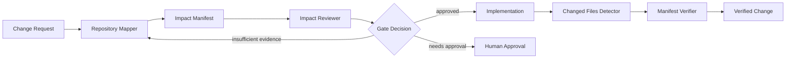

# Change Impact Analysis Gate

A reusable AI-assisted pre-implementation gate for mapping the blast radius of a proposed code change before editing begins.

## Problem

Changes that look local often affect API contracts, database behavior, background jobs, configuration, tests, integrations, observability, deployment, or downstream consumers. Coding agents are especially vulnerable to this because they can implement a plausible local fix without proving which surrounding behavior may change.

This kit forces a structured impact analysis before implementation and validates the resulting impact manifest with deterministic scripts.

## When to use

Use this kit before:

- modifying public APIs or shared libraries;
- changing database models, migrations, queries, or persistence behavior;
- altering background jobs, queues, scheduled tasks, or event handlers;
- refactoring code used by multiple modules;
- changing configuration, feature flags, permissions, or authentication;
- upgrading dependencies with non-trivial behavioral impact;
- implementing bug fixes where the execution path is not isolated.

Skip the full workflow only for clearly isolated documentation-only or formatting-only changes.

## Architecture



The package combines:

- **Skills** for semantic repository tracing and contract-risk analysis.
- **Rules** that prohibit editing before minimum evidence exists.
- **Subagents** with non-overlapping responsibilities: mapping and independent review.
- **Workflow** defining entry conditions, checkpoints, retries, approval boundaries, and Definition of Done.
- **Hooks** for deterministic pre-edit and pre-completion validation.
- **Scripts** for changed-file detection and manifest verification.
- **Schema** defining the expected impact-manifest structure.

## Package structure

```text
change-impact-analysis-gate/
├── README.md
├── skills/
│   ├── change-impact-analysis.md
│   └── contract-risk-assessment.md
├── rules/
│   └── change-safety.md
├── subagents/
│   ├── repository-mapper.md
│   └── impact-reviewer.md
├── workflows/
│   └── change-impact-gate.md
├── hooks/
│   └── hooks.md
├── scripts/
│   ├── detect-changed-files.py
│   └── verify-impact-manifest.py
├── schemas/
│   └── impact-manifest.schema.json
└── templates/
    └── impact-manifest.example.json
```

## Installation

Copy the `change-impact-analysis-gate` directory into your repository, for example under `.ai/change-impact-analysis-gate/`.

Requirements:

- Git available in the target repository;
- Python 3.9+ for deterministic helper scripts;
- an AI coding agent capable of reading repository files and running approved local commands.

No product-specific agent syntax is required.

## Configuration

Optional environment variables:

- `IMPACT_BASE_REF`: Git ref used by `detect-changed-files.py`; defaults to `HEAD` when omitted.
- `IMPACT_MANIFEST`: manifest path; defaults to `impact-manifest.json`.
- `IMPACT_ALLOW_UNTRACKED`: set to `1` to include untracked files in changed-file output.

Recommended repository-specific customization:

- add protected paths to `rules/change-safety.md`;
- add project-specific test/build commands to `hooks/hooks.md`;
- define contract surfaces such as OpenAPI, protobuf, GraphQL, database migration, event schema, or public package files.

## Usage

Example request:

> Change the order cancellation flow so that refunds are queued instead of executed synchronously.

Run the workflow before editing. The Repository Mapper traces the request entry point, queue producer, consumers, payment integration, state transitions, retry behavior, tests, dashboards, and configuration. It writes `impact-manifest.json` using the provided schema.

The Impact Reviewer then challenges missing dependencies and classifies risk. If the change introduces a new queue, changes durable message shape, modifies a public API, alters schema, or touches production configuration, implementation requires explicit human approval.

After implementation:

```bash
python .ai/change-impact-analysis-gate/scripts/detect-changed-files.py --base HEAD~1 --output changed-files.json
python .ai/change-impact-analysis-gate/scripts/verify-impact-manifest.py \
  --manifest impact-manifest.json \
  --changed-files changed-files.json
```

The verifier fails if changed files are outside the manifest's declared implementation or expected-supporting files unless explicitly acknowledged.

## Workflow

1. **Trigger** — receive a non-trivial proposed change.
2. **Context gathering** — identify entry points, callers, callees, state mutation, contracts, dependencies, tests, and operational surfaces.
3. **Manifest creation** — record affected components, evidence, expected files, risks, tests, and approvals.
4. **Independent review** — challenge unsupported assumptions and missing blast-radius areas.
5. **Gate decision** — approve, request more evidence, or require human approval.
6. **Implementation** — edit only after the gate passes.
7. **Post-edit detection** — compute actual changed files.
8. **Verification** — compare actual changes against declared impact and run relevant build/tests.
9. **Completion** — report both implementation status and verification status.

Detailed behavior is defined in `workflows/change-impact-gate.md`.

## Safety

Human approval is mandatory before:

- database schema or migration changes;
- breaking API/event contract changes;
- production configuration or infrastructure changes;
- secret or permission changes;
- destructive data operations;
- force push or history rewrite;
- large dependency upgrades with broad transitive impact.

The workflow never treats absence of evidence as evidence of no impact.

## Verification

A task is **implemented** when the requested code change exists.

A task is **verified** only when all applicable conditions hold:

- impact manifest passes structural validation;
- actual changed files are accounted for;
- required build/tests pass;
- declared contracts were checked;
- no unexpected protected path changed;
- required human approvals are recorded;
- unresolved risks are explicitly reported.

## Failure and recovery

- Repository search failure: retry once with narrower terms and once with a different navigation path; then stop and report missing evidence.
- Build/test transient failure: retry at most twice only when the failure is plausibly environmental.
- Same deterministic failure twice: stop; do not keep retrying.
- Manifest mismatch: update the analysis only if new evidence explains the file; otherwise revert or escalate the unexpected change.
- Missing approval: stop before the dangerous action.

## Customization

The easiest extension points are:

- add impact categories in `schemas/impact-manifest.schema.json`;
- add repository-specific MUST/MUST NOT rules;
- extend hooks with native build/test commands;
- add specialized reviewers for security, database, or performance-heavy repositories;
- integrate the verifier into CI as a pull-request gate.
