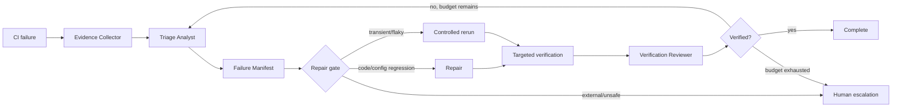

# CI Failure Triage and Repair

## Problem
CI failures mix real regressions, flaky tests, environment outages, dependency/network problems, configuration mistakes, and unrelated pre-existing failures. Coding agents often react by changing production code too early or repeatedly rerunning jobs without evidence. This kit creates an evidence-first triage and bounded repair loop.

## When to use
Use after a CI build, test, lint, packaging, or integration pipeline fails and the failure must be diagnosed before code is changed. It is suitable for GitHub Actions, Azure DevOps, GitLab CI, Jenkins, and other systems when logs/artifacts can be supplied locally.

## Architecture

Skills perform semantic diagnosis and verification design. Rules constrain edits and retries. The Triage Analyst classifies the failure; the Verification Reviewer independently evaluates evidence. Hooks call deterministic scripts to normalize logs and validate the manifest. Scripts never mutate source or trigger remote deployments.

## Package structure
```text
ci-failure-triage-and-repair/
├── README.md
├── skills/
│   ├── ci-failure-triage.md
│   └── repair-verification.md
├── rules/ci-repair-safety.md
├── subagents/
│   ├── triage-analyst.md
│   └── verification-reviewer.md
├── workflows/ci-failure-repair-loop.md
├── hooks/hooks.md
├── scripts/
│   ├── normalize-ci-log.py
│   └── verify-failure-manifest.py
├── schemas/failure-manifest.schema.json
└── templates/failure-manifest.example.json
```

## Installation
Copy this directory to `.ai/ci-failure-triage-and-repair/`. Requires Python 3.9+. Give the agent read access to repository files and CI logs; grant write/command permissions only according to `rules/ci-repair-safety.md`.

## Configuration
Optional environment variables: `CI_TRIAGE_MAX_LOG_LINES` (default `4000`) and `CI_TRIAGE_MAX_REPAIR_ATTEMPTS` (default `2`). Supply CI logs as files; do not place secrets in manifests. Customize repository build/test commands in `hooks/hooks.md`.

## Usage
For a failing pipeline, save the relevant log as `ci.log`, then run:
```bash
python .ai/ci-failure-triage-and-repair/scripts/normalize-ci-log.py ci.log --output ci.normalized.log
```
Give the normalized log, failed job/step name, commit/ref, expected behavior, and recent diff to the Triage Analyst. It produces `failure-manifest.json`. Validate it before repair:
```bash
python .ai/ci-failure-triage-and-repair/scripts/verify-failure-manifest.py failure-manifest.json
```
Implement only the repair authorized by the manifest, run targeted verification, and hand evidence to the Verification Reviewer.

## Workflow
The lifecycle is Evidence Collection → Classification → Hypothesis Ranking → Repair Gate → Minimal Repair or Controlled Rerun → Targeted Verification → Independent Review. A failed hypothesis may be replaced at most twice. Identical transient reruns are limited to two. The workflow stops when evidence is insufficient, a dangerous action is required, or the repair budget is exhausted.

## Safety
Explicit human approval is required for production deployment, secret/permission changes, infrastructure changes, database schema changes, disabling security checks, deleting tests to obtain green CI, force pushes, breaking public contracts, or broad dependency upgrades. The agent must never weaken assertions or suppress failures merely to make CI pass.

## Verification
`Task completed` means a candidate repair exists. `Task verified` additionally requires: manifest validation, reproduction or credible causal evidence, targeted checks passing, applicable broader tests/build passing, no unrelated changes, and independent review confirming the original failure mechanism is addressed.

## Failure and recovery
If logs are truncated, request/use artifacts or rerun only when permitted; otherwise stop with `insufficient-evidence`. If the same deterministic failure persists after two repair attempts, stop and escalate with evidence. If a rerun changes the symptom, create a new hypothesis rather than pretending the original repair succeeded. External service outages are reported, not patched around in application code unless resilience is explicitly required.

## Customization
Add CI-provider adapters only around evidence collection; keep core classification portable. Extend the failure taxonomy in the schema, repository commands in hooks, and approval boundaries in rules. For monorepos, add component-aware test selection without changing the workflow contract.
