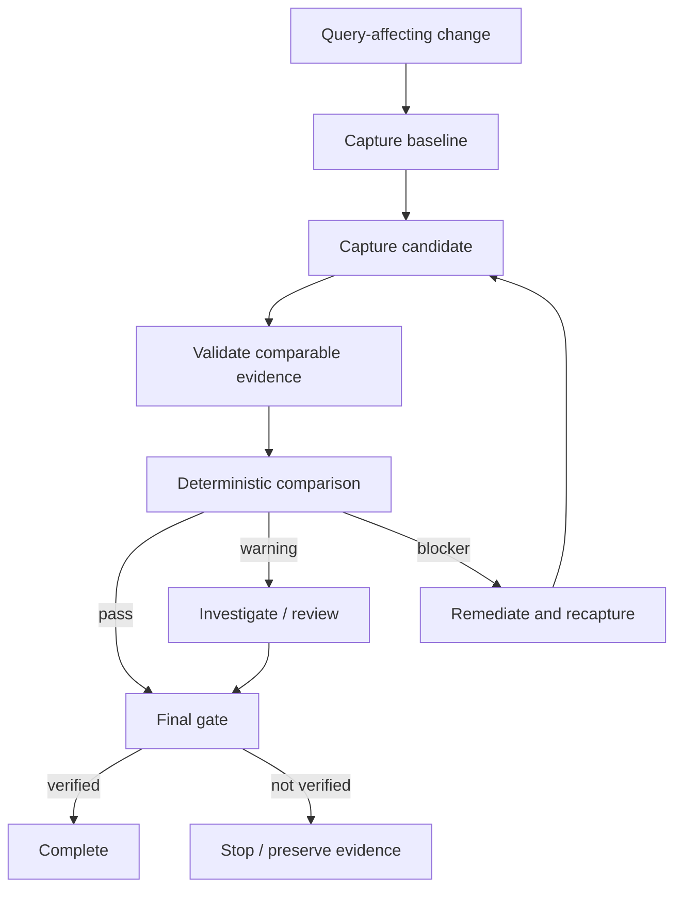

# Database Query Plan Regression Gate

A reusable AI-engineering kit for preventing SQL/ORM changes from being declared safe merely because functional tests pass while the database execution plan or measured query cost materially regresses.

## Problem

AI coding agents can change SQL, LINQ/EF Core, query-builder expressions, projections, joins, parameterization, providers, indexes, or schema in ways that preserve correctness but introduce full scans, spills, expensive sorts/hashes/lookups, cardinality-estimate errors, or large increases in logical reads, CPU, and duration. These regressions are often invisible to normal unit/integration tests.

## Purpose

This package turns plan/performance evidence into a repeatable gate:

1. Capture comparable baseline and candidate plan evidence.
2. Normalize SQL Server Showplan XML or PostgreSQL EXPLAIN JSON to a common contract.
3. Validate evidence deterministically.
4. Compare runtime/read/operator/cardinality metrics using configurable thresholds.
5. Investigate warnings/blockers with bounded agent behavior.
6. Require review where appropriate.
7. Fail closed on deterministic blockers, stale/incomparable evidence, or missing approval.
8. Distinguish `task_executed` from `task_verified`.

## When to use

Use when changes can alter database query behavior, including:

- SQL text or stored query changes.
- EF Core/LINQ query-shape changes.
- Projection/include/join/filter/order/group changes.
- Query-builder/provider upgrades.
- Parameterization changes.
- Index/schema/statistics-sensitive changes.
- Performance fixes whose correctness must be proven against a baseline.

## When not to use

Do not use this package as a substitute for load testing, capacity testing, production observability, database-specific expert review, or repository functional tests. It does not automatically execute database mutations or create indexes.

## Architecture



## Package tree

```text
database-query-plan-regression-gate/
├── README.md
├── config/
│   └── query-plan-policy.json
├── examples/
│   └── query-plan-review.example.json
├── hooks/
│   └── query-plan-regression-hooks.md
├── rules/
│   └── query-plan-regression-governance.md
├── schemas/
│   ├── query-plan-evidence.schema.json
│   └── query-plan-review.schema.json
├── scripts/
│   ├── compare-query-plans.py
│   ├── evaluate-query-plan-gate.py
│   ├── extract-postgres-explain.py
│   ├── extract-sqlserver-showplan.py
│   └── validate-query-plan-evidence.py
├── skills/
│   ├── capture-comparable-query-plan-evidence.md
│   └── investigate-query-plan-regression.md
├── subagents/
│   ├── query-plan-analyst.md
│   └── query-plan-reviewer.md
├── templates/
│   └── query-plan-evidence.example.json
├── tests/
│   └── smoke-test.py
└── workflows/
    └── query-plan-regression-workflow.md
```

## Component responsibilities

- `config/query-plan-policy.json`: comparison thresholds, comparability rules, review separation, retry limits.
- `schemas/query-plan-evidence.schema.json`: portable normalized evidence contract.
- `schemas/query-plan-review.schema.json`: reviewer handoff contract.
- `scripts/extract-sqlserver-showplan.py`: normalize SQL Server Showplan XML plus measured metrics.
- `scripts/extract-postgres-explain.py`: normalize PostgreSQL `EXPLAIN (ANALYZE, BUFFERS, FORMAT JSON)` output.
- `scripts/validate-query-plan-evidence.py`: stdlib structural/domain validation.
- `scripts/compare-query-plans.py`: deterministic threshold/operator/cardinality/freshness comparison and fingerprinting.
- `scripts/evaluate-query-plan-gate.py`: final evidence/review gate; deterministic blockers cannot be overridden by review.
- `skills/`: agent procedures for comparable capture and focused regression investigation.
- `subagents/`: separated analyst/reviewer ownership.
- `hooks/`: lifecycle integration points for agent loops or CI.
- `tests/smoke-test.py`: network-free smoke coverage of pass/warning/block/mismatch/staleness branches.

## Dependencies

Core scripts require Python 3.9+ standard library only. Database plan capture itself depends on your database tooling; this kit consumes captured Showplan/EXPLAIN artifacts and measured metrics.

## Installation

Copy this folder into the repository or shared agent-tooling repository. No Python package installation is required.

Optionally make scripts executable on Unix-like systems:

```bash
chmod +x scripts/*.py tests/smoke-test.py
```

## Configuration

Edit `config/query-plan-policy.json` to match organizational thresholds. Defaults include warning/block percentages for duration, CPU, logical reads, cardinality-estimate ratios, blocking policies for newly introduced full scans/spills, and a 120-minute maximum evidence age.

Policy changes should be separately reviewed. Do not weaken thresholds inside a query-change PR merely to make the candidate pass.

## Evidence contract

Every normalized evidence record binds:

- `query_id`
- database `engine`
- timezone-aware `captured_at`
- `dataset_profile`
- `source_revision`
- environment
- measured duration/CPU/logical reads
- estimated and actual rows
- normalized operator counts

Preserve the original plan artifact separately for high-risk review. The normalized record is an automation contract, not a replacement for the original plan.

## SQL Server example

Capture an actual Showplan XML using approved tooling, collect measured duration/CPU/logical reads, then normalize:

```bash
python scripts/extract-sqlserver-showplan.py plan.sqlplan \
  --query-id orders-by-customer \
  --dataset-profile staging-10m-orders-p95 \
  --source-revision abc123 \
  --environment staging \
  --duration-ms 120 \
  --cpu-ms 80 \
  --logical-reads 1500 \
  --output candidate.json
```

The extractor uses conservative operator heuristics. Critical conclusions must be checked against the original Showplan XML.

## PostgreSQL example

Capture `EXPLAIN (ANALYZE, BUFFERS, FORMAT JSON)` in a safe environment, then normalize:

```bash
python scripts/extract-postgres-explain.py explain.json \
  --query-id orders-by-customer \
  --dataset-profile staging-10m-orders-p95 \
  --source-revision abc123 \
  --environment staging \
  --output candidate.json
```

The adapter uses execution time as a conservative CPU proxy because PostgreSQL EXPLAIN does not directly provide process CPU time. For critical CPU conclusions, replace/augment this with an external measured CPU metric in a custom adapter.

## Validate evidence

```bash
python scripts/validate-query-plan-evidence.py baseline.json
python scripts/validate-query-plan-evidence.py candidate.json
```

Do not proceed if either validation fails.

## Compare plans

```bash
python scripts/compare-query-plans.py baseline.json candidate.json \
  --policy config/query-plan-policy.json \
  --output comparison.json
```

Comparison statuses:

- `pass`: thresholds/operators are acceptable.
- `review-required`: non-blocking warning exceeded policy threshold.
- `blocked`: deterministic blocker such as stale/incomparable evidence, new full scan/spill, or blocking metric/cardinality regression.

The comparison fingerprints the baseline, candidate, and full policy content. Any evidence or policy change creates a new fingerprint and invalidates prior review.

## Review

For `review-required`, create a review matching `schemas/query-plan-review.schema.json` and bind it to the current comparison fingerprint. `examples/query-plan-review.example.json` shows the shape.

High/critical findings require independent review according to policy, but a deterministic blocker still cannot be overridden by the final gate. Remediate and recapture; if organizational policy itself must change, handle that through a separately governed policy-change process.

## Final gate

Without review when none is required:

```bash
python scripts/evaluate-query-plan-gate.py comparison.json \
  --policy config/query-plan-policy.json \
  --output gate.json
```

With review:

```bash
python scripts/evaluate-query-plan-gate.py comparison.json \
  --policy config/query-plan-policy.json \
  --review review.json \
  --output gate.json
```

Success requires `gate.json.status == "verified"` and exit code `0`.

## Workflow

Use `workflows/query-plan-regression-workflow.md` as the end-to-end operating procedure and `hooks/query-plan-regression-hooks.md` for pre-task, post-capture, post-edit, approval, and final-verification integration.

Core flow:

```text
Trigger
  ↓
Comparable baseline
  ↓
Candidate capture
  ↓
Validate
  ↓
Compare
  ↓
Investigate/remediate if needed
  ↓
Review when required
  ↓
Final gate
  ↓
Verified or stop
```

## Approval boundaries

The package never authorizes dangerous database actions. Explicit human approval is required before production deployment, destructive SQL, index/schema changes, protected-environment statistics/config changes, irreversible migrations, security weakening, or other production mutations covered by organizational policy.

A permission failure must not cause an agent to silently increase privileges.

## Failure and recovery

- Transient plan-capture/tool failure: retry once and preserve the first error.
- Validation failure: no blind retry; fix or recapture evidence.
- Regression failure: investigate/remediate; do not retry unchanged evidence.
- Incomparable engine/query/dataset profile: stop and recapture comparable evidence.
- Baseline/candidate evidence older than the configured freshness window: stop and recapture.
- Stale review fingerprint: block and re-review current comparison.
- Missing permission/approval: stop without escalating privilege.
- Repeated capture failure after one retry: preserve diagnostics and escalate.

There are no infinite loops.

## Verification

Run the package smoke test:

```bash
python tests/smoke-test.py
```

The smoke test covers:

1. Small non-regressing candidate → `verified`.
2. Warning-level duration increase → review → `verified`.
3. Blocking logical-read/full-scan regression → remains `blocked` even with attempted review override.
4. Dataset-profile mismatch → `blocked`.
5. Candidate evidence older than the configured freshness window → `blocked`.

For a real repository, smoke-test success proves the kit behavior, not the query change itself. The real task additionally requires representative plan evidence, repository tests/build, and any project-specific acceptance checks.

## Definition of Done

The query-affecting task is complete only when:

- Baseline and candidate evidence are valid, fresh, and comparable.
- Evidence binds current source revisions and policy.
- Original plans are preserved where material.
- Deterministic comparison contains no unresolved blocker.
- Warning-level findings have required current review.
- High-risk work has independent review where policy requires it.
- Required human approvals were obtained before dangerous actions.
- Repository functional/build tests pass.
- Final gate returns `verified`.
- Remaining risks are documented.

## Portability

The workflow is tool-neutral and can be driven by ChatGPT, Codex, Claude Code, Cursor, GitHub Copilot, OpenCode, CI pipelines, or custom agents. Database-specific behavior is isolated in extractor scripts and evidence capture; the validation/comparison/review/final-gate contracts remain reusable.

For another database engine, add a small adapter that emits the existing evidence schema rather than changing the core workflow.
