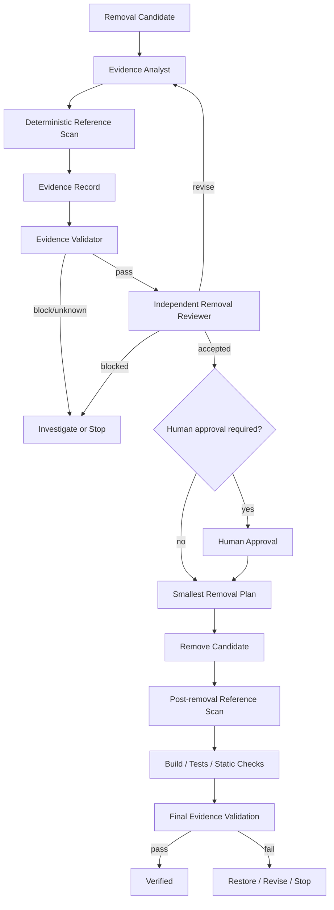

# Dead Code Removal Evidence Gate

## Problem

Deleting apparently unused code is deceptively risky. IDEs and compilers usually see static references, but production systems may reach code through dependency-injection scanning, reflection, serialization, routing, plugin discovery, background-job names, configuration keys, templates, scripts, generated code, external API clients, event consumers, or operational tooling.

A coding agent that sees “0 references” and deletes immediately can create a regression that only appears in production. This kit turns removal into an evidence-gated workflow. A candidate is first investigated across multiple channels, independently reviewed, explicitly approved when high-risk, then removed with a bounded verification loop.

The core invariant is:

> **No static reference is evidence, not proof. Removal is complete only after independent review and post-removal verification.**

## Purpose

Use this package to standardize repository cleanup and legacy-code removal so that developers and AI coding agents can distinguish:

- `investigating` — evidence is incomplete.
- `candidate` — no blocking use has been found, but review has not approved removal.
- `blocked` — a live reference or unresolved blocking risk exists.
- `approved-pending-human` — technically reviewable but a required human approval is missing.
- `approved-for-removal` — evidence and independent review permit the reviewed change.
- `removed` — code was removed, but this does not itself prove correctness.

Verification is separately tracked as `unverified`, `partially-verified`, `verified`, or `failed`.

## When to use

Use the gate when:

- Static analysis reports unused symbols or files.
- A feature/integration has been retired.
- A refactor leaves an old adapter, service, endpoint, job, or config key behind.
- A dependency upgrade makes compatibility code obsolete.
- A repository cleanup proposes deleting legacy modules.
- An AI coding agent suggests deletion as part of simplification.
- Tests or registrations look obsolete but runtime behavior is uncertain.

## When not to use

This is not a replacement for a dedicated migration/deprecation process when removing a public API, event schema, database object, externally consumed CLI/config contract, or other compatibility boundary. The gate can provide evidence, but those removals still require the appropriate migration workflow and explicit human approval.

Do not use “clear” text search results as permission to remove generated/vendor code or externally managed assets.

## Architecture



### Component responsibilities

- **Skills** define the reusable semantic procedures for evidence collection and safe removal planning.
- **Rules** define enforceable behavior and hard safety boundaries.
- **Evidence Analyst** owns evidence collection but cannot edit/delete the candidate or approve removal.
- **Removal Reviewer** independently challenges false-negative risk and cannot perform the removal.
- **Workflow** defines stage ownership, bounded retries, approval points, and Definition of Done.
- **Hooks** map lifecycle events to deterministic commands.
- **Reference scanner** performs conservative repository-wide text searches and emits JSON evidence. It explicitly does not claim to prove dead code.
- **Evidence validator** enforces required channels, live-reference blocking, reviewer independence, approvals, and final verification state.
- **Policy** centralizes status values, required channels, retry limits, high-risk actions, and exposure rules.
- **Schema/template/example** provide stable handoff contracts.
- **Smoke test** verifies the deterministic gate accepts a valid candidate, blocks an unknown channel, and accepts a fully verified removal record.

## Package structure

```text
dead-code-removal-evidence-gate/
├── README.md
├── skills/
│   ├── dead-code-evidence-collection.md
│   └── removal-plan-and-verification.md
├── rules/
│   └── dead-code-governance.md
├── subagents/
│   ├── evidence-analyst.md
│   └── removal-reviewer.md
├── workflows/
│   └── dead-code-removal-workflow.md
├── hooks/
│   └── hooks.md
├── scripts/
│   ├── scan-references.py
│   └── validate-evidence.py
├── config/
│   └── dead-code-policy.json
├── schemas/
│   └── dead-code-evidence.schema.json
├── templates/
│   └── evidence-record.json
├── examples/
│   └── internal-candidate.json
└── tests/
    └── smoke-test.py
```

## Installation

Copy the folder into your repository, for example:

```text
.ai/dead-code-removal-evidence-gate/
```

The scripts require Python 3.9+ and use only the Python standard library.

No secrets, API keys, model-specific SDKs, or external Python packages are required.

Create a working evidence directory that is ignored by Git unless your team intentionally commits review evidence:

```text
.dead-code/
```

Adapt agent/tool integration separately. The package is intentionally tool-neutral and can be referenced from Codex, Claude Code, Cursor, ChatGPT, Copilot, OpenCode, or another agent environment.

## Configuration

Edit `config/dead-code-policy.json` for repository-specific needs.

Important fields:

- `required_channels` — evidence channels every candidate must resolve.
- `runtime_evidence_required_for_exposure` — exposure classes that require runtime evidence.
- `high_risk_candidate_kinds` — candidate kinds that deserve stronger review/approval handling.
- `human_approval_required_for` — irreversible/high-impact actions agents may not perform autonomously.
- `max_review_revisions` — defaults to one evidence revision after reviewer feedback.
- `max_transient_retries` — defaults to one retry for transient tool failures.
- `fail_on_unknown_required_channel` — should remain `true` for fail-closed behavior.
- `fail_on_live_reference` — should remain `true`.
- `require_independent_review` — should remain `true` for removal-ready decisions.

If your framework uses runtime discovery, add explicit checks to the Evidence Analyst procedure rather than weakening the policy.

Examples include:

- ASP.NET Core endpoint/controller discovery.
- .NET DI assembly scanning.
- Hangfire recurring/background job names.
- MediatR handlers.
- JSON serializer type/member names.
- Entity Framework configuration or migrations.
- Plugin/assembly loading.
- Queue/topic/event subscription names.
- Java/Spring annotation scanning.
- JavaScript framework dynamic imports.

## Input contract

Start from `templates/evidence-record.json`.

The record identifies:

- Candidate identifier, kind, path, visibility, and exposure.
- Repository root and exact revision.
- Candidate lifecycle status.
- Verification status.
- Evidence channels and limitations.
- Independent review decision.
- Human approvals.
- Pre/post scan and build/test artifacts.
- Remaining risks.

The JSON Schema documents the stable shape, while `scripts/validate-evidence.py` performs the policy semantics used by the gate.

## Usage

### 1. Create an evidence record

```bash
mkdir -p .dead-code
cp templates/evidence-record.json .dead-code/evidence.json
```

Fill in the candidate identity and repository revision before investigation.

### 2. Run deterministic reference discovery

```bash
python scripts/scan-references.py \
  --repo . \
  --candidate LegacyPaymentAdapter \
  --output .dead-code/reference-scan-before.json
```

The scanner searches common source/config/build/documentation file formats, ignores standard generated/vendor/build directories, derives common name variants, and records line-level matches.

A zero-match report means only:

```text
No matching text reference was found in the files that were searched.
```

It does **not** mean:

```text
The candidate is safe to delete.
```

The Evidence Analyst must still resolve dynamic discovery, registration/configuration, tests, contracts, and runtime evidence when required.

### 3. Validate evidence before review

```bash
python scripts/validate-evidence.py \
  .dead-code/evidence.json \
  --policy config/dead-code-policy.json
```

Any `reference-found` or required `unknown` channel blocks progression.

### 4. Independent review

Give the evidence record and repository context to the role defined in `subagents/removal-reviewer.md`.

The reviewer may return:

- `accepted`
- `revise`
- `blocked`

Only one reviewer-driven evidence revision is allowed by the default workflow before escalation.

### 5. Check removal readiness

After the reviewer accepts and required human approvals have been recorded:

```bash
python scripts/validate-evidence.py \
  .dead-code/evidence.json \
  --policy config/dead-code-policy.json \
  --require-removal-ready
```

The command must return exit code 0 and `removal_ready=true` before the removal step.

### 6. Perform the smallest reviewed removal

Follow `skills/removal-plan-and-verification.md`.

Do not combine the removal with unrelated cleanup. Remove only the candidate and directly orphaned artifacts that were explicitly included in the reviewed plan.

### 7. Re-scan after removal

```bash
python scripts/scan-references.py \
  --repo . \
  --candidate LegacyPaymentAdapter \
  --output .dead-code/reference-scan-after.json
```

Investigate any remaining reference, registration, config key, route, serialization name, job identifier, or related artifact before continuing.

### 8. Build and test

Run your repository-specific commands. Examples only—replace with actual project commands:

```bash
dotnet build

dotnet test
```

Record the actual executed checks in `artifacts.build_test_evidence`.

### 9. Final verification

Set the record to `status=removed` and `verification_status=verified` only after required checks succeed, then run:

```bash
python scripts/validate-evidence.py \
  .dead-code/evidence.json \
  --policy config/dead-code-policy.json \
  --require-verified
```

A deletion is not successful merely because the compiler still builds.

## Workflow

The full lifecycle is documented in `workflows/dead-code-removal-workflow.md`:

```text
Candidate
→ classify exposure
→ collect multi-channel evidence
→ deterministic validation
→ independent review
→ human approval when required
→ smallest removal
→ post-removal scan
→ build/tests/static checks
→ diff review
→ verified
```

### Retry policy

- Transient tool/environment failures: retry at most once and preserve the original failure.
- Reviewer `revise`: one revision cycle; a second request escalates/stops.
- Deterministic build/test/reference failures: do not blindly rerun. Diagnose, restore, revise, or stop.

There are no indefinite autonomous loops.

## Safety and approval boundaries

The agent must stop for explicit human approval before actions such as:

- File deletion when governed as a destructive action by the host workflow.
- Public or external contract removal.
- Database object/schema/data removal.
- Production configuration changes.
- Infrastructure changes.
- Security-control removal.
- Git history rewriting.

The package never grants extra permissions and never treats missing permissions as a reason to weaken a gate.

For public/external contracts, repository-local silence is insufficient because consumers may live outside the repository.

## Failure handling

### Live reference found
Detection: any required channel is `reference-found`.

Action: set/keep status `blocked`, preserve evidence, and stop removal.

### Required channel unknown
Detection: dynamic/config/contract/runtime evidence cannot be established.

Action: keep `investigating`; do not convert uncertainty into `clear`.

### Ambiguous candidate
Detection: multiple symbols/config keys/routes share the same identifier.

Action: stop and refine candidate identity before continuing.

### Tool failure
Retry once only if clearly transient. If the same failure persists, record the channel as unknown and stop removal progression.

### Missing human approval
Status may remain `approved-pending-human`; no removal action occurs.

### Post-removal regression
Preserve first failure, investigate once, then restore/revise or stop. Do not weaken tests or patch unrelated behavior just to retain the deletion.

## Verification strategy

A removal is verified only when all applicable evidence exists:

1. Evidence record passes policy validation.
2. Independent reviewer accepted.
3. Required human approvals exist.
4. Removal scope matches the reviewed plan.
5. Post-removal reference scan is clear or remaining matches are explicitly explained.
6. Targeted tests pass.
7. Required build/regression/static checks pass.
8. No unexpected files changed.
9. No stale registrations/config/routes/contracts remain.
10. `scripts/validate-evidence.py --require-verified` exits 0.

This deliberately separates:

```text
Task executed: code was deleted.
```

from:

```text
Task verified successfully: evidence shows the reviewed removal is safe under the configured checks.
```

## Definition of Done

The package considers a removal done only when:

- Candidate identity and repository revision were recorded.
- All policy-required evidence channels were resolved.
- No blocking live reference remains.
- Independent review is accepted.
- Required approvals were obtained.
- The implemented change stayed inside reviewed scope.
- Post-removal scan completed.
- Required build/tests/static checks passed.
- Remaining risks are documented.
- Final evidence record validates with `verification_status=verified`.

## Smoke test

Run:

```bash
python tests/smoke-test.py
```

It verifies three deterministic cases:

- A fully evidenced internal candidate is removal-ready.
- An unknown required dynamic-discovery channel is blocked.
- A removed candidate with post-scan and build/test evidence can be validated as verified.

## Customization

The easiest extension points are:

1. **Policy:** add candidate kinds, exposure classes, or approval actions in `config/dead-code-policy.json`.
2. **Evidence channels:** add framework-specific channels to the template and Evidence Analyst skill.
3. **Scanner file types/ignores:** update `TEXT_EXTENSIONS` and `DEFAULT_IGNORES` in `scripts/scan-references.py`.
4. **Build/test hooks:** replace example commands with repository-native commands.
5. **Runtime evidence:** define required telemetry source, minimum observation period, instrumentation coverage, and acceptable limitations for your system.
6. **Agent adapters:** map the tool-neutral Evidence Analyst and Removal Reviewer roles into your coding-agent product without changing the core contract.

Keep the central safety property unchanged: **uncertainty blocks removal; generated code is not proof; deletion is not verification.**