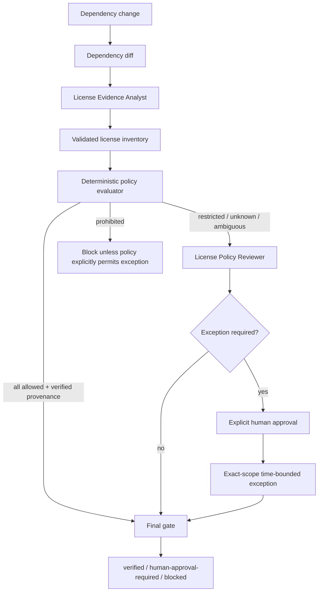

# dependency-license-policy-gate

Reusable AI engineering kit for preventing dependency additions/upgrades from silently introducing prohibited, incompatible, unknown, or weakly evidenced software licenses.

## Problem
AI coding agents can add or upgrade packages quickly, but dependency changes also change legal/distribution obligations. A package may have a different license at the candidate version, ambiguous dual-license metadata, an unverified source, or no trustworthy license metadata at all. Treating package installation success as dependency safety creates a blind spot.

This kit turns dependency-license checks into a repeatable evidence and verification workflow rather than an ad-hoc prompt.

## Purpose
- Capture exact dependency/version/source provenance.
- Normalize license evidence without guessing.
- Classify licenses against repository policy.
- Fail closed on unknown or conflicting evidence.
- Require independent review for restricted/prohibited/unknown/exception paths.
- Bind exceptions to exact package/version/source/license/policy and expiry.
- Distinguish a scan that executed from a dependency set that was verified successfully.

## When to use
Use when an agent or developer:
- adds a dependency;
- upgrades or replaces a package;
- changes package source/registry;
- vendors third-party code;
- changes an SBOM or generated dependency graph;
- prepares merge/release after dependency changes.

## When not to use
Do not use this kit as a substitute for legal advice or organization-specific legal review. The included policy is an example engineering control and must be customized for the repository's licensing/distribution requirements.

## Architecture



## Package tree

```text
dependency-license-policy-gate/
├── README.md
├── config/
│   └── license-policy.json
├── examples/
│   ├── license-exception.example.json
│   └── license-review.example.json
├── hooks/
│   └── dependency-license-hooks.md
├── rules/
│   └── dependency-license-governance.md
├── schemas/
│   ├── license-inventory.schema.json
│   └── license-review.schema.json
├── scripts/
│   ├── evaluate-license-gate.py
│   ├── evaluate-license-policy.py
│   └── validate-license-inventory.py
├── skills/
│   ├── dependency-license-evidence-capture.md
│   └── license-policy-review.md
├── subagents/
│   ├── license-evidence-analyst.md
│   └── license-policy-reviewer.md
├── templates/
│   └── license-inventory.example.json
├── tests/
│   └── smoke-test.py
└── workflows/
    └── dependency-license-policy-workflow.md
```

## Component responsibilities

### Skills
`skills/dependency-license-evidence-capture.md` defines exact evidence collection, provenance binding, uncertainty handling, validation, failure handling, and stop conditions.

`skills/license-policy-review.md` defines deterministic classification, review/exception requirements, status semantics, and final verification.

### Rules
`rules/dependency-license-governance.md` contains testable MUST/MUST NOT/SHOULD rules for evidence, provenance, dual-license handling, exception scope, secrets, Git/release boundaries, and policy changes.

### Subagents
`subagents/license-evidence-analyst.md` owns evidence capture and cannot approve exceptions.

`subagents/license-policy-reviewer.md` independently evaluates non-allowed findings and cannot rewrite evidence to make a dependency pass.

### Workflow
`workflows/dependency-license-policy-workflow.md` connects dependency diff, evidence capture, deterministic evaluation, independent review, human approval, and final gate with bounded retry rules.

### Hooks
`hooks/dependency-license-hooks.md` defines pre-change, post-change, pre-merge/release, and drift invalidation hooks.

### Deterministic scripts
- `scripts/validate-license-inventory.py`: validates required inventory fields, identity uniqueness, evidence confidence, references, and policy shape.
- `scripts/evaluate-license-policy.py`: hashes the inventory, classifies each license expression against policy, enforces provenance confidence, and emits preliminary status.
- `scripts/evaluate-license-gate.py`: verifies inventory/policy freshness, independent review requirements, prohibited findings, exact exception binding, expiry, and max exception lifetime.

All scripts use Python standard library only.

## Installation

Copy this directory into the repository, for example:

```text
.ai/dependency-license-policy-gate/
```

Requirements:
- Python 3.9+
- access to dependency manifests/lockfiles/SBOM or package metadata;
- read-only access to package/upstream metadata when evidence must be collected.

No Python packages are required by the deterministic scripts.

## Configuration

Customize `config/license-policy.json` before use.

The default example defines:
- permissive licenses as `allowed`;
- selected weak-copyleft licenses as `restricted`;
- AGPL/SSPL examples as `prohibited`;
- unknown evidence as blocking;
- restricted/unknown/partial/ambiguous findings as exceptionable only with exact human approval;
- prohibited findings as non-exceptionable;
- maximum exception validity of 168 hours.

These are engineering defaults for the kit, not universal legal conclusions.

## Evidence model

Each changed dependency must contain:
- `package_key`
- `ecosystem`
- `name`
- `version`
- `change_type`
- `source_fingerprint`
- `license_expression`
- `raw_license`
- `evidence_confidence`
- `evidence_references`
- `direct`

Evidence preference:
1. candidate artifact/package metadata;
2. exact source tag/commit license file;
3. official package registry metadata;
4. approved internal record explicitly applicable to the candidate identity.

Never infer a license from package popularity, author, neighboring versions, or a similarly named package.

## Usage

### 1. Build the inventory
Start from `templates/license-inventory.example.json` and replace the fixture values with exact evidence for every changed dependency.

### 2. Validate the inventory

```bash
python scripts/validate-license-inventory.py \
  --inventory artifacts/license-inventory.json \
  --policy config/license-policy.json
```

Expected success output:

```text
VALID
```

### 3. Evaluate policy

```bash
python scripts/evaluate-license-policy.py \
  --inventory artifacts/license-inventory.json \
  --policy config/license-policy.json \
  --output artifacts/license-evaluation.json
```

Exit/status semantics:
- exit `0`: `verified` preliminary policy result;
- exit `3`: `human-approval-required`;
- exit `4`: `blocked`.

### 4. Perform independent review when required
Create a review record following `schemas/license-review.schema.json`. `examples/license-review.example.json` shows the contract.

For restricted/prohibited/unknown/partial/ambiguous/exception paths, the reviewer must be independent of the evidence analyst.

### 5. Supply a human-approved exception only where policy permits
Use the structure in `examples/license-exception.example.json`.

An exception is accepted only when all of these match the current finding:
- package key;
- version;
- source fingerprint;
- license expression;
- policy version;
- approval timestamp and unexpired expiry;
- policy maximum validity window.

Changing any bound dependency identity invalidates the exception.

### 6. Run the final gate

Allowed-only path:

```bash
python scripts/evaluate-license-gate.py \
  --inventory artifacts/license-inventory.json \
  --evaluation artifacts/license-evaluation.json \
  --policy config/license-policy.json
```

Reviewed/exception path:

```bash
python scripts/evaluate-license-gate.py \
  --inventory artifacts/license-inventory.json \
  --evaluation artifacts/license-evaluation.json \
  --policy config/license-policy.json \
  --review artifacts/license-review.json \
  --exception artifacts/license-exception.json
```

Only final status `verified` permits the workflow to claim dependency-license verification.

## Status model

### `verified`
The current inventory fingerprint matches the evaluated inventory, policy version matches, all findings are allowed with verified provenance or are covered by a valid policy-permitted exact exception, and required independent review exists.

### `human-approval-required`
A finding is exceptionable under policy but valid exact-scope approval is missing.

### `blocked`
Examples:
- prohibited dependency when prohibited exceptions are disabled;
- stale evaluation fingerprint;
- policy-version mismatch;
- missing independent review;
- self-review where independence is required;
- invalid/expired/mismatched exception;
- unknown/partial evidence that policy does not permit to proceed.

## Approval boundaries
Explicit human approval is required before:
- accepting an exception;
- large dependency upgrades with material distribution/license impact;
- vendoring third-party source;
- accepting new redistribution/source-disclosure obligations;
- changing policy to allow a previously blocked license.

The agent must stop before production deployment, destructive database/file operations, infrastructure/secret changes, force push/history rewriting, breaking API changes, security weakening, irreversible migrations, or other dangerous actions even if this license gate passes.

## Retry and recovery
- Transient metadata/tool lookup: maximum 1 retry.
- Preserve failed lookup evidence.
- Validation failure: no automatic retry; correct the inventory/evidence.
- Unknown or conflicting license: no guessing; remain unknown/partial and escalate.
- Permission failure: stop for the affected evidence source.
- Dependency/policy drift after evaluation: invalidate downstream review/gate evidence and rerun.
- Expired exception: obtain a new explicit approval; never extend it automatically.

There are no infinite retry loops.

## Verification
Run the smoke test:

```bash
python tests/smoke-test.py
```

The test uses temporary local JSON fixtures and no network/package installation. It verifies:
1. MIT fixture → `verified`.
2. MPL-2.0 fixture → `human-approval-required` after independent review.
3. Exact-scope unexpired MPL-2.0 exception → `verified`.
4. AGPL-3.0-only fixture → `blocked` under the default policy.

Expected output:

```text
SMOKE TEST PASS
```

## Failure handling
A scan that ran is not proof that the dependency set is compliant. The workflow records deterministic reasons and stops when evidence is missing, provenance is uncertain, policy is violated, review is stale, or approval is invalid.

If package metadata and source metadata conflict, preserve both references, set confidence to `partial`, and escalate instead of choosing whichever result is more permissive.

## Definition of Done
The package-specific workflow is complete only when:
- every changed dependency has an inventory record;
- exact candidate version/source identity is captured;
- inventory validation passes;
- license evidence is evidence-backed and uncertainty remains explicit;
- every dependency has a policy classification;
- required independent review is present;
- required exceptions are explicit, exact-scope, policy-bound, and unexpired;
- final gate returns `verified`;
- remaining non-blocking obligations/risks are documented;
- no blocking failure remains.

## Customization
Adapt:
- allowed/restricted/prohibited license sets;
- unknown/partial evidence behavior;
- which categories are exceptionable;
- exception validity window;
- distribution contexts;
- organization-specific reviewer/approval requirements.

Keep tool-specific package-manager adapters outside the core policy logic unless they materially improve evidence collection. The core contracts and gate are portable across Codex, Claude Code, Cursor, ChatGPT, GitHub Copilot, OpenCode, CI pipelines, and other agent runners.