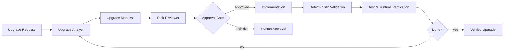

# Dependency Upgrade Blast-Radius Guard

## Problem
Dependency upgrades can compile successfully while still changing runtime behavior, transitive dependencies, serialization, configuration defaults, security posture, database behavior, HTTP semantics, or public contracts. AI coding agents often optimize for "make the build green" and can miss these wider effects.

This kit forces a structured upgrade analysis before package changes, records expected impact in an upgrade manifest, limits risky changes, and verifies the final diff and tests against the declared blast radius.

## When to use
Use for framework, SDK, ORM, HTTP client, serializer, auth/security, database driver, build-tool, test-framework, or other non-trivial dependency upgrades. It is especially useful for major/minor upgrades with migration notes, transitive changes, or generated-code impact.

## Architecture


- `skills/` defines semantic analysis and verification procedures.
- `rules/` controls editing, dependency safety, approval, and evidence requirements.
- `subagents/` separates analysis from independent risk review.
- `workflows/` defines the end-to-end bounded loop.
- `hooks/` defines deterministic checkpoints around edits and completion.
- `scripts/` inspects dependency and file changes and validates the manifest.
- `schemas/` and `templates/` define the machine-checkable upgrade manifest.

## Package structure
```text
dependency-upgrade-blast-radius-guard/
├── README.md
├── skills/
│   ├── dependency-upgrade-analysis.md
│   └── upgrade-verification.md
├── rules/
│   └── dependency-upgrade-safety.md
├── subagents/
│   ├── upgrade-analyst.md
│   └── upgrade-risk-reviewer.md
├── workflows/
│   └── dependency-upgrade-workflow.md
├── hooks/
│   └── hooks.md
├── scripts/
│   ├── collect-dependency-diff.py
│   └── verify-upgrade-manifest.py
├── schemas/
│   └── upgrade-manifest.schema.json
└── templates/
    └── upgrade-manifest.example.json
```

## Installation
Copy this folder into a repository, for example `.ai/dependency-upgrade-blast-radius-guard/`.

Requirements:
- Git
- Python 3.9+
- Repository-native package manager/build/test tools
- Access to official release notes or migration guidance when available

## Configuration
Optional environment variables:
- `UPGRADE_BASE_REF`: comparison base, default `HEAD~1`
- `UPGRADE_MANIFEST`: manifest path, default `upgrade-manifest.json`
- `UPGRADE_MAX_MAJOR_JUMPS`: default `1`; larger jumps require explicit approval

Adapt `hooks/hooks.md` with project-native restore/build/test commands.

## Usage
Example request:

> Upgrade Entity Framework Core from 9.x to 10.x without changing public API behavior.

The workflow first records current package versions, direct/transitive dependency deltas, breaking changes, config/default changes, generated artifacts, database/query risks, affected modules, migration requirements, tests, rollback steps, and approval requirements. Only after the manifest passes review may package files be changed.

After implementation:
```bash
python .ai/dependency-upgrade-blast-radius-guard/scripts/collect-dependency-diff.py --base HEAD~1 --output dependency-diff.json
python .ai/dependency-upgrade-blast-radius-guard/scripts/verify-upgrade-manifest.py --manifest upgrade-manifest.json --dependency-diff dependency-diff.json
```

## Workflow
1. Baseline dependency state.
2. Read authoritative release/migration evidence.
3. Trace direct and transitive blast radius.
4. Create `upgrade-manifest.json`.
5. Independent risk review.
6. Human approval if required.
7. Apply the smallest upgrade-only change.
8. Restore/build/lint/test.
9. Run runtime/contract checks for affected surfaces.
10. Compare actual dependency/file changes with the manifest.
11. Verify rollback instructions.
12. Mark `implemented` and `verified` separately.

## Safety
Human approval is required before:
- more than one major-version jump;
- breaking public API/event/schema changes;
- database schema/data migration;
- auth/security-control changes;
- production configuration changes;
- deleting compatibility shims;
- large transitive dependency replacement;
- changing framework/runtime targets for multiple applications.

Never suppress a failing compatibility test only to complete the upgrade.

## Failure and recovery
- Package restore/network failure: retry at most twice when transient.
- Same deterministic build/test failure twice: stop and report evidence.
- Unexpected transitive dependency: update the analysis and re-review before proceeding.
- Missing official migration evidence for a high-risk upgrade: stop or require human approval.
- Runtime regression: rollback the dependency change or isolate a compatibility fix; do not stack unrelated refactors.

## Verification
An upgrade is **implemented** when dependency files have been updated.

It is **verified** only when:
- the manifest passes validation;
- dependency deltas are expected;
- no unrelated files changed;
- restore/build succeed;
- relevant unit/integration/regression tests pass;
- affected runtime contracts/defaults were checked;
- required approvals exist;
- rollback steps are valid;
- unresolved risks are explicitly reported.

## Customization
Extend the schema with ecosystem-specific evidence such as NuGet lockfiles, npm lockfiles, Maven dependency trees, Docker base images, database providers, source generators, or API compatibility reports. Add specialized reviewers only when the repository has meaningful domain-specific risk such as security, database, or performance-sensitive workloads.
