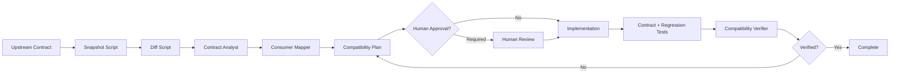

# External API Contract Drift Guard

## Problem

External APIs change independently of your repository. A field can become required, an enum can gain values, a response can change shape, a deprecated endpoint can disappear, or authentication requirements can shift. Coding agents often react only after integration failures appear and may patch the nearest symptom without proving broader compatibility.

This kit creates a reusable contract-drift workflow that snapshots upstream contracts, detects structural changes, classifies risk, maps internal consumers, prepares a compatibility plan, and verifies adapters before declaring success.

## When to use

Use when a project depends on OpenAPI/Swagger, JSON Schema, GraphQL schema exports, event schemas, typed SDK metadata, or stable JSON fixtures from an external service. It is especially useful before dependency upgrades, scheduled API-version migrations, partner API changes, or production incident follow-up caused by upstream behavior.

## Architecture



- **Skills** define contract-diff analysis and compatibility planning.
- **Rules** enforce evidence, safe upgrade boundaries, and human approval.
- **Subagents** separate discovery from verification.
- **Workflow** limits retry loops and defines checkpoints.
- **Hooks** run deterministic snapshots/diffs before semantic analysis and verification before completion.
- **Scripts** normalize JSON-like contracts and produce machine-readable diffs.

## Package structure

```text
external-api-contract-drift-guard/
├── README.md
├── skills/
│   ├── analyze-contract-drift.md
│   └── build-compatibility-plan.md
├── rules/
│   └── contract-safety.md
├── subagents/
│   ├── contract-analyst.md
│   └── compatibility-verifier.md
├── workflows/
│   └── contract-drift-response.md
├── hooks/
│   └── hooks.md
├── scripts/
│   ├── normalize-contract.py
│   └── diff-contracts.py
├── schemas/
│   └── drift-report.schema.json
└── templates/
    └── compatibility-plan.example.json
```

## Installation

Copy this folder into a repository, for example `.ai/external-api-contract-drift-guard/`.

Requirements:

- Python 3.9+
- Git
- access to the current and candidate contract files
- the project's normal build/test tooling

No vendor-specific AI agent syntax is required.

## Configuration

Recommended variables:

- `CONTRACT_CURRENT`: current normalized or raw contract path.
- `CONTRACT_CANDIDATE`: candidate upstream contract path.
- `DRIFT_REPORT`: output path, default `contract-drift-report.json`.
- `CONTRACT_KIND`: descriptive value such as `openapi`, `json-schema`, `graphql-json`, or `fixture`.

Do not place API keys or bearer tokens in contract files or generated artifacts.

## Usage

Example:

```bash
python .ai/external-api-contract-drift-guard/scripts/normalize-contract.py \
  --input contracts/provider-current.json \
  --output .contract/current.normalized.json

python .ai/external-api-contract-drift-guard/scripts/normalize-contract.py \
  --input contracts/provider-next.json \
  --output .contract/next.normalized.json

python .ai/external-api-contract-drift-guard/scripts/diff-contracts.py \
  --current .contract/current.normalized.json \
  --candidate .contract/next.normalized.json \
  --output contract-drift-report.json
```

Then run `workflows/contract-drift-response.md` using the generated drift report plus repository context.

## Workflow

1. Capture or receive current and candidate contracts.
2. Normalize both deterministically.
3. Generate a machine-readable structural diff.
4. Contract Analyst classifies each change as additive, behavioral-risk, potentially breaking, or breaking.
5. Map changed paths/types/operations to repository consumers.
6. Build a compatibility plan with affected code, tests, rollout, fallback, and approval requirements.
7. Obtain human approval for breaking contracts, production config/auth changes, or large SDK upgrades.
8. Implement the smallest compatibility change.
9. Run targeted contract tests plus regression tests.
10. Compatibility Verifier independently checks evidence and unresolved risk.
11. Complete only when implementation and verification are both satisfied.

## Safety

Explicit human approval is required before:

- changing production credentials or authentication flows;
- breaking public API contracts in this repository;
- deleting compatibility code still required by supported upstream versions;
- changing production routing, infrastructure, or rollout configuration;
- accepting a major SDK/dependency upgrade that introduces broad transitive changes;
- disabling validation or security controls to make a new contract pass.

## Verification

A task is **implemented** when adapter/client code has been changed.

A task is **verified** only when:

- normalization and diff scripts succeed;
- every breaking or potentially breaking drift item has a disposition;
- mapped consumers are tested or explicitly justified;
- build/tests pass;
- old/new compatibility expectations are documented where applicable;
- no security control was weakened;
- approval-required changes contain approval evidence.

## Failure and recovery

- Invalid JSON contract: stop immediately; do not infer structure from malformed input.
- Normalization failure: retry once after verifying encoding/path; then stop.
- Same test failure twice: stop and report evidence instead of looping.
- Unknown drift semantics: mark unresolved and escalate to a human or provider documentation review.
- Missing consumer evidence: return to mapping stage at most twice; then stop with uncovered areas listed.

## Customization

Extend `diff-contracts.py` for domain-specific semantics such as OpenAPI required fields, enum removals, protobuf field numbers, or GraphQL nullability. Add repository-specific protected paths and commands to `rules/contract-safety.md` and `hooks/hooks.md`. Keep deterministic structural detection in scripts and semantic risk judgment in skills/subagents.
