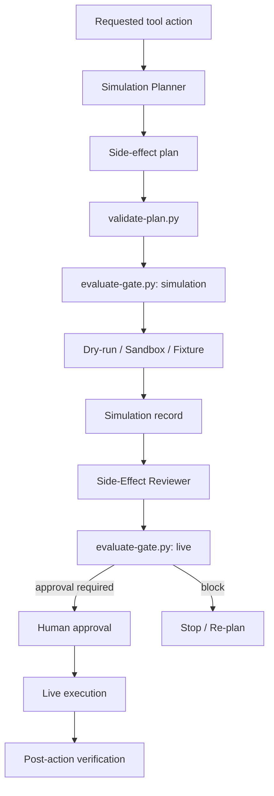

# External Side-Effect Simulation Gate

A reusable, tool-neutral safety gate for AI agents and automations that may mutate external systems. The package requires simulation evidence before live execution and separates planning, simulation, independent review, human approval, and live execution.

## Problem
AI agents can accidentally send emails, publish content, trigger workflows, mutate SaaS records, charge/refund users, deploy to production, change secrets, or otherwise create external side effects while attempting to validate a tool call. A successful API response is not proof that the action was safe or correctly targeted.

## Purpose
Use this kit to force side-effecting operations through a repeatable admission workflow:

1. classify the effect,
2. discover the safest simulation mode,
3. build an explicit plan,
4. validate the plan,
5. run dry-run/sandbox/fixture simulation,
6. review the observed effects independently,
7. require human approval for high-risk live effects,
8. execute only the exact approved request,
9. verify the post-action effect.

## When to use
Use before operations such as:

- sending email, chat, SMS, notifications, or webhooks,
- publishing content or releases,
- charging/refunding or billing mutations,
- creating/updating/deleting SaaS records,
- triggering external workflows or background jobs,
- production deployments or configuration mutations,
- secret/security-control changes,
- destructive or irreversible external actions.

## When not to use
Do not add this gate to ordinary read-only queries, local computations, or deterministic transformations that cannot mutate an external target. If a supposedly read-only operation can trigger hidden side effects, classify it as side-effecting.

## Architecture



## Package tree

```text
external-side-effect-simulation-gate/
├── README.md
├── skills/
│   ├── side-effect-classification.md
│   └── simulation-evidence-review.md
├── rules/
│   └── side-effect-governance.md
├── subagents/
│   ├── simulation-planner.md
│   └── side-effect-reviewer.md
├── workflows/
│   └── external-side-effect-simulation.md
├── hooks/
│   └── side-effect-hooks.md
├── scripts/
│   ├── validate-plan.py
│   └── evaluate-gate.py
├── config/
│   └── side-effect-policy.json
├── schemas/
│   ├── side-effect-plan.schema.json
│   └── simulation-record.schema.json
├── templates/
│   └── side-effect-plan.example.json
├── examples/
│   └── simulation-record.example.json
└── tests/
    └── smoke-test.py
```

## Component responsibilities

### Skills
`skills/side-effect-classification.md` defines how to identify effect category, target, blast radius, reversibility, simulation capability, and approval requirements.

`skills/simulation-evidence-review.md` defines how independent review compares expected and observed effects before live admission.

### Rules
`rules/side-effect-governance.md` contains testable MUST/MUST NOT/SHOULD rules. Core constraints include no live call merely to test connectivity, no silent permission escalation, no production target substitution, and no self-verification for high-risk actions.

### Subagents
`subagents/simulation-planner.md` owns classification and simulation planning. It cannot perform live mutations or self-approve.

`subagents/side-effect-reviewer.md` independently checks the simulation result. It cannot rewrite the plan to hide discrepancies or issue approval.

### Workflow
`workflows/external-side-effect-simulation.md` defines the full bounded workflow, retry policy, approval points, failure paths, produced artifacts, and Definition of Done.

### Hooks
`hooks/side-effect-hooks.md` defines pre-plan, pre-simulation, post-simulation, pre-live, and post-live lifecycle gates.

### Scripts
`scripts/validate-plan.py` validates required plan fields, policy membership, request fingerprint, expected effects, executable status, and computed approval requirement.

`scripts/evaluate-gate.py` implements deterministic admission for both simulation and live stages. Live admission requires matching action ID, plan revision, request fingerprint, successful simulation, valid reviewer state, reviewer independence when required, and human approval when policy requires it.

## Installation
Copy this folder into the repository that contains your agent rules/workflows. Python 3.9+ is sufficient for the deterministic scripts; they use only the standard library.

No provider SDK is required by the core kit. Provider-specific simulation adapters may be added outside the core workflow as long as they produce records compatible with `schemas/simulation-record.schema.json`.

## Configuration
Edit `config/side-effect-policy.json` to match your organization.

Important fields:

- `effect_categories`: recognized effect classes.
- `simulation_modes`: approved non-live validation modes.
- `approval_required_categories`: effect classes that always require human approval for live execution.
- `approval_required_risk_tags`: additional risk tags that require approval.
- `independent_review_required_categories`: categories requiring reviewer separation.
- `max_simulation_transient_retries`: bounded transient retry count.
- `live_retry_default`: default live retry count; intentionally zero.

Do not weaken policy merely to make a blocked action pass.

## Permissions
Use least privilege. Simulation credentials should preferably be scoped to sandbox/test resources. A permission failure must stop the workflow; the agent must never silently add scopes, switch accounts, or use more privileged credentials.

## Usage

Validate a plan:

```bash
python scripts/validate-plan.py \
  --plan templates/side-effect-plan.example.json \
  --policy config/side-effect-policy.json
```

Check whether simulation is allowed:

```bash
python scripts/evaluate-gate.py \
  --stage simulation \
  --plan templates/side-effect-plan.example.json \
  --policy config/side-effect-policy.json
```

For live admission, provide simulation, review, and approval artifacts as required:

```bash
python scripts/evaluate-gate.py \
  --stage live \
  --plan plan.json \
  --simulation simulation.json \
  --review review.json \
  --approval approval.json \
  --policy config/side-effect-policy.json
```

Run the built-in smoke test:

```bash
python tests/smoke-test.py
```

## Input/output contracts

### Side-effect plan
A valid plan must bind the operation to:

- `action_id`,
- `plan_revision`,
- provider and operation,
- exact target and environment,
- effect category and risk tags,
- reversibility,
- simulation mode and simulation target,
- SHA-256 request fingerprint,
- expected effects,
- executor identity,
- approval requirement,
- executable plan status.

### Simulation record
A simulation record must contain the same `action_id`, `plan_revision`, and request fingerprint as the plan, plus simulation target, observed effects, unexpected effects, status, executor, and evidence references.

### Review record
The deterministic gate expects at minimum:

```json
{
  "action_id": "action-001",
  "plan_revision": 1,
  "reviewer_id": "independent-reviewer",
  "status": "verified-for-approval"
}
```

### Approval record
For approval-required actions:

```json
{
  "action_id": "action-001",
  "plan_revision": 1,
  "approved_by": "human-owner",
  "status": "approved",
  "request_fingerprint": "<same SHA-256 fingerprint as the plan>"
}
```

Approval is invalidated when the target, payload, request fingerprint, action ID, or plan revision changes.

## Workflow behavior
The core workflow is deliberately fail-closed.

A provider-native dry-run/validate-only operation is preferred. If unavailable, use sandbox/test tenant. If neither exists, use deterministic fixture/mock evidence where it meaningfully models the action. If no simulation mode can establish sufficient confidence, record `simulation-unavailable`; the workflow must not issue a real request merely to test it.

For high-risk operations, simulation success is still not authorization. Human approval remains a separate gate immediately before live execution.

## Approval boundaries
Explicit human approval is required before live:

- financial actions,
- real-recipient communications,
- public publishing,
- production mutations/deployments,
- destructive operations,
- secret changes,
- security-control changes,
- irreversible effects,
- actions with no adequate simulation capability when policy requires escalation.

The agent must stop before the approval-required action.

## Failure and recovery
- **Transient simulation/network/tool failure:** retry at most once and preserve first failure evidence.
- **Validation failure:** correct the plan before retrying; no automatic retry.
- **Business-rule failure:** stop and re-plan.
- **Permission failure:** stop without permission escalation.
- **Unexpected side effect during simulation:** block and escalate.
- **Stale simulation/review/approval:** repeat the relevant stages using the new plan revision.
- **Live failure:** default is no automatic retry. A retry is only allowed when the approved plan explicitly defines safe idempotency/retry semantics.

## Verification
A task is not verified merely because a tool returned success.

Verification requires:

- valid plan,
- successful simulation or explicit simulation-unavailable escalation,
- no unexpected simulated effects,
- independent review when required,
- required human approval,
- exact request fingerprint match,
- exact action/plan revision match,
- post-live verification of actual effects when live execution occurs.

## Definition of Done
The package workflow is complete when one of these states is reached:

1. **Safely blocked:** the action cannot proceed because target/capability/evidence/approval is insufficient, and evidence is preserved.
2. **Verified for approval:** simulation and independent review are complete and the workflow is waiting at an explicit human approval boundary.
3. **Verified live completion:** the exact approved action was executed and post-action effects match the approved expected effects with no unexplained divergence.

No blocking failure, stale artifact, hidden side effect, or missing required approval may remain.

## Customization
Add provider adapters only when they provide concrete simulation value. Keep provider-specific behavior isolated from the core policy and contracts. Do not claim that an SDK supports dry-run/validate-only unless the provider semantics are known and tested.

For email, payment, cloud, deployment, ticketing, CRM, messaging, or publishing systems, define provider-specific adapters that emit the same plan/simulation records instead of bypassing this gate.
