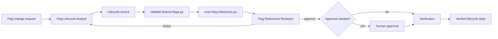

# Feature Flag Lifecycle Guard

## Problem
Feature flags are often introduced safely but retired poorly. Temporary branches become permanent architecture, stale flags keep both code paths alive, owners disappear, kill-switch semantics become unclear, and rollout configuration drifts away from repository code. This kit turns feature flags into governed lifecycle records with explicit ownership, expiry, rollout state, cleanup criteria, code-reference evidence, independent retirement review, and deterministic validation.

## Purpose
Use this package to ensure every feature flag has a reason to exist, a bounded lifetime, observable rollout criteria, and a verifiable retirement path. It is designed for AI-assisted development workflows where agents may create, modify, or remove feature flags across many repositories.

## When to use
Use when introducing a new feature flag, changing rollout semantics, converting a temporary flag into a long-lived operational switch, auditing existing flags, or removing a flag after rollout stabilizes.

## When not to use
Do not use feature flags as a substitute for authorization, secret management, durable business configuration, or permanent environment settings. If behavior is permanently configurable by users or operators, model it as configuration or domain data instead of a temporary feature flag.

## Architecture


The Flag Lifecycle Analyst owns lifecycle modeling and evidence gathering. Deterministic scripts validate records and scan repository references. The Flag Retirement Reviewer independently checks whether rollout evidence justifies simplification and whether removing a flag would preserve the intended permanent behavior. The host implementation agent may edit code, but it must not be the only verifier for a high-risk flag retirement.

## Package structure
```text
feature-flag-lifecycle-guard/
├── README.md
├── skills/
│   ├── flag-introduction.md
│   └── flag-retirement.md
├── rules/
│   └── feature-flag-governance.md
├── subagents/
│   ├── flag-lifecycle-analyst.md
│   └── flag-retirement-reviewer.md
├── workflows/
│   └── feature-flag-lifecycle.md
├── hooks/
│   └── hooks.md
├── scripts/
│   ├── validate-feature-flags.py
│   └── scan-flag-references.py
├── config/
│   └── feature-flag-policy.json
├── schemas/
│   └── feature-flag-record.schema.json
├── templates/
│   └── feature-flag-record.example.json
└── examples/
    └── retirement-plan.example.md
```

## Installation
Copy this folder into the target repository. Python 3.10+ is required; both scripts use only the standard library. Store real lifecycle records in a repository path such as `.feature-flags/flags.json` using the same object shape as the template.

## Configuration
Edit `config/feature-flag-policy.json` to configure:
- maximum temporary flag lifetime,
- required rollout states,
- allowed flag types,
- protected flag types requiring human approval,
- reference scan extensions,
- ignored repository paths,
- recognized code patterns for flag lookup.

Environment variable `FEATURE_FLAG_POLICY` may point to another policy file. CLI `--policy` overrides the environment variable.

## Dependencies
- Python 3.10+
- repository read access
- the project test/build tooling for final verification

## Permissions
The deterministic scripts require read-only repository access. Code edits, deleting flag branches, removing production kill switches, or changing production rollout configuration must be performed by the host workflow with appropriate permissions. Production flag changes and protected flag retirement require explicit human approval.

## Usage
Validate lifecycle records:
```bash
python scripts/validate-feature-flags.py --records .feature-flags/flags.json --policy config/feature-flag-policy.json
```

Scan code references and compare them with lifecycle records:
```bash
python scripts/scan-flag-references.py --root . --records .feature-flags/flags.json --policy config/feature-flag-policy.json --output .feature-flags/reference-report.json
```

A realistic introduction flow is: add a temporary release flag, record owner, created date, expiry, default behavior, rollout metric, rollback behavior, and cleanup trigger; then validate records before merge.

A realistic retirement flow is: prove the winning branch, scan all references, remove dead branch code and configuration, run affected tests, rerun the scanner, and independently verify that no required reference remains.

## Workflow
The primary workflow is defined in `workflows/feature-flag-lifecycle.md`.

Lifecycle states:
- `planned`
- `rolling-out`
- `stable`
- `retirement-ready`
- `retired`
- `blocked`

A flag may move to `retirement-ready` only when rollout evidence shows the intended permanent state is known and rollback dependency is no longer required. `retired` means flag definition and obsolete branches have been removed and verification passed; simply setting a flag permanently on/off is not retirement.

## Approval boundaries
Human approval is mandatory before:
- removing a production emergency kill switch,
- changing production rollout configuration,
- deleting a protected operational flag,
- removing a branch that changes security, billing, data integrity, or public API behavior,
- changing a flag from temporary to permanent operational configuration,
- performing destructive cleanup outside the scoped feature-flag change.

Agents must stop before the approval-required action.

## Failure handling
- Validation/schema failure: no retry; fix the record and rerun.
- Deterministic scanner operational failure: one retry if clearly transient; otherwise stop with evidence.
- Reviewer requests revision: maximum two revision cycles.
- Tests fail after retirement: diagnose and fix at most twice; if the same failure persists, restore or preserve the flag path and escalate.
- Missing rollout evidence or unknown permanent branch: stop; do not guess.
- Missing owner for active flag: mark blocked until ownership is assigned.

## Verification
Task execution and task verification are separate.

A lifecycle change is verified only when:
1. lifecycle records pass `validate-feature-flags.py`,
2. reference scan completed successfully,
3. repository build/tests relevant to the changed behavior pass,
4. expected references exist for active flags or no prohibited references remain for retired flags,
5. independent reviewer returns `pass`,
6. required human approvals are recorded,
7. no unintended files or unrelated flags changed.

## Definition of Done
### New flag
- owner exists,
- flag type is allowed,
- expiry and cleanup trigger are set for temporary flags,
- default/fallback behavior is explicit,
- rollout and rollback evidence requirements are documented,
- records validate,
- relevant tests pass.

### Retired flag
- permanent behavior is explicitly identified,
- retirement evidence exists,
- obsolete branch and configuration are removed,
- scanner finds no prohibited stale references,
- relevant tests/build pass,
- independent review passes,
- required approvals exist,
- lifecycle record is `retired` or archived according to repository policy.

## Customization
Adapt `config/feature-flag-policy.json` first. Add framework-specific lookup regexes for LaunchDarkly, Azure App Configuration, custom `IFeatureManager`, environment-backed flags, or other systems. Keep lifecycle semantics and approval rules tool-neutral; isolate vendor-specific integration in repository adapters rather than changing the core workflow.