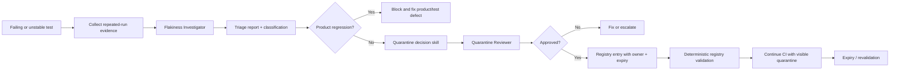

# Flaky Test Triage & Quarantine Gate

## Problem

Intermittent tests create a dangerous failure mode: teams cannot easily tell whether a red test is a real product regression, test nondeterminism, shared-state leakage, timing/race behavior, an external dependency, or CI infrastructure noise. The common response—rerun until green—destroys evidence and teaches both humans and AI agents to treat a passing retry as proof of correctness.

This kit provides an evidence-driven workflow for diagnosing unstable tests, deciding whether quarantine is justified, enforcing bounded retries, and preventing quarantined tests from becoming permanent blind spots.

The kit does **not** automatically hide failing tests. Quarantine is a controlled exception with an owner, evidence, classification, expiry, and approval when required.

## When to use

Use this kit when:

- a test passes and fails across otherwise equivalent runs;
- CI failures disappear after a rerun;
- a test depends on timing, ordering, shared state, network services, clock, random data, or asynchronous behavior;
- a team wants a consistent quarantine policy instead of ad-hoc skips;
- an AI coding agent is asked to fix a flaky test;
- a test suite has accumulated ignored/skipped tests without ownership or expiry;
- CI noise is high enough that real regressions risk being ignored.

Do not use quarantine as a shortcut for a reproducible product defect. A reproducible regression remains a blocking defect.

## Architecture



The package combines:

- **Skills** for diagnosis and quarantine decisions that require semantic judgment.
- **Rules** that forbid retry-until-green behavior and permanent unowned quarantine.
- **Subagents** with non-overlapping responsibilities: investigation versus approval/review.
- **Workflow** with bounded reruns, checkpoints, escalation, and Definition of Done.
- **Hooks** for deterministic evidence aggregation and quarantine validation.
- **Scripts** for JUnit aggregation and registry validation.
- **Configuration/schema/templates** so the policy can be adapted without redesigning the workflow.

## Package structure

```text
flaky-test-triage-quarantine-gate/
├── README.md
├── config/
│   └── flaky-test-policy.json
├── hooks/
│   └── flaky-test-hooks.md
├── rules/
│   └── flaky-test-governance.md
├── schemas/
│   └── quarantine-registry.schema.json
├── scripts/
│   ├── aggregate-junit.py
│   └── validate-quarantine.py
├── skills/
│   ├── flaky-test-triage.md
│   └── quarantine-decision.md
├── subagents/
│   ├── flakiness-investigator.md
│   └── quarantine-reviewer.md
├── templates/
│   ├── quarantine-registry.example.json
│   └── triage-report.example.md
└── workflows/
    └── flaky-test-triage-quarantine.md
```

## Installation

Copy this directory into the target repository, for example:

```text
.ai/flaky-test-triage-quarantine-gate/
```

Requirements:

- Python 3.9+ for deterministic scripts.
- Test results exported as JUnit XML for automated aggregation.
- A repository-owned quarantine registry, recommended path: `test-quarantine.json`.

No third-party Python package is required.

## Configuration

Edit `config/flaky-test-policy.json`:

- `max_reruns`: maximum diagnostic reruns after the original failure;
- `min_observations_for_quarantine`: minimum observed executions before quarantine may be considered;
- `max_quarantine_days`: maximum allowed expiry horizon;
- `allowed_quarantine_classifications`: root-cause classes that may be quarantined;
- `forbidden_quarantine_classifications`: classes that must remain blocking;
- `require_human_approval_for_critical_path`: whether critical-path tests require explicit human approval.

The default policy is intentionally conservative.

## Usage

### Example: intermittent checkout integration test

A test named `CheckoutTests.SubmitOrder_returns_201` fails once in CI, then passes on retry.

1. Preserve the first failure. Do not overwrite its logs or JUnit result.
2. Run at most the configured diagnostic reruns under equivalent conditions.
3. Aggregate all results:

```bash
python scripts/aggregate-junit.py \
  --input "artifacts/test-runs/*.xml" \
  --output artifacts/flaky-summary.json
```

4. Give the summary, logs, relevant code, environment details, and recent diff to the **Flakiness Investigator**.
5. The investigator classifies the failure, for example `shared-state`, and records evidence for and against that hypothesis.
6. If quarantine is proposed, the **Quarantine Reviewer** independently decides whether the evidence meets policy.
7. Add an approved entry to `test-quarantine.json` with owner and expiry.
8. Validate it deterministically:

```bash
python scripts/validate-quarantine.py \
  --registry test-quarantine.json \
  --policy config/flaky-test-policy.json
```

9. CI may then treat the test according to the repository's existing quarantine mechanism, but the failure must remain visible in reporting.
10. Before expiry, fix the cause and demonstrate stable repeated passes before removing the registry entry.

## Workflow

The end-to-end lifecycle is:

```text
Detect unstable failure
  ↓
Preserve first-failure evidence
  ↓
Bounded diagnostic reruns
  ↓
Aggregate outcomes/signatures
  ↓
Investigate root-cause class
  ↓
Product regression or unknown?
  ├─ Yes → remain blocking; fix/escalate
  └─ No → evaluate quarantine
              ↓
        independent review
              ↓
        approved exception?
        ├─ No → fix/escalate
        └─ Yes → registry + expiry + owner
                        ↓
                  validate registry
                        ↓
                  visible quarantine
                        ↓
                  repair + revalidate
                        ↓
                  remove quarantine
```

Important distinction:

- **Task completed**: diagnosis or code changes were produced.
- **Task verified**: evidence supports the classification, required tests/checks pass, registry validation passes when applicable, and unresolved risk is documented.

A passing retry alone is never verification.

## Safety

### Human approval is required when

- quarantining a test marked `critical_path: true` when policy requires it;
- quarantine would suppress the only automated coverage for a security, payment, identity, data-loss, migration, or production-critical behavior;
- the proposed response changes production configuration, infrastructure, secrets, database schema, security controls, or public API contracts;
- a fix requires deleting tests, disabling a suite, or broadly reducing coverage.

### Always stop rather than quarantine when

- evidence indicates a reproducible product regression;
- classification remains `unknown` after bounded investigation;
- the failure reveals possible data corruption, security regression, or unsafe production behavior;
- the requested quarantine exceeds policy and has no explicit approval.

## Failure and recovery

- **Diagnostic rerun fails differently**: preserve both signatures; do not reset the investigation. Mixed signatures increase uncertainty.
- **Same failure persists on every run**: classify as reproducible, stop calling it flaky, and route to normal defect fixing.
- **JUnit aggregation fails**: retry once only if the error is operational (missing artifact, interrupted copy). Otherwise stop and report the parser/input error.
- **Quarantine validation fails**: do not silently edit expiry/approval fields. Correct the registry or obtain approval.
- **Investigation is inconclusive**: stop after the workflow's bounded hypothesis cycle and report `unknown`; do not quarantine.
- **Quarantined test expires**: CI/review should fail the quarantine gate until it is removed, repaired, or explicitly renewed with fresh evidence and approval.

## Verification

Verification should include the checks appropriate to the repository:

1. First-failure evidence is preserved.
2. Number of reruns does not exceed policy.
3. Aggregated outcomes show all observations, not only the final pass.
4. Failure signatures and relevant environment differences are documented.
5. A reproducible product regression is not mislabeled as flakiness.
6. Any quarantine has a supported classification, evidence, owner, created date, expiry date, and issue/work item reference.
7. Critical-path quarantine contains required approval.
8. `validate-quarantine.py` exits successfully.
9. The affected tests are repaired or remain explicitly visible as quarantined—not silently skipped.
10. After a fix, the test passes the agreed repeated-run verification before quarantine removal.

## Customization

The easiest adaptation points are:

- `config/flaky-test-policy.json` for retry budgets and expiry limits;
- `templates/quarantine-registry.example.json` for repository-specific metadata;
- `hooks/flaky-test-hooks.md` for CI commands;
- `aggregate-junit.py` if your test runner emits additional JUnit properties worth preserving;
- the classification list if your environment has special categories such as emulator instability or browser-driver drift.

Keep the core rule unchanged: **quarantine is a temporary, evidence-backed exception—not success.**
