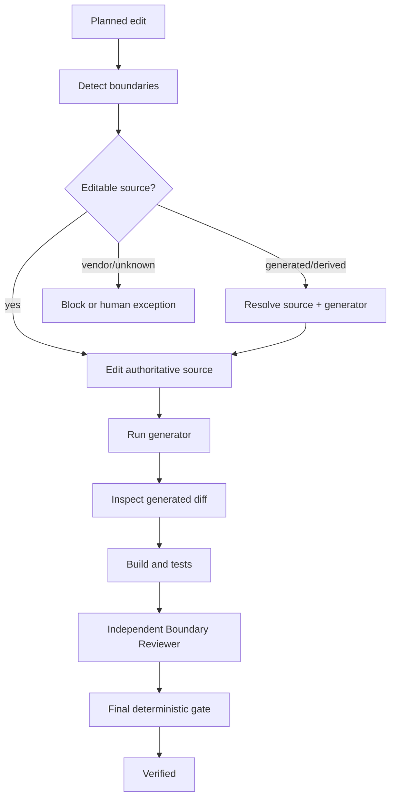

# Generated Code Edit Boundary Guard

Prevent AI coding agents from directly editing generated, derived, vendored, or tool-owned artifacts when the safe change belongs in an authoritative source file or generator input.

## Problem
AI agents often optimize for the visible file that contains the failing code. In repositories with generated clients, ORM outputs, source-generator artifacts, compiled assets, vendor trees, or checked-in build outputs, that can produce a patch that is overwritten on the next generation run, silently diverges from the source-of-truth, or creates unsupported third-party modifications.

This kit creates an evidence-based boundary before editing, resolves the source/generator relationship, regenerates from source, independently reviews the resulting diff, and blocks unexplained protected edits.

## When to use
Use before feature work, bug fixes, refactors, formatting, bulk edits, code-review fixes, dependency migrations, or repository-wide transformations that may touch generated/vendor/derived files.

## When not to use
Do not use it as a substitute for domain tests, API compatibility review, migration safety, dependency licensing, or security review. It only governs edit ownership and regeneration integrity.

## Architecture



## Package tree

```text
generated-code-edit-boundary-guard/
├── README.md
├── config/
│   └── generated-boundary-policy.json
├── examples/
│   └── verified-review.json
├── hooks/
│   └── generated-boundary-hooks.md
├── rules/
│   └── generated-edit-governance.md
├── schemas/
│   └── generated-boundary-manifest.schema.json
├── scripts/
│   ├── evaluate-generated-boundary-gate.py
│   ├── inspect-generated-diff.py
│   └── validate-generated-boundary.py
├── skills/
│   ├── detect-generated-boundaries.md
│   └── regenerate-derived-artifacts.md
├── subagents/
│   ├── boundary-reviewer.md
│   └── generated-source-resolver.md
├── templates/
│   └── generated-boundary-manifest.example.json
├── tests/
│   └── smoke-test.py
└── workflows/
    └── generated-edit-boundary-workflow.md
```

## Component responsibilities
- **Detect Generated Boundaries skill**: classifies edit targets and resolves ownership evidence.
- **Regenerate Derived Artifacts skill**: changes source-of-truth, executes the documented generator, and verifies outputs.
- **Generated Source Resolver**: read-only discovery subagent for source/generator relationships.
- **Boundary Reviewer**: independent verifier for protected changes and exceptions.
- **Governance rules**: enforce MUST/MUST NOT/SHOULD boundaries.
- **Hooks**: define deterministic pre-edit, post-generation, and final checks.
- **Policy**: centralizes protected patterns, classifications, retry limits, and approval boundaries.
- **Scripts**: validate manifests, inspect Git diffs, and calculate final gate status.
- **Smoke test**: proves safe regeneration passes and direct generated editing is blocked.

## Installation
Copy this directory into your repository, for example under `.ai/generated-code-edit-boundary-guard/`. Python 3.9+ and Git are sufficient for the deterministic scripts. No third-party Python packages are required.

## Configuration
Edit `config/generated-boundary-policy.json` only to match repository-specific generated folders, filename conventions, or policy requirements. Add patterns rather than weakening existing protections unless a human owner explicitly approves the policy change.

The default policy protects common generated/vendor locations including `*.g.cs`, `*.generated.*`, `obj/`, `bin/`, `dist/`, `build/`, `vendor/`, and `node_modules/`.

## Permissions
The discovery and review stages require read access only. The implementation stage needs write access to authoritative source files and whatever local execution permission the existing repository generator requires. Do not grant broader repository, production, infrastructure, or external-system permissions just to make generation succeed.

## Usage
1. Create a boundary manifest using `templates/generated-boundary-manifest.example.json` as the shape.
2. Classify each planned path using `skills/detect-generated-boundaries.md`.
3. Validate before edits:

```bash
python scripts/validate-generated-boundary.py \
  --manifest .artifacts/generated-boundary.json \
  --policy config/generated-boundary-policy.json
```

4. Edit authoritative sources only and run the repository-native generator.
5. Inspect the worktree:

```bash
python scripts/inspect-generated-diff.py \
  --manifest .artifacts/generated-boundary.json \
  --output .artifacts/generated-diff.json
```

6. Run relevant build/tests and create a verification record such as:

```json
{
  "build_passed": true,
  "tests_passed": true
}
```

7. Have an independent Boundary Reviewer create a review record.
8. Evaluate the final gate:

```bash
python scripts/evaluate-generated-boundary-gate.py \
  --manifest .artifacts/generated-boundary.json \
  --diff-report .artifacts/generated-diff.json \
  --review .artifacts/generated-review.json \
  --verification .artifacts/verification.json \
  --policy config/generated-boundary-policy.json
```

## Status semantics
- `verified`: protected changes are explained, source/regenerator evidence is present, build/tests passed, and independent review requirements are satisfied.
- `blocked`: unresolved ownership, unexplained direct generated edit, failed build/tests, invalid reviewer ownership, or other blocking evidence exists.
- `human-approval-required`: the change requires an explicit exception or other approval-defined action.

## Approval boundaries
Explicit human approval is required before:
- direct generated-file edits,
- vendor patches,
- generator/version changes,
- destructive regeneration,
- breaking public contracts,
- production configuration or infrastructure changes,
- irreversible migrations.

Approval is not permission to bypass verification. The source/diff/test/reviewer evidence still has to be recorded.

## Failure handling
- **Unknown ownership:** stop; do not edit until ownership is resolved.
- **Missing generator:** stop; do not hand-edit output as a fallback.
- **Transient generator failure:** preserve first failure evidence and retry at most once.
- **Unexpected generated churn:** investigate inputs, generator version, environment, or nondeterminism; do not normalize it away blindly.
- **Build/test failure:** treat execution as unsuccessful even if generation completed.
- **Permission failure:** stop instead of silently increasing privileges.
- **Approval missing:** return `human-approval-required`.

## Verification
Run the package smoke test:

```bash
python tests/smoke-test.py
```

It initializes a temporary Git repository, verifies that changing an authoritative schema together with its generated output is accepted, then proves that a direct generated-only change is blocked.

## Definition of Done
A task governed by this kit is done only when:
- every changed/planned path is classified,
- protected generated/derived paths map to authoritative source and generator evidence or have an approved exception,
- no unexplained direct generated/vendor edit remains,
- regeneration evidence exists when applicable,
- relevant build/tests pass,
- protected changes received independent review,
- required human approvals exist,
- the final deterministic gate returns `verified`.

## Portability
The core instructions are tool-neutral and can be used with Codex, Claude Code, Cursor, ChatGPT, GitHub Copilot, OpenCode, or another coding agent. Tool-specific integration should invoke the documented hooks without changing the policy semantics.

## Customization
Common useful additions are repository-specific generated path patterns, known header markers, generator metadata, or CI commands. Keep deterministic scripts independent of a specific AI vendor and prefer repository-native generators over agent-specific wrappers.
