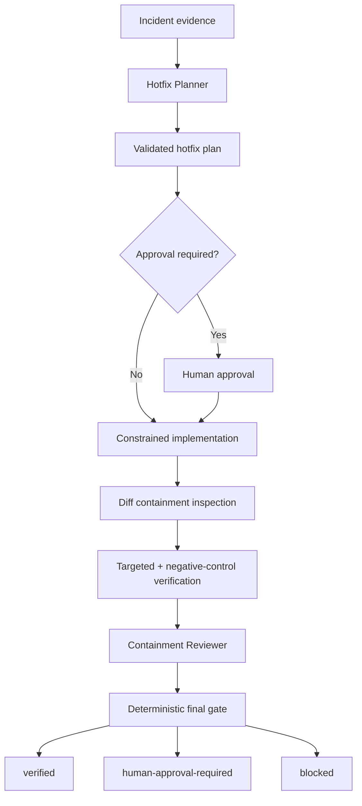

# Incident Fix Regression Containment Gate

A reusable AI engineering kit for keeping emergency incident hotfixes narrow, reversible, evidence-backed, and independently verified before they are treated as safe.

## Problem

Incident pressure encourages scope creep: unrelated cleanup slips into a hotfix, temporary bypasses become permanent, tests focus only on the broken path, rollback is vague, or a successful deployment is mistaken for proof that the incident is resolved. AI coding agents can amplify this by making broader edits than the operator intended.

This package introduces a deterministic containment gate around emergency fixes so urgency does not remove scope, regression, rollback, or approval controls.

## Purpose

Use the kit to convert incident evidence into a bounded hotfix plan, constrain implementation to approved paths, verify targeted and adjacent behavior, preserve rollback readiness, track expiring exceptions, require independent review for severe incidents, and produce a final machine-readable containment decision.

## When to use

Use for:
- Sev0–Sev3 production hotfixes.
- Urgent regressions discovered before release where normal feature workflow is too broad.
- Emergency configuration/code changes that need explicit rollback and follow-up debt.
- AI-assisted incident fixes where change containment must be proven.

## When not to use

Do not use this as a substitute for root-cause investigation, normal feature development, database migration governance, production deployment tooling, or a post-incident review. It contains a fix; it does not authorize production execution by itself.

## Architecture



## Component responsibilities

- `skills/incident-hotfix-planning.md` — builds the minimal scope, verification, rollback, and exception plan.
- `skills/hotfix-verification.md` — evidence-based post-edit verification procedure.
- `rules/hotfix-containment-rules.md` — enforceable incident safety rules.
- `subagents/hotfix-planner.md` — planning-only agent that cannot implement or self-approve.
- `subagents/containment-reviewer.md` — independent reviewer that cannot modify the hotfix.
- `workflows/incident-hotfix-containment.md` — end-to-end bounded workflow.
- `hooks/hooks.md` — pre-implementation, post-edit, post-verification, and follow-up lifecycle hooks.
- `config/containment-policy.json` — severity, retry, exception-expiry, approval, and gate policy.
- `schemas/hotfix-plan.schema.json` — structured contract for hotfix plans.
- `scripts/validate-hotfix-plan.py` — deterministic semantic plan validator.
- `scripts/inspect-hotfix-diff.py` — changed-path containment checker.
- `scripts/evaluate-containment-gate.py` — final deterministic decision gate.
- `templates/hotfix-plan.example.json` — reusable starter plan.
- `examples/verified-run.example.json` — example verification and reviewer records.
- `tests/test-containment-gate.py` — stdlib-only smoke test for verified, approval-required, and blocked branches.

## Package tree

```text
incident-fix-regression-containment-gate/
├── README.md
├── config/
│   └── containment-policy.json
├── examples/
│   └── verified-run.example.json
├── hooks/
│   └── hooks.md
├── rules/
│   └── hotfix-containment-rules.md
├── schemas/
│   └── hotfix-plan.schema.json
├── scripts/
│   ├── evaluate-containment-gate.py
│   ├── inspect-hotfix-diff.py
│   └── validate-hotfix-plan.py
├── skills/
│   ├── hotfix-verification.md
│   └── incident-hotfix-planning.md
├── subagents/
│   ├── containment-reviewer.md
│   └── hotfix-planner.md
├── templates/
│   └── hotfix-plan.example.json
├── tests/
│   └── test-containment-gate.py
└── workflows/
    └── incident-hotfix-containment.md
```

## Installation

Copy this directory into your repository or agent-instruction workspace. Python 3.9+ is sufficient for the deterministic layer; the scripts use only the standard library.

## Configuration

Adjust `config/containment-policy.json` to match your incident taxonomy and governance. The default policy:
- requires independent review for `sev0` and `sev1`;
- permits at most one retry for transient infrastructure/tool failures;
- requires a negative-control check and rollback plan;
- limits temporary exceptions to seven days;
- requires explicit human approval for production deploy, destructive operation, schema/infrastructure/secret changes, breaking API changes, security weakening, and irreversible actions.

## Dependencies

- Python 3.9+
- Git or another source of changed-file paths
- Your normal build/test tools
- Read-only incident logs/metrics where available

No third-party Python package is required.

## Permissions

Planning and review stages should use read-only repository/log access wherever possible. The package itself does not deploy, delete, mutate infrastructure, change secrets, execute SQL, or rewrite Git history.

Production deployment, destructive rollback, database schema changes, infrastructure changes, secret changes, breaking API changes, weakening security controls, or irreversible actions require explicit human approval outside the package.

## Usage

### 1. Create a plan

Copy:

```bash
cp templates/hotfix-plan.example.json hotfix-plan.json
```

Fill it with the actual incident evidence, paths, verification commands, rollback mechanism, approval actions, and temporary exceptions.

### 2. Validate before editing

```bash
python scripts/validate-hotfix-plan.py \
  --plan hotfix-plan.json \
  --policy config/containment-policy.json
```

Exit codes:
- `0` valid plan
- `2` unreadable/invalid input
- `3` policy or semantic validation failure

### 3. Inspect the implemented diff

Create `changed-files.txt`, one repository-relative changed file per line, then run:

```bash
python scripts/inspect-hotfix-diff.py \
  --plan hotfix-plan.json \
  --changed-files changed-files.txt \
  --output diff-report.json
```

Exit `4` means at least one changed path is outside the allowed scope or matches a forbidden path.

### 4. Record verification and review

Use the shape shown in `examples/verified-run.example.json`. The verification record must state targeted-check status, negative-control status, rollback readiness, transient retry count, and evidence references.

For Sev0/Sev1, the reviewer identity must differ from the implementer identity.

### 5. Run the final gate

```bash
python scripts/evaluate-containment-gate.py \
  --plan hotfix-plan.json \
  --diff diff-report.json \
  --verification verification-result.json \
  --review reviewer-record.json \
  --policy config/containment-policy.json \
  --output containment-result.json
```

Decision exit codes:
- `0` → `verified`
- `5` → `blocked`
- `6` → `human-approval-required`

### 6. Run the package smoke test

```bash
python tests/test-containment-gate.py
```

The smoke test exercises a clean contained fix, an otherwise valid fix awaiting production approval, and an out-of-scope change that must be blocked.

## Example invocation

An AI coding agent receives an incident where a null mapping causes checkout failures. The Hotfix Planner restricts scope to the mapper and its tests, defines a negative-control payment-flow test, and records revert-and-redeploy rollback instructions. The implementation agent edits only those files. The diff inspector verifies containment. The independent reviewer checks test and rollback evidence. The final gate returns `human-approval-required` until the human incident owner approves production deployment; only then can the record become `verified`.

## Workflow and retry behavior

The complete workflow is in `workflows/incident-hotfix-containment.md`. There are no autonomous infinite loops.

Only transient network, runner, or tool failures may be retried, once. The first failure evidence must be preserved. Build failures, test failures, semantic regressions, business-rule failures, policy failures, or out-of-scope edits are not transient and stop the workflow.

## Approval boundaries

A passing containment gate is not deployment authorization. Human approval remains mandatory for policy-listed dangerous actions. Agents must stop before those actions and must not increase privileges or weaken thresholds to unblock the incident.

## Failure handling

- Incomplete incident scope → return to investigation/planning.
- Invalid plan → block editing.
- Unexpected/forbidden diff path → block verification and shrink or explicitly re-authorize scope.
- Failed targeted/negative-control check → block; preserve evidence.
- Missing rollback → block.
- Temporary exception expired or malformed → block.
- Reviewer is not independent for Sev0/Sev1 → block.
- Approval-required action without approval → `human-approval-required`.
- Repeated transient failure after one retry → stop and escalate with preserved evidence.

## Verification model

The package explicitly separates:

**Task executed** — code was edited, tests may have run, or a deployment command may have succeeded.

from:

**Task verified successfully** — final diff is contained, required checks pass, rollback is ready, exceptions are bounded, independent review requirements are met, approvals exist, and the deterministic gate returns `verified`.

## Definition of Done

A hotfix is complete only when:
- incident scope and symptom are documented;
- a valid plan exists;
- all changed files are inside allowed scope and outside forbidden scope;
- targeted checks pass;
- at least one negative-control check passes;
- rollback mechanism and trigger are ready;
- temporary exceptions have owner, expiry, reason, and follow-up;
- independent review is complete for Sev0/Sev1;
- required human approvals exist;
- no blocking finding remains;
- `containment-result.json` reports `verified`.

## Customization

Common adaptations include adding repository-specific protected path patterns, severity names, maximum exception lifetime, additional approval-required actions, or a richer verification-result schema. Keep the core principles unchanged: bounded scope, preserved evidence, independent severe-incident review, expiring exceptions, reversible changes, bounded retries, and explicit human authority for dangerous production actions.

## Portability

The package is tool-neutral. Its instructions and JSON contracts can be used with OpenAI Codex, Claude Code, Cursor, ChatGPT, GitHub Copilot, OpenCode, custom agents, or human-driven incident workflows. Tool-specific runners should remain adapters around the core plan/diff/evidence contracts rather than changing their safety semantics.