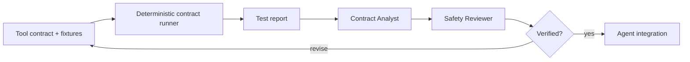

# MCP Tool Contract Test Harness

## Problem
AI agents depend on tools whose schemas and side effects are often trusted without systematic testing. A tool may accept invalid arguments, return inconsistent error shapes, omit required fields, mutate state despite being described as read-only, or expose dangerous operations without an approval boundary. These failures are difficult to detect because the agent usually sees only the runtime result.

This kit creates a reusable contract-testing gate for MCP-style tools and other structured agent tools. It validates declared contracts, executes replayable fixtures against a safe adapter, checks result/error envelopes, verifies side-effect declarations, and requires human approval before any live destructive fixture can run.

## When to use
Use when adding a new MCP server/tool, changing tool schemas, upgrading a tool adapter, introducing agent write actions, investigating tool-call regressions, or reviewing whether an existing tool is safe enough for autonomous use.

## Architecture


Skills define how to model and assess a tool contract. Rules enforce safe fixture execution, no-secret handling, side-effect boundaries, and approval points. The Contract Analyst classifies failures and coverage gaps. The Safety Reviewer independently validates side-effect claims and release readiness. Scripts perform deterministic schema/fixture validation and report aggregation.

## Package structure
```text
mcp-tool-contract-test-harness/
├── README.md
├── skills/
│   ├── contract-modeling.md
│   └── tool-safety-assessment.md
├── rules/tool-contract-rules.md
├── subagents/
│   ├── contract-analyst.md
│   └── safety-reviewer.md
├── workflows/tool-contract-verification.md
├── hooks/hooks.md
├── scripts/
│   ├── validate-contract.py
│   └── evaluate-fixtures.py
├── config/tool-test-policy.json
├── schemas/tool-contract.schema.json
└── templates/tool-contract.example.json
```

## Installation
Copy the folder into a repository. Python 3.10+ is sufficient; scripts use only the standard library. Place project-specific contracts in a controlled path such as `.agent-tools/contracts/` and fixtures in `.agent-tools/fixtures/`.

## Configuration
Edit `config/tool-test-policy.json` to define allowed side-effect levels, live-execution policy, approval requirements, required negative-test coverage, and result-envelope constraints. Tool-specific runtime adapters are intentionally outside the portable core; they should convert a contract fixture into the real tool invocation and save a normalized result JSON.

## Usage
Validate a contract:
```bash
python scripts/validate-contract.py --policy config/tool-test-policy.json --contract my-tool.json
```

Evaluate fixture results exported by your adapter:
```bash
python scripts/evaluate-fixtures.py --contract my-tool.json --results results.json
```

A realistic write-tool contract should include at least: valid input, missing required input, wrong type, unauthorized/approval-required path, expected application error, and idempotency/replay behavior where relevant.

## Workflow
1. Capture the declared tool contract and side-effect level.
2. Model positive, negative, permission, error, and replay fixtures.
3. Run deterministic validation before any runtime invocation.
4. Execute fixtures only through a safe adapter; default to mocked/sandbox execution.
5. Aggregate normalized results.
6. Contract Analyst classifies mismatches and missing coverage.
7. Safety Reviewer checks whether side effects, approvals, secrets, and live-test boundaries are truthful.
8. Revise at most twice for contract/test defects. Persistent mismatches stop the workflow.
9. Mark the tool `verified` only when required fixtures pass and reviewer status is `pass`.

## Safety
Live destructive fixtures are disabled by default. Production mutation, secret changes, infrastructure updates, file deletion, database schema changes, force pushes, permission changes, and security-control modifications require explicit human approval. A tool described as read-only MUST NOT be approved if any fixture demonstrates mutation. Test fixtures MUST NOT contain real credentials or production customer data.

## Verification
`Task completed` means the contract and fixtures were authored and executed. `Task verified` means deterministic validation passed, required fixture classes passed, no unexpected side effect was observed, all approval requirements were satisfied, and the independent Safety Reviewer returned `pass`.

## Customization
Extend `tool-test-policy.json` for project-specific risk levels, add fields to the schema only when all adapters understand them, and add tool-specific adapters separately without changing the core workflow. The package is tool-neutral and can be used around Claude Code, Codex, ChatGPT, Cursor, Copilot, OpenCode, custom agents, or MCP clients.