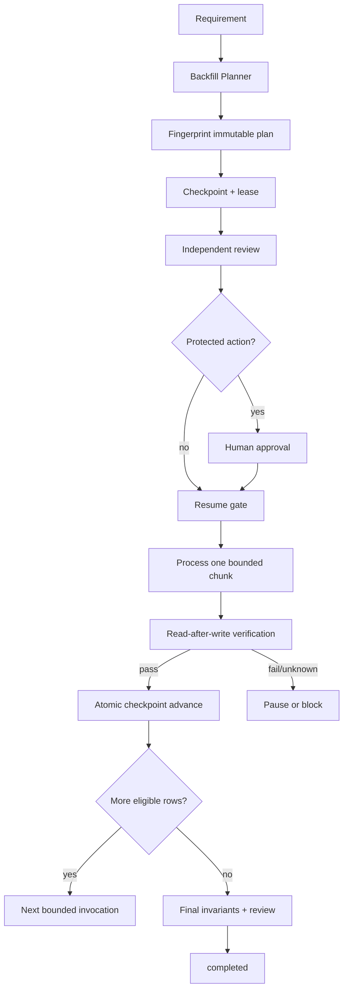

# Migration Backfill Resumability Guard

A reusable AI-engineering package for designing, pausing, resuming and verifying long-running data backfills without duplicate writes, skipped records, stale checkpoints or blind retries.

## Problem
Bulk data changes often outlive one process or agent session. A crash after a write but before checkpoint persistence can create duplicates; a changed transformation can make an old cursor unsafe; two workers can race; a green command can be mistaken for a verified migration; and “resume from where we left off” can rely on stale chat context instead of durable state.

## Purpose
This kit turns a backfill into an immutable, fingerprinted execution contract with stable cursor semantics, idempotent writes, monotonic checkpoints, leases, bounded retries, read-after-write verification, independent review and explicit approval boundaries.

## When to use
Use for data normalization, denormalized read-model rebuilds, corrective updates, historical enrichment, schema-adjacent data migration, cache/materialized-state regeneration, or any bulk mutation that may need pause/resume.

## When not to use
Do not use this as a substitute for a database transaction for a tiny atomic update. Do not use it to bypass provider-native migration tooling or required DBA/change-management controls.

## Architecture


## Package tree
```text
migration-backfill-resumability-guard/
├── README.md
├── config/backfill-policy.json
├── schemas/
│   ├── backfill-plan.schema.json
│   └── checkpoint.schema.json
├── scripts/
│   ├── fingerprint-backfill-plan.py
│   ├── validate-backfill-state.py
│   ├── evaluate-resume-gate.py
│   └── advance-checkpoint.py
├── skills/
│   ├── design-resumable-backfill.md
│   └── resume-and-verify-backfill.md
├── rules/backfill-governance.md
├── subagents/
│   ├── backfill-planner.md
│   └── backfill-reviewer.md
├── workflows/resumable-backfill-workflow.md
├── hooks/backfill-lifecycle-hooks.md
├── templates/backfill-plan.example.json
├── examples/
│   ├── checkpoint.example.json
│   └── review.example.json
└── tests/smoke-test.py
```

## Dependencies
Python 3.9+; scripts use only the standard library. Project-specific executors can be C#, SQL, Python, a job worker or provider API, but must obey the same checkpoint/idempotency contract.

## Installation
Copy this directory into a repository. Customize `config/backfill-policy.json`. Keep durable runtime checkpoints outside transient agent context and version-control them only when appropriate for your environment.

## Configuration
Configure chunk limits, retry budgets, lease duration, verification sample size, independent-review triggers and protected actions. Do not weaken idempotency or checkpoint-version checks to make a failed resume pass.

## Usage
1. Start from `templates/backfill-plan.example.json` and replace the intentional placeholder fingerprint.
2. Fingerprint the plan:
```bash
python scripts/fingerprint-backfill-plan.py plan-draft.json --output artifacts/plan.json
```
3. Create a checkpoint bound to `plan_fingerprint`.
4. Validate state:
```bash
python scripts/validate-backfill-state.py --plan artifacts/plan.json --checkpoint artifacts/checkpoint.json --policy config/backfill-policy.json --output artifacts/state-validation.json
```
5. Obtain independent review and required human approval.
6. Immediately before each initial execution/resume run:
```bash
python scripts/evaluate-resume-gate.py --plan artifacts/plan.json --checkpoint artifacts/checkpoint.json --validation artifacts/state-validation.json --review artifacts/review.json --policy config/backfill-policy.json --actor worker-1 --output artifacts/resume-gate.json
```
Only `allow` permits the project-specific executor to process the next bounded chunk.
7. After successful read-back verification, atomically advance checkpoint:
```bash
python scripts/advance-checkpoint.py --checkpoint artifacts/checkpoint.json --expected-version 7 --cursor 4000 --processed 500 --status paused --lease-owner worker-1 --lease-expires-at 2026-08-17T12:00:00Z
```

## Execution contract
The kit intentionally does not ship generic production mutation SQL. The executor is domain-specific, but it MUST process at most the approved chunk, use the plan's predicate/order/transform/idempotency semantics, emit affected-key/count evidence, and verify before checkpoint advance.

## Recovery semantics
- Crash before writes: same chunk may run again.
- Crash after some/all writes but before checkpoint: resolve by idempotent destination read-back, then either safely retry the same chunk or advance only with verified evidence.
- Checkpoint version conflict: another worker changed state; reload and re-evaluate, never overwrite.
- Plan fingerprint drift: increment plan revision and re-review/re-approve.
- Unknown source semantics or missing stable cursor: stop.
- Transient chunk failure: maximum two retries by default; preserve first failure.
- Whole-workflow crash/resume: maximum three resume attempts before operator review.

## Approval boundaries
Explicit human approval is required before production backfill start, destructive transforms, schema changes, data deletion, irreversible rollback/compensation, infrastructure/secret/production-config change or security weakening. Approval must be bound to migration id, revision, scope and current plan fingerprint. A changed predicate/transform/scope invalidates old approval.

## Verification
A chunk is not complete because the write command returned success. It must pass read-after-write checks. Final completion requires no eligible rows remaining plus configured aggregate/business invariants and required independent review.

Run package smoke tests:
```bash
python tests/smoke-test.py
```
The test proves valid resume is allowed, checkpoint advancement is monotonic, stale expected versions are blocked, and fingerprint drift is blocked.

## Definition of Done
- Current plan fingerprint matches transformation/predicate/source/order/idempotency contract.
- Durable checkpoint is valid, monotonic and not owned by another live worker.
- Required independent review and human approval exist.
- Every processed chunk was verified before checkpoint advance.
- Retry/resume budgets were not exceeded.
- No unresolved unknown write outcome remains.
- Final selection is empty and business invariants pass.
- Checkpoint status is `completed`.
- Remaining risks/open questions are explicit and non-blocking.

## Portability
The core workflow is tool-neutral and can be used by Codex, Claude Code, Cursor, ChatGPT, GitHub Copilot, OpenCode, CI workers or custom agents. Tool adapters should call these deterministic checks rather than reimplementing checkpoint safety in prompts.
