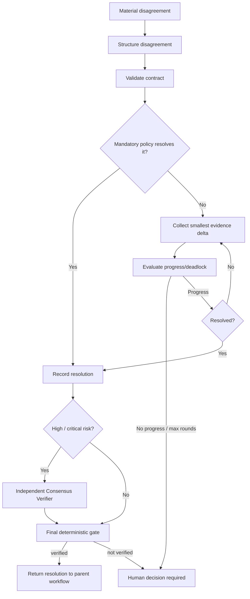

# Multi-Agent Consensus Deadlock Guard

A reusable, tool-neutral control package that prevents multi-agent coding and operations workflows from entering endless debate, reviewer/planner ping-pong, repeated argument loops, or false consensus caused by silence and timeouts.

## Problem

Multi-agent workflows often delegate planning, implementation, review, testing, security, database, and verification to different agents. That separation improves quality, but it creates a failure mode: agents can disagree indefinitely without producing new evidence. Rephrased opinions are mistaken for progress, retries restart the same debate, or an orchestrator eventually treats timeout/silence as agreement.

This package turns disagreement into a bounded, evidence-driven state machine. A later debate round is allowed only when it contains a meaningful evidence delta. High-risk resolutions require an independent verifier. If evidence cannot safely discriminate between positions, the workflow stops with `human-decision-required` instead of looping.

## When to use

Use this kit when:
- planner and reviewer recommend incompatible approaches;
- implementation and test agents disagree about correctness;
- security/database/architecture reviewers block a change for competing reasons;
- an incident-response swarm develops mutually exclusive hypotheses;
- agents repeatedly reopen the same decision;
- a multi-agent orchestrator needs deterministic stop conditions.

## When not to use

Do not use this as a replacement for normal code review when no material disagreement exists. Do not use voting to bypass mandatory repository, security, legal, production, or human-approval rules.

## Architecture



## Package tree

```text
multi-agent-consensus-deadlock-guard/
├── README.md
├── config/
│   └── consensus-policy.json
├── schemas/
│   ├── disagreement.schema.json
│   └── resolution-review.schema.json
├── scripts/
│   ├── fingerprint-disagreement.py
│   ├── validate-disagreement.py
│   ├── evaluate-deadlock.py
│   └── evaluate-final-gate.py
├── skills/
│   ├── structure-agent-disagreement.md
│   └── resolve-with-evidence-delta.md
├── rules/
│   └── consensus-governance.md
├── subagents/
│   ├── disagreement-coordinator.md
│   └── consensus-verifier.md
├── workflows/
│   └── consensus-resolution-workflow.md
├── hooks/
│   └── consensus-lifecycle-hooks.md
├── templates/
│   └── disagreement.example.json
├── examples/
│   └── review.example.json
└── tests/
    └── smoke-test.py
```

## Dependencies

- Python 3.9+ for deterministic scripts.
- Python standard library only.
- No network dependency is required by the package itself.

## Installation

Copy the directory into your repository, for example under `.ai/consensus/`, and keep the relative `scripts/`, `config/`, and `schemas/` paths together. Adapt orchestrator-specific prompts or hooks to call these tool-neutral assets.

## Configuration

Edit `config/consensus-policy.json` only when repository policy requires different limits. Defaults:
- maximum debate rounds: 3;
- maximum transient tool retry: 1;
- evidence delta required after round 1;
- independent verification required for high/critical risk;
- silence and timeout never count as consensus;
- high-risk self-review is forbidden.

Do not increase round limits merely because agents fail to agree. If repeated rounds do not add evidence, escalation is the intended behavior.

## Input contract

`schemas/disagreement.schema.json` defines the disagreement record. It binds:
- one disagreement ID and narrowly scoped subject;
- risk level;
- current round;
- distinct participants;
- each participant's claim, recommended action, and evidence IDs;
- evidence fingerprint;
- new evidence IDs for later rounds;
- explicit workflow status and optional resolution.

`schemas/resolution-review.schema.json` defines the independent review output for high-risk resolutions.

## Core workflow

1. Detect a material conflict between at least two agents.
2. Run the procedure in `skills/structure-agent-disagreement.md`.
3. Validate the record:

```bash
python scripts/validate-disagreement.py disagreement.json
```

4. Before round 2+, compare against the prior round:

```bash
python scripts/evaluate-deadlock.py \
  current.json \
  --previous previous.json \
  --policy config/consensus-policy.json
```

5. Collect only evidence capable of falsifying an unresolved claim. New wording, confidence changes, or another opinion without evidence do not count as progress.
6. Resolve directly when deterministic evidence or mandatory policy decides the claim.
7. For high/critical risk, obtain an independent review bound to the exact disagreement fingerprint.
8. Run the final gate:

```bash
python scripts/evaluate-final-gate.py \
  disagreement.json \
  --policy config/consensus-policy.json \
  --review review.json \
  --planner disagreement-coordinator
```

For low/medium risk, omit `--review` when policy does not require it.

## Status semantics

Working statuses:
- `open` — competing positions still exist;
- `evidence-required` — another round is allowed only after targeted evidence collection;
- `review-required` — independent review is required.

Terminal disagreement statuses:
- `resolved` — a resolution is recorded, but final verification still must pass;
- `human-decision-required` — autonomous resolution stopped safely;
- `blocked` — a validation, safety, stale-review, or policy failure prevents continuation.

Final gate success is only `verified`.

## Resolution modes

Allowed modes are configured in policy:
- `evidence-dominates` — new evidence falsifies or materially outweighs a competing claim;
- `policy-rule` — an enforceable repository/security/business rule decides the conflict;
- `independent-verifier` — an independent verifier establishes the resolution;
- `human-decision` — a human explicitly decides when evidence cannot safely resolve the issue.

A majority vote is not a substitute for evidence or mandatory rules.

## Hooks

`hooks/consensus-lifecycle-hooks.md` defines deterministic lifecycle boundaries:
- `pre-disagreement` fingerprints the structured conflict;
- `pre-round` validates evidence progress before another debate round;
- `pre-dangerous-evidence-action` stops before dangerous evidence-gathering actions and requires explicit human approval;
- `pre-final-consensus` invokes the final gate;
- `post-resolution` preserves the reproducible resolution bundle.

## Approval boundaries

Explicit human approval is required before evidence gathering or resolution actions that perform:
- production deployment;
- destructive SQL or data/file deletion;
- schema or irreversible migration changes;
- infrastructure, secret, or production configuration changes;
- force push or Git history rewriting;
- breaking public API changes;
- security-control weakening;
- large dependency upgrades.

The guard must not increase permissions to obtain evidence.

## Failure and recovery

### Transient tool failure
Retry once. Preserve the first failure. If the second attempt fails, stop and report the unavailable evidence.

### Validation failure
Do not retry blindly. Correct the structured record and re-run validation.

### Semantic disagreement
Do not open another round unless new relevant evidence exists.

### No evidence progress
`evaluate-deadlock.py` returns a non-success result and escalates to `human-decision-required`.

### Max rounds
Autonomous debate stops. The preserved evidence bundle is handed to a human decision owner.

### Stale high-risk review
A review fingerprint mismatch blocks the final gate. Re-review the current disagreement revision rather than reusing the old approval.

## Verification

Run the smoke test:

```bash
python tests/smoke-test.py
```

The test covers:
- structurally valid disagreement;
- same-evidence/no-progress escalation;
- low-risk evidence-based resolution;
- high-risk self-review rejection;
- maximum-round escalation.

Repository integrations should additionally verify that evidence IDs point to real build/test/log/repository artifacts and that the parent workflow's dangerous-action approvals remain valid.

## Executed vs verified

Creating a disagreement record, running agents, or completing debate rounds means the task was **executed**. It is **verified successfully** only when:
- the exact disagreement revision is resolved;
- evidence and policy support the selected resolution;
- required independent review is bound to the exact fingerprint;
- the final gate returns `verified`.

## Definition of Done

- A single material disagreement was scoped explicitly.
- Competing claims and evidence IDs were preserved.
- Every debate round after the first added relevant evidence.
- Debate stayed within the configured maximum rounds.
- No timeout, silence, or agent confidence was treated as consensus.
- Dangerous evidence actions stopped for explicit approval.
- High/critical risk resolution had an independent verifier.
- Stale review evidence was rejected.
- Resolution mode and reason were recorded.
- Final gate returned `verified`, or the workflow stopped with an explicit human/blocked status instead of looping.

## Portability

The package does not depend on a specific agent platform. The coordinator/verifier roles can be mapped to OpenAI Codex, Claude Code, Cursor, ChatGPT, GitHub Copilot, OpenCode, custom MCP agents, or an internal orchestrator. Keep the policy, JSON contracts, deterministic scripts, and stop conditions unchanged where possible; isolate platform-specific tool invocation outside the core package.
