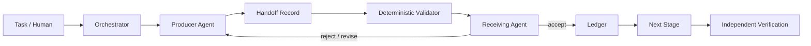

# Multi-Agent Handoff Integrity Ledger

## Problem
Multi-agent workflows often fail at boundaries rather than inside an individual agent. A planner hands off an incomplete assumption, an implementer drops an unresolved risk, a reviewer receives stale artifacts, or one agent reports “done” and the next silently interprets that as “verified.” These failures are hard to see because the handoff is usually unstructured prose.

This kit creates a durable, schema-backed handoff ledger. Every transfer between agents records scope, inputs, artifacts, assumptions, decisions, unresolved risks, approval state, completion state, verification state, and a deterministic fingerprint of referenced artifacts. A receiving agent must explicitly accept or reject the handoff before work continues.

## When to use
Use this kit when a workflow contains two or more specialized agents, long-running agent chains, human-agent-agent handoffs, resumable workflows, architecture/review pipelines, coding + verification separation, or any process where context loss between roles can create hidden risk.

## Architecture


- **Skills** define how to create and consume handoffs.
- **Rules** prevent state inflation, missing provenance, hidden assumptions, and unsafe approval propagation.
- **Producer Agent** owns creation of a complete handoff record.
- **Handoff Reviewer** independently checks transfer integrity before the receiving stage begins.
- **Workflow** defines staged acceptance, bounded revision, escalation, and verification.
- **Hooks** validate records before write, before receive, and before completion.
- **Scripts** validate JSON records and verify referenced artifact fingerprints.

## Package structure
```text
multi-agent-handoff-integrity-ledger/
├── README.md
├── skills/
│   ├── produce-handoff.md
│   └── consume-handoff.md
├── rules/handoff-governance.md
├── subagents/
│   ├── handoff-producer.md
│   └── handoff-reviewer.md
├── workflows/handoff-integrity-workflow.md
├── hooks/handoff-hooks.md
├── scripts/
│   ├── validate-handoff.py
│   └── verify-artifacts.py
├── config/handoff-policy.json
├── schemas/handoff-record.schema.json
└── templates/handoff-record.example.json
```

## Installation
Copy this folder into the target repository. Python 3.10+ is required for the deterministic scripts; no third-party packages are required.

Choose a ledger directory, for example:

```text
.agent-handoffs/
  0001-planner-to-implementer.json
  0002-implementer-to-reviewer.json
```

The directory may be committed for non-sensitive engineering metadata or kept outside version control when it contains sensitive operational context.

## Configuration
Edit `config/handoff-policy.json` to define:

- allowed status values;
- required artifact fingerprint behavior;
- maximum unresolved-risk severity allowed without human approval;
- roles that require independent review;
- whether stale artifacts block acceptance.

All timestamps use ISO-8601 UTC. Human approval references must be identifiers or links, never secrets.

## Usage
A planner finishes a feature plan and hands work to an implementation agent. Instead of writing “implement the plan,” the planner creates a handoff record with:

- exact task scope;
- accepted and rejected alternatives;
- repository paths investigated;
- assumptions still unverified;
- implementation constraints;
- required tests;
- unresolved risks;
- artifact references and SHA-256 fingerprints;
- `completion_state = completed`;
- `verification_state = unverified`.

Validate the record:

```bash
python scripts/validate-handoff.py \
  --policy config/handoff-policy.json \
  --record .agent-handoffs/0001-planner-to-implementer.json
```

Verify referenced artifacts before the receiver starts:

```bash
python scripts/verify-artifacts.py \
  --record .agent-handoffs/0001-planner-to-implementer.json \
  --repo-root .
```

Only after both checks pass may the receiver explicitly accept the handoff.

## Workflow
1. Producer finishes its stage.
2. Producer creates the handoff record.
3. Deterministic validation checks schema, status rules, approvals, and required fields.
4. Artifact verification recomputes file fingerprints.
5. Handoff Reviewer checks semantic completeness and verifies that no unresolved risk was hidden.
6. Receiver either accepts, rejects, or requests revision.
7. Rejected handoffs may be revised at most twice.
8. After two failed revisions, stop and escalate with evidence.
9. Accepted handoff is appended to the ledger and the receiving stage begins.
10. Final completion requires the last handoff to preserve the distinction between task completion and independent verification.

## Safety
A handoff cannot grant new permissions. Human approval must be revalidated when the target action changes materially. Approval is mandatory before a handoff authorizes database schema changes, production deployment/configuration, secret changes, infrastructure modification, force push, file deletion, security-control removal, breaking public API changes, or large dependency upgrades.

Never copy secrets into the ledger. Reference secret names or secure-store identifiers only.

## Failure and recovery
- **Malformed record:** block immediately; producer may revise twice.
- **Artifact fingerprint mismatch:** stop the receiving stage; regenerate the handoff from current evidence.
- **Missing approval:** block rather than assume approval.
- **Conflicting handoffs:** newest record does not automatically win; reviewer must resolve the conflict.
- **Tool failure:** retry deterministic verification at most twice only for transient I/O failures.
- **Stale record:** if a referenced artifact changed, invalidate acceptance and require re-review.

## Verification
Three states are intentionally separate:

- **Stage completed:** producer says its work is finished.
- **Handoff accepted:** receiver and reviewer confirm the transfer is usable.
- **Task verified:** independent verification evidence confirms the final result.

No agent may infer `verified` from `completed`, test generation, code generation, or handoff acceptance alone.

Definition of Done:

- every stage transition has a valid handoff record;
- all referenced artifacts are present and fingerprint-valid;
- no unresolved blocking risk remains;
- required human approvals are recorded;
- final verification state is supported by evidence;
- validator and artifact verifier both exit successfully.

## Customization
Adapt roles and status vocabulary in `config/handoff-policy.json`. Add domain-specific fields only when they materially improve transfer quality. Keep the core contract tool-neutral so it can be used with Claude Code, OpenAI Codex, ChatGPT, Cursor, GitHub Copilot, OpenCode, custom agent runners, or human workflows.