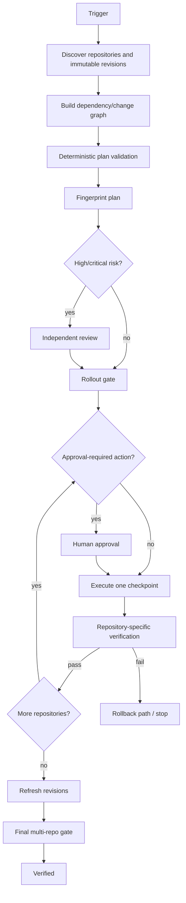

# Multi-Repo Change Coordination Gate

Reusable AI engineering kit for coordinating one logical change across multiple repositories without letting local repository success masquerade as system-level readiness.

## Problem
AI coding agents often work one repository at a time. A change can be locally correct yet unsafe when another repository consumes its API, schema, event, shared package, migration, configuration, or deployment output. Common failures include merging a producer before consumers are compatible, reviewing an old revision, forgetting rollback coupling, or declaring success after only one repository's tests pass.

## Purpose
This package turns a multi-repository change into an evidence-bound directed graph with immutable repository revisions, explicit compatibility, deterministic rollout/rollback validation, independent review for high-risk work, human approval boundaries, bounded retry, checkpoint verification, and a final cross-repository gate.

## When to use
Use for API/schema evolution, shared libraries, event contracts, database/application migrations, coordinated service/client releases, infrastructure/application coupling, or any feature/fix spanning at least two repositories.

## When not to use
Do not use for a truly isolated single-repository change with no proven external contract/deployment dependency. Do not invent extra repositories merely to satisfy the model.

## Architecture


## Package tree
```text
multi-repo-change-coordination-gate/
├── README.md
├── config/
│   └── coordination-policy.json
├── schemas/
│   ├── change-plan.schema.json
│   └── review.schema.json
├── scripts/
│   ├── fingerprint-plan.py
│   ├── validate-change-plan.py
│   ├── evaluate-rollout-gate.py
│   └── evaluate-final-gate.py
├── skills/
│   ├── build-cross-repo-change-graph.md
│   └── verify-coordinated-rollout.md
├── rules/
│   └── multi-repo-governance.md
├── subagents/
│   ├── coordination-planner.md
│   └── coordination-reviewer.md
├── workflows/
│   └── coordinated-change-workflow.md
├── hooks/
│   └── coordination-lifecycle-hooks.md
├── templates/
│   └── change-plan.example.json
├── examples/
│   └── review.example.json
└── tests/
    └── smoke-test.py
```

## Dependencies
Python 3.9+ standard library only for deterministic scripts and smoke tests. The core workflow is tool-neutral and can be adapted to Codex, Claude Code, Cursor, ChatGPT, GitHub Copilot, OpenCode, or another agent/runtime.

## Installation
Copy this directory into your repository/tooling workspace. Keep paths unchanged or update workflow/hook commands consistently. No package installation is required.

## Configuration
Edit `config/coordination-policy.json` only when organizational policy differs. Preserve fail-closed behavior for unknown compatibility, stale revisions, stale review fingerprints, and approval-required actions.

## Permissions
Discovery should use read-only repository/Git access. Build/test execution should have only the permissions required by those commands. Production deploy, breaking contract, database schema/destructive data changes, force-push/history rewrite, infrastructure/secret/production-config changes, security weakening, irreversible migrations, and large dependency upgrades require explicit human approval before the side effect.

Agents must never silently increase permission to unblock a workflow.

## Usage
1. Copy `templates/change-plan.example.json` to a work file, for example `change-plan.json`.
2. Replace repository names and branch placeholders with exact immutable revisions.
3. Add directly evidenced dependency edges and classify them as `compatible`, `requires-ordering`, `breaking`, or `unknown`.
4. Define rollout, rollback, repository-specific verification, risk, and approval actions.
5. Validate:
   `python scripts/validate-change-plan.py change-plan.json`
6. Fingerprint before review:
   `python scripts/fingerprint-plan.py change-plan.json --output plan-fingerprint.json`
7. For high/critical risk, create a reviewer record matching `schemas/review.schema.json` using the exact fingerprint.
8. Evaluate readiness:
   `python scripts/evaluate-rollout-gate.py change-plan.json --review review.json --output rollout-gate.json`
9. Execute only the next authorized checkpoint, collect fresh evidence, and update repository state.
10. At completion, refresh repository revisions into `current-revisions.json` and run:
   `python scripts/evaluate-final-gate.py change-plan.json rollout-gate.json --current-revisions current-revisions.json`

For low/medium risk where policy does not require independent review, omit `--review` from the rollout command.

## Input/output contracts
The change plan is the shared contract among planning, implementation, release, and verification. It binds repository revisions, roles, changes, evidence, dependency edges, compatibility, rollout, rollback, risk, and approval metadata.

The review record binds a reviewer decision to the exact SHA-256 plan fingerprint. Editing the plan invalidates the prior review.

Gate states are `verified`, `review-required`, `approval-required`, or `blocked`.

## Workflow semantics
`from -> to` means the `from` repository is a provider/producer dependency for `to`. For `requires-ordering` and `breaking` edges, deterministic validation requires the provider to occur before its dependent in rollout order unless the plan is redesigned with a compatibility bridge and classified accordingly.

`unknown` is never equivalent to `compatible`.

## Approval boundaries
The workflow stops before approval-required actions. Approval must match the actual repository/action/scope. Missing approval yields `approval-required` or `blocked`; agents do not grant their own approval.

## Failure handling
Transient repository metadata or tool failures may retry once while preserving the failed source/error. Validation errors, unknown compatibility, test/build failures, revision drift, stale review, missing approval, dependency cycles, and unsafe rollback are not blind-retry conditions.

A checkpoint verification failure stops forward rollout. Recovery follows the documented rollback order/conditions from the last verified state. Rollback failure stops further mutation and escalates with evidence.

## Verification
Deterministic checks prove structure and evidence bindings; repository-specific tests prove behavior.

- `validate-change-plan.py` rejects malformed repository sets, invalid revisions/states, unknown edge targets, cycles, incomplete rollout/rollback, duplicate rollout entries, and ordering violations.
- `fingerprint-plan.py` creates stable review binding.
- `evaluate-rollout-gate.py` blocks non-ready repositories, missing verification evidence, unknown compatibility, stale/high-risk review, and missing approval evidence.
- `evaluate-final-gate.py` requires rollout verification, every repository state=`verified`, repository verification evidence, and optionally exact current revision equality.
- `tests/smoke-test.py` exercises success, unknown compatibility, bad ordering, and high-risk self-review rejection.

Run the smoke test with:
`python tests/smoke-test.py`

## Definition of Done
The coordinated task is complete only when:
- All directly affected repositories and dependencies are identified from evidence.
- Every participating repository is bound to the current reviewed revision.
- The dependency graph is valid and acyclic, or an explicit migration strategy has replaced the unsafe cycle.
- Compatibility for every edge is known.
- Rollout and required rollback coverage are valid.
- Required independent review is current and fingerprint-bound.
- Required human approvals exist before dangerous actions.
- Every rollout checkpoint has repository-specific verification evidence.
- Every repository is `verified`.
- Final gate exits 0 with no revision drift.
- Remaining non-blocking risks are recorded outside the success claim.

## Customization
Extend repository roles or policy actions only when the deterministic scripts and schema contracts are updated together. If integrating provider-specific tools, keep adapters outside the core contract: convert provider data into repository revisions, evidence references, and plan fields rather than embedding provider semantics throughout the workflow.
