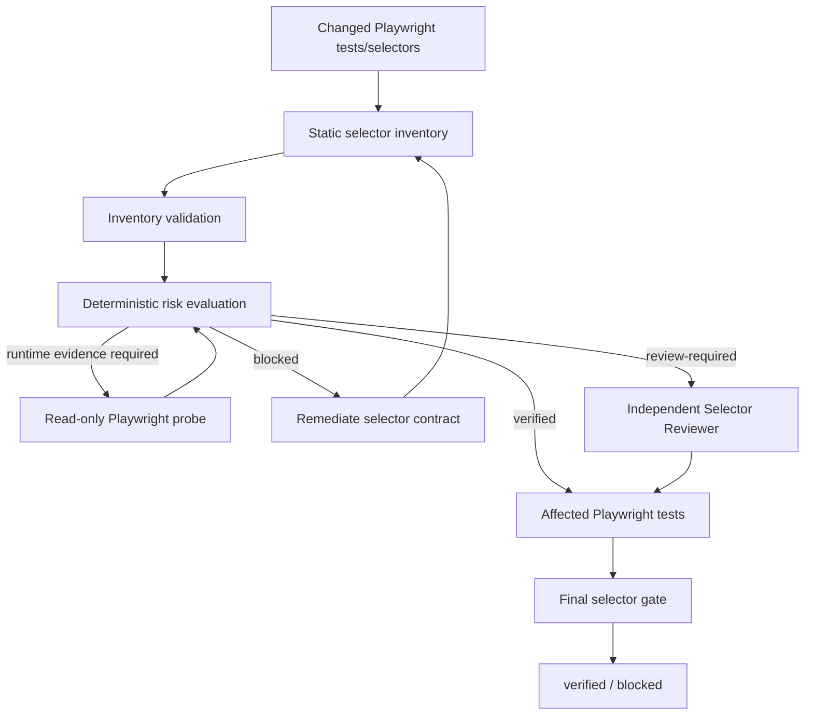

# Playwright Selector Resilience Gate

Reusable AI-engineering kit for preventing brittle Playwright locators from being accepted as reliable QA evidence merely because a test happens to pass today.

## Problem
AI coding agents frequently generate selectors that are locally convenient but operationally fragile: long CSS chains, indexed XPath, positional selectors, text coupled to localization, or locators that only work because the current page contains one matching element. These selectors can fail after harmless DOM refactors, rerenders, translations, repeated list items, accessibility changes, or asynchronous UI updates.

A green Playwright run proves the observed scenario passed once; it does not prove the selector is stable, unique, visible, or appropriately bound to user-facing semantics.

## Purpose
This kit adds an evidence-based selector quality gate around Playwright work. It combines static selector inventory, deterministic risk scoring, optional read-only runtime uniqueness/visibility probing, bounded remediation, independent review for residual high risk, and a final revision/fingerprint-bound gate.

The central rule is: **selector execution success is not selector resilience verification.**

## When to use
Use when:
- adding or modifying Playwright/E2E selectors;
- AI agents generate tests/page objects;
- locator timeouts or strict-mode violations are flaky;
- UI/component/accessibility/localization refactors are underway;
- Playwright results contribute to PR/release confidence;
- repeated DOM elements or rerendering make selectors ambiguous.

## When not to use
Do not use this as a replacement for Playwright assertions, application accessibility testing, visual regression testing, product acceptance tests, or test-environment parity checks. Purely temporary exploratory scripts may not need the full gate if they are not treated as verification evidence.

## Architecture


## Package tree
```text
playwright-selector-resilience-gate/
├── README.md
├── config/
│   └── selector-policy.json
├── schemas/
│   ├── selector-inventory.schema.json
│   └── selector-review.schema.json
├── scripts/
│   ├── evaluate-selector-gate.mjs
│   ├── evaluate-selector-resilience.mjs
│   ├── probe-selectors.mjs
│   ├── scan-playwright-selectors.mjs
│   └── validate-selector-inventory.mjs
├── skills/
│   ├── discover-selector-risk.md
│   └── remediate-selector-risk.md
├── rules/
│   └── selector-resilience-governance.md
├── subagents/
│   ├── selector-analyst.md
│   └── selector-reviewer.md
├── workflows/
│   └── selector-resilience-workflow.md
├── hooks/
│   └── selector-resilience-hooks.md
├── templates/
│   └── selector-inventory.example.json
├── examples/
│   └── selector-review.example.json
└── tests/
    └── smoke-test.mjs
```

## Component responsibilities
- `scripts/scan-playwright-selectors.mjs`: discovers common Playwright selector calls in test files and assigns static risk evidence.
- `scripts/validate-selector-inventory.mjs`: validates required inventory fields, duplicate ids, risk/score structure, and emits an inventory fingerprint.
- `scripts/probe-selectors.mjs`: optional read-only browser probe that records match count and visibility count without clicking, filling or submitting.
- `scripts/evaluate-selector-resilience.mjs`: combines static and runtime evidence under policy and emits `verified`, `review-required`, or `blocked`.
- `scripts/evaluate-selector-gate.mjs`: enforces deterministic blockers and independent fingerprint-bound review.
- `skills/`: reusable discovery/remediation procedures.
- `rules/`: enforceable MUST/MUST NOT/SHOULD guardrails.
- `subagents/`: separates selector implementation/evidence collection from high-risk review.
- `workflows/` and `hooks/`: define end-to-end lifecycle, retry limits, stop conditions and approval boundaries.
- `schemas/`: machine-readable handoff contracts.
- `tests/smoke-test.mjs`: deterministic package-level behavioral checks that do not require network/browser access.

## Requirements
### Core static gate
- Node.js 18+.
- Node standard library only.

### Runtime probe
- A host repository with the `playwright` package installed.
- An approved, non-destructive page URL/state.

The package intentionally does not auto-install Playwright or increase permissions.

## Installation
Copy this directory into the repository or agent-tooling workspace. Keep relative paths intact or update workflow/hook commands consistently.

No dependency installation is needed for scan, validate, evaluate, final gate, or smoke test.

Run package smoke tests:
```bash
node tests/smoke-test.mjs
```

## Configuration
Edit `config/selector-policy.json` for project-specific tolerance.

Important controls:
- preferred selector kinds;
- selector kinds/patterns requiring scrutiny;
- scores for CSS/XPath/text/positional risk;
- runtime-probe requirements;
- maximum allowed runtime matches;
- visibility requirement;
- review/block thresholds;
- independent-review rules;
- bounded retry counts;
- approval-required dangerous actions.

Do not lower thresholds in the same change merely to make a selector pass. Treat policy weakening as a separate reviewed control change.

## Selector model
The scanner recognizes common Playwright patterns:
- `getByRole(...)`
- `getByLabel(...)`
- `getByPlaceholder(...)`
- `getByTestId(...)`
- `getByText(...)`
- `locator(...)` classified as CSS or XPath.

Static parsing is intentionally deterministic and conservative; it is not a complete JavaScript/TypeScript AST replacement. Complex selector factories or wrappers should either be adapted into the inventory contract or covered by project-specific extensions.

## Preferred selector strategy
Prefer the narrowest stable contract that represents user or test intent:
1. role + accessible name when semantics are correct and stable;
2. label/placeholder when they are the intended user contract;
3. intentional stable test id for widgets whose user-visible text/structure is expected to vary;
4. scoped locators through a stable semantic container when repeated controls are legitimate.

Avoid using positional selectors as a default ambiguity fix.

## Usage
### 1. Scan selectors
```bash
node scripts/scan-playwright-selectors.mjs \
  --repo . \
  --policy config/selector-policy.json \
  --output artifacts/selector-inventory.json
```

### 2. Validate inventory
```bash
node scripts/validate-selector-inventory.mjs \
  --inventory artifacts/selector-inventory.json \
  --output artifacts/selector-validation.json
```

### 3. Evaluate static risk
```bash
node scripts/evaluate-selector-resilience.mjs \
  --inventory artifacts/selector-inventory.json \
  --policy config/selector-policy.json \
  --output artifacts/selector-evaluation.json
```

Statuses:
- `verified`: no selector exceeds the review threshold after available evidence.
- `review-required`: residual high risk exists but no deterministic blocker exists.
- `blocked`: critical score/evidence exists; reviewer approval cannot override this state.

### 4. Collect runtime uniqueness/visibility evidence
When policy requires it:
```bash
node scripts/probe-selectors.mjs \
  --inventory artifacts/selector-inventory.json \
  --base-url "$SELECTOR_PROBE_URL" \
  --browser chromium \
  --output artifacts/selector-inventory.probed.json
```

The bundled probe only navigates and reads locators. It never clicks, fills, presses, submits, deletes, or mutates page state.

Then re-evaluate using `selector-inventory.probed.json`.

### 5. Remediate findings
Follow `skills/remediate-selector-risk.md`. Run affected Playwright tests after each authorized change. Maximum selector remediation cycles: 2 before escalation/block.

### 6. Independent review
If evaluation returns `review-required`, create a review matching `schemas/selector-review.schema.json` and bind it to:
- current repository revision;
- exact `inventory_fingerprint`;
- a reviewer different from the implementation owner.

`examples/selector-review.example.json` shows the shape. Replace example values with current evidence.

### 7. Final gate
For a review-required evaluation:
```bash
node scripts/evaluate-selector-gate.mjs \
  --evaluation artifacts/selector-evaluation.json \
  --review artifacts/selector-review.json \
  --implementation-owner "$IMPLEMENTATION_OWNER" \
  --output artifacts/selector-gate.json
```

For an evaluation already `verified`, omit `--review`.

Only final `status=verified` is selector-resilience completion evidence.

## Runtime probe limitations
The generic probe reconstructs common literal Playwright locator expressions. Selectors assembled dynamically by helper functions may not be safely reconstructable from source text. In that case:
- do not use `eval` or arbitrary code execution to probe them;
- adapt the project helper to emit an inventory/probe contract;
- or add a project-specific read-only adapter that produces the same `runtime_probe` fields.

A probe result belongs to a particular page state. Re-probe after meaningful DOM/accessibility/localization changes.

## Delegation
### Selector Analyst
Owns discovery, static evidence, runtime probing, remediation and affected test execution. Cannot self-approve high/critical residual risk.

### Selector Reviewer
Independently reviews residual high-risk selectors, test intent and evidence. Cannot change inventory/evaluation to make it pass and cannot override deterministic blockers.

## Failure and recovery
- **Repository read/scanner failure:** one retry only when clearly transient.
- **Invalid inventory:** zero automatic retries; fix the cause.
- **Browser/probe navigation failure:** one transient retry; preserve first error.
- **Zero runtime matches:** do not increase waits blindly; confirm target/page state and repair selector/fixture.
- **Duplicate runtime matches:** scope semantically; do not default to `nth()`.
- **Rerender flakiness:** rely on Playwright locator/actionability behavior and stable contracts; do not add arbitrary sleeps.
- **Localization instability:** choose role/label/test-id strategy appropriate to the product contract.
- **Stale review/fingerprint:** regenerate evidence and re-review.
- **Permission failure:** stop; never silently elevate permissions.
- **Repeated remediation failure:** stop after two cycles and escalate with evidence.

## Approval boundaries
This kit does not authorize dangerous application or repository changes. Stop for explicit human approval before:
- production deployment;
- breaking public/API/accessibility contracts;
- security-control weakening;
- force push/history rewrite;
- production configuration changes;
- destructive data/schema/infrastructure/secret actions introduced by surrounding work.

Selector review is not human authorization for those actions.

## Verification semantics
Keep these claims separate:
1. **Selector scanned** — expression was discovered and classified.
2. **Runtime selector probed** — match/visibility evidence was collected in a known page state.
3. **Affected test passed** — test assertions passed.
4. **Selector resilience verified** — deterministic gate plus required independent review passed.
5. **Feature/release verified** — broader task-specific acceptance criteria passed.

Do not collapse them into one “tests are green” claim.

## Definition of Done
The selector-resilience workflow is complete only when:
- current repository revision was inventoried;
- inventory validates;
- policy-defined runtime probes are present and current;
- no zero/duplicate/probe-failed or other deterministic blocker remains;
- affected Playwright tests pass;
- required independent review is approved and fingerprint-bound;
- implementation owner is not the sole high-risk reviewer;
- final selector gate returns `verified`;
- retry/remediation budgets were not exceeded;
- dangerous actions remain behind explicit approval;
- unresolved risks are recorded and non-blocking.

## Portability
The core instructions and Node scripts are tool-neutral. They can be invoked by OpenAI Codex, Claude Code, Cursor, ChatGPT, GitHub Copilot, OpenCode, CI jobs, MCP tools, or custom agent orchestrators. Keep platform adapters at the edges and preserve inventory/evaluation/gate semantics.

## Customization
Common extensions:
- AST-based scanner for custom selector wrappers;
- project-specific page-state setup for runtime probes;
- policy overrides by test area;
- localization-aware selector classification;
- accessibility snapshot integration;
- CI reporting of new selector risk relative to a baseline.

When extending, preserve core invariants: revision binding, deterministic blocker precedence, read-only probing, bounded retries, no positional shortcut by default, independent high-risk review, and evidence-based completion.
