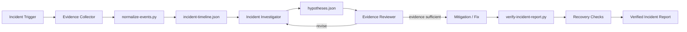

# Production Incident Evidence Timeline

## Problem

Production incidents often produce fragmented evidence: alerts, logs, traces, deployment events, feature-flag changes, tickets, operator commands, and chat updates. AI agents can correlate these quickly, but they can also invent causality, confuse event time with ingestion time, or overfit to the first plausible hypothesis.

This kit creates an evidence-first incident investigation flow. It normalizes evidence into a deterministic timeline, separates observation from inference, records provenance, ranks hypotheses, and prevents an incident from being declared resolved or an RCA from being declared verified until required evidence and recovery checks pass.

## When to use

Use this kit when:

- an alert, outage, latency spike, data error, or background-job failure needs investigation;
- several telemetry sources must be correlated;
- a deploy, config change, dependency event, or operator action may be related;
- an AI coding/operations agent is assisting incident response;
- a post-incident RCA needs traceable evidence rather than narrative reconstruction.

Do not use it as a replacement for your monitoring, paging, or incident-management platform. It is an investigation and verification layer.

## Architecture



The package deliberately splits semantic and deterministic work:

- **Skills** define evidence collection, hypothesis testing, and RCA construction.
- **Rules** prevent unsafe production actions and unsupported causal claims.
- **Subagents** separate investigation from independent evidence review.
- **Workflow** provides bounded investigation, mitigation, and verification loops.
- **Hooks** run predictable checks around evidence ingestion, mitigation, and completion.
- **Scripts** normalize timestamped events and validate the final incident report.

## Package structure

```text
production-incident-evidence-timeline/
├── README.md
├── skills/
│   ├── evidence-led-incident-investigation.md
│   └── hypothesis-testing.md
├── rules/
│   └── incident-safety.md
├── subagents/
│   ├── incident-investigator.md
│   └── evidence-reviewer.md
├── workflows/
│   └── incident-investigation.md
├── hooks/
│   └── hooks.md
├── scripts/
│   ├── normalize-events.py
│   └── verify-incident-report.py
├── schemas/
│   └── incident-report.schema.json
└── templates/
    ├── raw-events.example.json
    └── incident-report.example.json
```

## Installation

Copy this folder into a repository or an agent-support directory such as:

```text
.ai/production-incident-evidence-timeline/
```

Requirements:

- Python 3.9+
- access to incident evidence exported as JSON
- read access to relevant source, configuration, deployment metadata, and telemetry
- existing project-specific commands for health checks and tests

The Python scripts use only the standard library.

## Configuration

Optional environment variables:

- `INCIDENT_TIMEZONE`: default timezone label used for documentation; timestamps supplied to scripts should still be ISO-8601 and offset-aware.
- `INCIDENT_MAX_CLOCK_SKEW_SECONDS`: accepted clock-skew window for ordering warnings; default `120`.
- `INCIDENT_REPORT`: default report path for verification; default `incident-report.json`.

Repository adopters should document local evidence sources and recovery commands separately. Do not store API keys, tokens, connection strings, or production credentials in this kit.

## Usage

Example incident: API error rate increased from 0.3% to 18% shortly after a deployment, while database CPU remained normal and queue depth rose sharply.

1. Export relevant evidence into a JSON array. Each event should contain at least `timestamp`, `source`, `kind`, and `message`.
2. Normalize and sort the evidence:

```bash
python .ai/production-incident-evidence-timeline/scripts/normalize-events.py \
  --input raw-events.json \
  --output incident-timeline.json
```

3. Give `incident-timeline.json`, the incident trigger, deployment diff, and known service topology to the **Incident Investigator**.
4. The investigator creates an `incident-report.json` based on `templates/incident-report.example.json`.
5. The **Evidence Reviewer** challenges causality, missing evidence, and confirmation bias.
6. Any production mitigation or configuration change requires the human-approval boundary in `rules/incident-safety.md`.
7. After mitigation and recovery checks, validate the report:

```bash
python .ai/production-incident-evidence-timeline/scripts/verify-incident-report.py \
  --report incident-report.json
```

## Workflow

The lifecycle is:

```text
Trigger
  -> Preserve evidence
  -> Normalize timeline
  -> Establish impact window
  -> Generate bounded hypotheses
  -> Test hypotheses with discriminating evidence
  -> Independent evidence review
  -> Human-approved mitigation when required
  -> Recovery verification
  -> RCA verification
  -> Complete
```

A hypothesis must include predicted observations and disconfirming evidence. The workflow permits at most two investigation revisions after independent review. If the same evidence gap persists, stop and escalate rather than generating more speculation.

Transient evidence-fetch failures may be retried at most twice. Production actions are never retried automatically unless an approved runbook explicitly defines idempotent retry behavior.

## Safety

Explicit human approval is required before:

- changing production configuration;
- deploying or rolling back production code;
- modifying database schema or production data;
- disabling security controls, alerts, rate limits, or validation;
- deleting data, files, queues, topics, or infrastructure resources;
- rotating or modifying secrets;
- force-pushing Git or rewriting shared history;
- executing a mitigation with unknown blast radius.

Read-only evidence collection is preferred. The investigator must not convert a plausible correlation into a confirmed root cause without supporting and discriminating evidence.

## Verification

This kit distinguishes three states:

- **Investigated**: evidence is collected and hypotheses were tested.
- **Mitigated**: user impact is reduced or stopped, but cause may remain uncertain.
- **Verified**: report structure passes validation, the winning hypothesis has supporting evidence, significant alternatives are addressed, recovery checks pass, and unresolved uncertainties are disclosed.

Verification should include project-appropriate checks such as:

- health metrics returning to expected range;
- error-rate and latency recovery sustained for a defined observation window;
- queue/backlog stabilization;
- affected integration checks;
- targeted tests for the fix;
- no unexpected production changes;
- rollback or follow-up plan recorded where necessary.

The script validates report completeness, not the truth of semantic conclusions. Independent review remains required for causal claims.

## Failure and recovery

- **Missing timestamps**: normalization stops for invalid records and reports indexes; fix the source export rather than inventing times.
- **Clock disagreement**: preserve original timestamps and record uncertainty; do not silently reorder by guesswork.
- **Insufficient evidence**: mark cause as `unconfirmed` and escalate; mitigation can still be verified separately.
- **Hypothesis repeatedly fails**: reject it after evidence contradiction; do not rewrite observations to preserve it.
- **Telemetry unavailable**: retry collection twice if transient, then record the gap and use independent evidence if available.
- **Mitigation fails**: stop automatic action, preserve evidence, reassess blast radius, and require a new approval for a materially different action.

## Customization

The easiest extension points are:

- add organization-specific evidence adapters before `normalize-events.py`;
- add event kinds to your raw-event exporter;
- extend the report schema with service ownership, incident severity, or ticket references;
- add deterministic health-check scripts to `PostMitigation` hooks;
- map the subagents to tool-specific agent definitions for Codex, Claude Code, Cursor, Copilot, or another platform while preserving the same responsibilities and safety boundaries.
