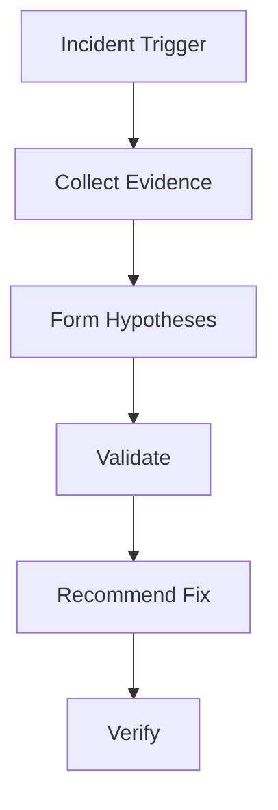

# Production Incident Root Cause Agent

Reusable AI engineering kit for evidence-driven production incident investigation.

## Purpose
Helps agents investigate incidents using logs, metrics, traces, code, and deployment history while preventing unsupported conclusions.

## Workflow

## Components
- skills: investigation procedures
- rules: safety constraints
- subagents: specialized reviewers
- workflows: bounded execution flow
- hooks: deterministic checks
- scripts: evidence collection helpers

## Safety
Production changes, data changes, and deployments require human approval.
