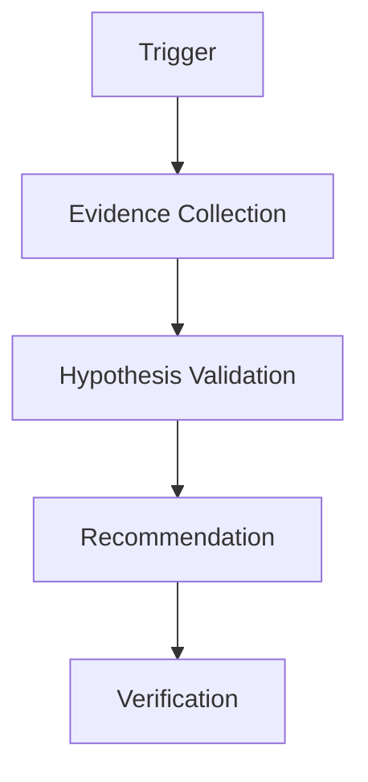

# Production Incident Root Cause Agent Kit

## Problem
Standardize AI-assisted production incident investigation using evidence, bounded hypotheses, and verification.

## Use when
- Production alerts occur
- Error rates increase
- Performance regressions appear
- Logs need correlation

## Workflow

## Components
- skills/evidence-driven-investigation.md
- skills/hypothesis-validation.md
- rules/incident-safety.md
- subagents/incident-investigator.md
- workflows/incident-analysis.md
- hooks/pre-investigation.md
- scripts/collect-runtime-evidence.py

## Safety
Production changes, destructive operations, deployments, and data modifications require explicit approval.
