# Public API Backward Compatibility Gate

## Problem
Public API changes often look small in implementation code but break real consumers: a renamed response field, removed enum value, new required request property, altered serialization name, or incompatible public method signature can pass local tests while still causing downstream failures. AI coding agents make this risk worse when they optimize for the current repository and silently reshape contracts to simplify implementation.

This kit creates an evidence-based gate around public contract evolution. It captures a baseline, generates a deterministic diff, separates structural detection from semantic review, requires independent review for high-risk changes, and blocks intentional breaking changes until explicit human approval plus migration/deprecation evidence exist.

## Purpose
Use this package to make backward compatibility a repeatable workflow rather than an ad-hoc code-review question.

It supports normalized JSON representations of:
- REST/OpenAPI contracts
- Serialized DTO/payload contracts
- Public .NET APIs
- Events and webhooks
- Other repository-specific public surfaces after export to deterministic JSON

## When to use
Use when a task can change:
- routes, HTTP methods, request/response bodies, status codes, or OpenAPI schemas;
- serialized property names, required fields, discriminators, enums, or type shapes;
- public C# classes, methods, properties, constructors, interfaces, or SDK-visible members;
- event/webhook payloads;
- generated client contracts;
- versioning/deprecation behavior.

## When not to use
Do not use this as a substitute for full consumer testing, semantic API governance, security review, or database migration safety. Purely internal implementation changes that provably do not affect public contracts can skip this gate.

## Architecture

```mermaid
flowchart LR
    Change[Contract-affecting change] --> Baseline[Capture baseline]
    Baseline --> Candidate[Capture candidate]
    Candidate --> Diff[Deterministic contract diff]
    Diff --> Analyst[Contract Analyst]
    Analyst --> Reviewer[Compatibility Reviewer]
    Reviewer -->|breaking| Human[Human approval]
    Reviewer --> Gate[Compatibility gate]
    Human --> Gate
    Gate --> Tests[Build + contract/consumer tests]
    Tests --> Verified[Verified]
```



### Component responsibilities
- **Skills** define baseline capture and semantic classification procedures.
- **Rules** enforce fail-closed compatibility governance.
- **Contract Analyst** owns discovery/classification but cannot self-approve breaking changes.
- **Compatibility Reviewer** independently challenges evidence and cannot implement or approve production changes.
- **Workflow** defines bounded retries, checkpoints, approvals, and Definition of Done.
- **Hooks** describe deterministic lifecycle checks.
- **Scripts** validate manifests, compare normalized JSON contracts, and evaluate the final gate.
- **Schemas/config** define machine-readable contracts and policy.
- **Examples/tests** provide runnable fixtures and a smoke test.

## Package structure

```text
public-api-backward-compatibility-gate/
├── README.md
├── skills/
│   ├── capture-contract-baseline.md
│   └── classify-contract-change.md
├── rules/
│   └── compatibility-governance.md
├── subagents/
│   ├── contract-analyst.md
│   └── compatibility-reviewer.md
├── workflows/
│   └── backward-compatibility-workflow.md
├── hooks/
│   └── hooks.md
├── scripts/
│   ├── validate-contract-manifest.py
│   ├── compare-contracts.py
│   └── evaluate-compatibility-gate.py
├── config/
│   └── compatibility-policy.json
├── schemas/
│   ├── contract-manifest.schema.json
│   └── compatibility-review.schema.json
├── templates/
│   └── compatibility-review.json
├── examples/
│   ├── baseline-contract.json
│   └── candidate-contract.json
└── tests/
    └── smoke-test.py
```

## Installation
Copy this folder into your repository, for example:

```text
.ai/public-api-backward-compatibility-gate/
```

Python 3.10+ is sufficient for the supplied scripts; they use only the standard library.

Create a repository-specific adapter that exports your real contracts to deterministic JSON. The core gate intentionally does not depend on a specific framework or AI product.

## Configuration
Edit `config/compatibility-policy.json`.

Important fields:
- `breaking_change_kinds`: structural changes treated as breaking candidates.
- `human_approval_required_for_breaking`: keep `true` for production-facing contracts.
- `reviewer_required_for_breaking`: requires independent semantic review.
- `deprecation_evidence_required`: requires a migration/deprecation path for approved breaking changes.
- `max_transient_retries`: one retry by default.
- `fail_closed_on_unknown_change_kind`: prevents silent compatibility assumptions.

The package does not store credentials or call production systems.

## Dependencies and permissions
The core scripts need only read/write access to local compatibility artifacts. Repository-specific export commands may require build tooling. Use least privilege.

Human approval is required before intentionally accepting a breaking public contract. Deployment, package publishing, production configuration changes, and destructive migration actions remain outside this kit and require their own approval boundaries.

## Usage

### 1. Export baseline and candidate
Normalize your contract surfaces to JSON, for example:

```text
.compat/baseline-contract.json
.compat/candidate-contract.json
```

Record provenance with a manifest matching `schemas/contract-manifest.schema.json`.

Validate it:

```bash
python scripts/validate-contract-manifest.py --manifest .compat/baseline-manifest.json
```

Use `--verify-files` when manifest artifact paths are relative to the manifest and hashes should be checked.

### 2. Compare contracts

```bash
python scripts/compare-contracts.py \
  --baseline .compat/baseline-contract.json \
  --candidate .compat/candidate-contract.json \
  --output .compat/diff.json
```

The comparator recursively emits stable change IDs and marks configured structural patterns as breaking candidates. It is intentionally conservative: semantic judgment still belongs to the review step.

### 3. Review changes
Start from:

```text
templates/compatibility-review.json
```

The Contract Analyst must account for every diff entry. The Compatibility Reviewer then independently confirms classifications and evidence.

### 4. Evaluate gate

```bash
python scripts/evaluate-compatibility-gate.py \
  --diff .compat/diff.json \
  --review .compat/review.json \
  --policy config/compatibility-policy.json
```

Exit code `0` means the evidence satisfies the configured gate. Exit code `1` means blocked compatibility evidence. Exit code `2` means invalid/unreadable input.

### 5. Run smoke test

```bash
python tests/smoke-test.py
```

The smoke test proves both behaviors:
1. an unapproved removal is blocked;
2. the same breaking change only passes after an explicit approval ID and deprecation evidence are recorded.

## Example invocation
A feature removes `customerCode` from a response and adds optional `email`.

The deterministic comparator detects both changes. The removal is a breaking candidate; the additive field is not. The analyst cannot declare the removal safe merely because the current frontend no longer uses it. The reviewer checks consumer evidence, SDK contracts, and migration/deprecation strategy. Without explicit approval, the gate fails.

## Workflow
The complete lifecycle is defined in `workflows/backward-compatibility-workflow.md`:

```text
Scope
  ↓
Baseline capture
  ↓
Candidate capture
  ↓
Deterministic diff
  ↓
Semantic classification
  ↓
Independent review
  ↓
Breaking change?
 ├─ No → Gate
 └─ Yes → Human approval → Gate
                           ↓
                    Build/contract tests
                           ↓
                       Verification
```

Retry behavior is bounded:
- transient export/tool I/O failure: retry once;
- deterministic validation failure: fix evidence/input, do not blindly retry;
- test-fix cycles: at most two within this workflow;
- repeated failure stops and preserves evidence.

## Approval boundaries
Explicit human approval is mandatory for intentional breaking public contracts, including:
- route/operation removal;
- public member or incompatible signature removal/change;
- incompatible serialization-name changes;
- new required request fields;
- enum/value narrowing or removal;
- incompatible type narrowing.

Approval must be represented by an auditable `approval_id`; an agent cannot manufacture or infer it.

## Failure handling
- **Missing baseline:** stop; do not compare against an invented baseline.
- **Nondeterministic contract generation:** stop and fix exporter/normalization.
- **Unknown structural change:** fail closed when policy requires it.
- **Ambiguous consumer behavior:** mark `needs-review`; do not treat as compatible.
- **Breaking change without approval:** block.
- **Tests fail after compatibility gate:** task is executed but not verified.
- **Candidate changes after review:** regenerate artifacts, rerun diff/review/gate.

## Verification
A contract task is **executed** when artifacts and review records exist.

It is **verified successfully** only when:
1. baseline and candidate refs are recorded;
2. baseline/candidate artifacts are current;
3. deterministic diff accounts for all structural differences;
4. every difference has semantic evidence and consumer risk;
5. an independent reviewer has completed review;
6. every intentional breaking change has required human approval and deprecation/migration evidence;
7. compatibility gate exits `0` on the final candidate;
8. required build/contract/consumer tests pass after the final contract-affecting edit.

## Definition of Done
- Required contract surfaces were identified.
- Baseline provenance is valid.
- Candidate contract corresponds to final code.
- Every diff has a disposition.
- No unresolved `needs-review` item remains.
- No unapproved breaking change remains.
- Gate and required tests pass.
- Remaining consumer risk is documented.
- Final state is `verified`, not merely `executed` or `reviewed`.

## Customization
The easiest extension points are:
- repository-specific contract exporters;
- additional `breaking_change_kinds` in policy;
- stricter enum/additive-field handling for generated clients;
- framework-specific public .NET API export adapters;
- consumer contract tests;
- CI wrappers that invoke the supplied scripts before merge/release.

Keep tool-specific integrations outside the core logic. The Skills, Rules, workflow, schemas, and gate remain portable across Codex, Claude Code, Cursor, ChatGPT, GitHub Copilot, OpenCode, and other agent systems.
