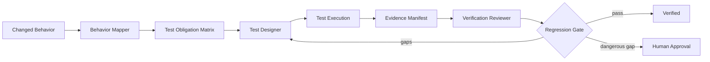

# Regression Evidence Gate

A reusable AI-assisted framework that turns test generation into an evidence-based verification process. It requires the agent to map changed behavior to explicit test obligations, prove that each obligation is exercised, and distinguish "tests exist" from "the change is verified."

## Problem

Coding agents can generate many tests while still missing the behavior that matters: negative paths, boundary conditions, authorization, state transitions, compatibility, retry behavior, or integration contracts. Passing tests alone do not prove adequate regression protection.

This kit introduces a structured regression evidence manifest that connects changed behavior to concrete tests and deterministic validation.

## When to use

Use before completing:

- feature implementation;
- non-trivial bug fixes;
- refactoring of shared code;
- API, event, database, permission, or configuration changes;
- concurrency, retry, caching, or state-machine changes;
- production incident fixes that require regression protection.

## Architecture



- **Skills** define behavior mapping and evidence-driven test design.
- **Rules** prevent shallow coverage claims and prohibit modifying production behavior merely to satisfy a test.
- **Subagents** separate test design from independent verification.
- **Workflow** defines bounded test-fix-review loops.
- **Hooks** run deterministic evidence validation before completion.
- **Scripts** validate the evidence manifest and check referenced test files.

## Package structure

```text
regression-evidence-gate/
├── README.md
├── skills/
│   ├── behavior-to-test-obligations.md
│   └── regression-evidence-design.md
├── rules/
│   └── regression-safety.md
├── subagents/
│   ├── test-designer.md
│   └── verification-reviewer.md
├── workflows/
│   └── regression-evidence-gate.md
├── hooks/
│   └── hooks.md
├── scripts/
│   ├── validate-evidence.py
│   └── check-test-files.py
├── schemas/
│   └── regression-evidence.schema.json
└── templates/
    └── regression-evidence.example.json
```

## Installation

Copy the folder into a repository, for example:

```text
.ai/regression-evidence-gate/
```

Requirements:

- Python 3.9+ for helper scripts;
- the repository's native test runner;
- an AI agent able to inspect code and tests.

## Configuration

Optional environment variables:

- `REGRESSION_EVIDENCE_FILE`: defaults to `regression-evidence.json`.
- `REGRESSION_MIN_HIGH_RISK_TESTS`: defaults to `2`.
- `REGRESSION_ALLOW_MANUAL_EVIDENCE`: defaults to `0`.

Customize project-specific test commands in `hooks/hooks.md`.

## Usage

For a change such as:

> Make password reset tokens single-use and expire after 15 minutes.

The workflow creates obligations for successful reset, expired token, reused token, invalid token, race/concurrency where relevant, unchanged API response semantics, persistence behavior, and audit/observability expectations.

After implementing tests, create `regression-evidence.json`, then run:

```bash
python .ai/regression-evidence-gate/scripts/check-test-files.py --evidence regression-evidence.json
python .ai/regression-evidence-gate/scripts/validate-evidence.py --evidence regression-evidence.json
```

## Workflow

1. Identify behavior changed by the implementation.
2. Convert behavior into explicit test obligations.
3. Classify each obligation by risk and test type.
4. Reuse existing tests where they already prove the behavior.
5. Add only missing tests.
6. Execute the narrowest relevant test set.
7. Fix implementation or tests based on evidence, not on the desire to make green output.
8. Record test command, test file, result, and evidence note.
9. Independently review missing negative/boundary/contract paths.
10. Run deterministic manifest validation.
11. Run broader regression/build checks appropriate to the repository.
12. Mark the task verified only when required obligations have evidence.

## Safety

Human approval is required if achieving coverage appears to require:

- breaking a public contract;
- changing production schema;
- weakening authorization/security behavior;
- deleting or bypassing existing tests;
- disabling static analysis or test gates;
- changing production configuration or infrastructure.

## Verification

"Task completed" means implementation and tests were written.

"Task verified" means:

- each required obligation has a status;
- all high-risk obligations are covered or explicitly approved as exceptions;
- referenced test files exist;
- executed commands and outcomes are recorded;
- relevant tests pass;
- broader build/regression checks pass when required;
- unresolved risks are reported.

## Failure and recovery

- Test discovery failure: retry once with a narrower path and once with repository-native discovery; then stop and report.
- Flaky test suspected: rerun at most twice and record all outcomes; never silently classify as pass.
- Same deterministic test failure persists after two fix attempts: stop and escalate with evidence.
- Evidence manifest invalid: fix the manifest before declaring verification.
- Coverage gap requiring dangerous behavior change: stop for human approval.

## Customization

Extend the schema with repository-specific obligation types, test tiers, or contract surfaces. Add specialized reviewers for security, database, messaging, UI, or performance-heavy systems.
