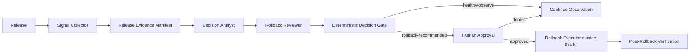

# Release Rollback Decision Gate

## Problem
Post-release incidents are often handled with noisy dashboards, conflicting signals, and time pressure. Teams may wait too long, rollback too early, or let an automation infer authority it does not have. This kit creates a reusable evidence gate that turns release health signals into a structured decision, preserves the observation window, separates recommendation from approval, and blocks production rollback until explicit human approval exists.

## Purpose
Use this package to standardize post-release monitoring and rollback decisions for web services, APIs, workers, mobile backends, infrastructure changes, and other production releases.

## When to use
Use when a release can materially affect production reliability, latency, errors, business KPIs, data integrity, security, or downstream integrations.

## When not to use
Do not use it as a replacement for deployment tooling, incident command, SRE alerting, database recovery procedures, or an emergency break-glass process already defined by your organization.

## Architecture


This kit intentionally does not execute production rollback. It produces evidence, recommendations, approval requirements, and verification contracts. A deployment system may consume the approved artifact separately.

## Package structure
```text
release-rollback-decision-gate/
├── README.md
├── skills/
│   ├── release-signal-assessment.md
│   └── rollback-decision-analysis.md
├── rules/release-safety.md
├── subagents/
│   ├── decision-analyst.md
│   └── rollback-reviewer.md
├── workflows/release-rollback-gate.md
├── hooks/release-hooks.md
├── scripts/
│   ├── validate-release-evidence.py
│   ├── evaluate-release-gate.py
│   └── verify-rollback-result.py
├── config/release-policy.json
├── schemas/
│   ├── release-evidence.schema.json
│   └── rollback-result.schema.json
├── templates/
│   ├── release-evidence.example.json
│   └── rollback-result.example.json
└── examples/decision-scenarios.md
```

## Installation
Copy this folder into a repository. Python 3.10+ is required for deterministic scripts. The scripts use only the standard library.

## Configuration
Edit `config/release-policy.json` with your release-specific thresholds, observation windows, minimum evidence requirements, critical metrics, and approval policy. Metric values are supplied in the release evidence manifest; this kit does not assume a specific monitoring vendor.

## Permissions
Read-only monitoring access is sufficient for analysis. Production rollback, deployment mutation, traffic shifting, feature-flag changes, database restore, or infrastructure mutation require separate least-privilege tooling and explicit human approval.

## Usage
Validate evidence:
```bash
python scripts/validate-release-evidence.py --policy config/release-policy.json --evidence release-evidence.json
```

Evaluate gate:
```bash
python scripts/evaluate-release-gate.py --policy config/release-policy.json --evidence release-evidence.json
```

Verify a rollback result after an approved external rollback:
```bash
python scripts/verify-rollback-result.py --policy config/release-policy.json --evidence release-evidence.json --result rollback-result.json
```

## Workflow
1. Capture release identity, baseline, observation timestamps, metrics, incidents, tests, and business signals.
2. Validate the evidence manifest deterministically.
3. Decision Analyst separates facts from hypotheses and recommends `healthy`, `observe`, or `rollback-recommended`.
4. Rollback Reviewer independently checks whether evidence, thresholds, trend direction, scope, and alternative causes support the recommendation.
5. Deterministic gate recomputes threshold breaches from policy and evidence.
6. If rollback is recommended, stop and require explicit human approval.
7. Production rollback is executed outside this package.
8. Capture rollback result and verify recovery against the pre-defined recovery criteria.

## Approval boundaries
Human approval is mandatory before production rollback, traffic switching, production feature-flag mutation, database restore, production config mutation, or any other irreversible/high-impact recovery action. The gate may recommend; it may never authorize itself.

## Failure handling
Transient data collection failures may be retried once. A repeated collection failure stops the gate with `blocked`. Evidence validation failures are not retryable until the manifest is corrected. Reviewer disagreement allows at most two evidence revisions; unresolved disagreement escalates to a human release owner. Production rollback failures stop immediately and must preserve deployment logs and current production state.

## Verification
`Task executed` means the release was observed and a decision artifact was produced. `Task verified successfully` means the evidence is valid, the decision gate passed, required approvals exist, and—if rollback occurred—the rollback result satisfies recovery criteria with no blocking verification failure.

## Definition of Done
The package workflow is complete only when release evidence is valid, required critical metrics exist, decision status is deterministically reproducible, reviewer status is recorded, approvals are present when required, rollback recovery is verified when applicable, and remaining risks are documented.

## Customization
Adjust thresholds and critical metrics in `config/release-policy.json`. Extend the evidence/result schemas only when your adapters can populate the added fields. Keep deployment execution outside this kit unless you deliberately build a separate approved adapter with least privilege and human confirmation.