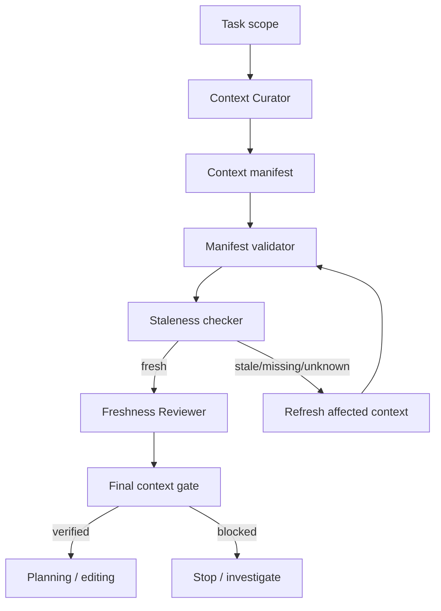

# Repository Context Staleness Gate

## Problem
AI coding agents often keep working from repository maps, retrieved snippets, summaries, indexes, or prior session notes after the repository has changed. A path can still exist while its content, dependencies, generated code, or surrounding behavior has changed. Continuing from stale context can produce incorrect plans and unsafe edits even when the agent appears confident.

## Purpose
This package binds context artifacts to repository revisions and source-file SHA-256 hashes, detects stale dependencies before planning/editing, refreshes only affected context, and requires independent freshness review before the workflow may continue.

## When to use
Use for long-running coding-agent sessions, resumed tasks, large repositories, branch switches, merges/rebases/pulls, refactors, architecture work, debugging, repository indexing, generated summaries, or any workflow that reuses cached repository context.

## When not to use
Do not use it as a replacement for tests, code review, artifact-integrity controls, repository instruction conflict resolution, or human approval for dangerous actions. Fresh context proves only that the agent is reasoning from the current source evidence.

## Architecture



## Component responsibilities
- `skills/context-capture.md` — build source-bound context manifests.
- `skills/staleness-resolution.md` — detect and refresh stale context safely.
- `rules/context-freshness-governance.md` — mandatory, forbidden, and preferred behavior.
- `subagents/context-curator.md` — captures and refreshes context but cannot self-verify critical freshness.
- `subagents/freshness-reviewer.md` — independent freshness verification.
- `workflows/context-freshness-workflow.md` — end-to-end bounded workflow.
- `hooks/context-freshness-hooks.md` — lifecycle gates before plan/edit/final verification.
- `config/context-freshness-policy.json` — portable policy defaults.
- `schemas/context-manifest.schema.json` — manifest contract.
- `schemas/staleness-report.schema.json` — staleness result contract.
- `scripts/validate-context-manifest.py` — deterministic manifest validation.
- `scripts/check-context-staleness.py` — deterministic current-file hash comparison.
- `scripts/evaluate-context-gate.py` — final fail-closed gate.
- `templates/context-manifest.json` — reusable starting manifest.
- `examples/freshness-review.example.json` — reviewer record example.
- `tests/test-context-staleness.py` — executable smoke test for fresh and stale branches.

## Package tree

```text
repository-context-staleness-gate/
├── README.md
├── config/
│   └── context-freshness-policy.json
├── examples/
│   └── freshness-review.example.json
├── hooks/
│   └── context-freshness-hooks.md
├── rules/
│   └── context-freshness-governance.md
├── schemas/
│   ├── context-manifest.schema.json
│   └── staleness-report.schema.json
├── scripts/
│   ├── check-context-staleness.py
│   ├── evaluate-context-gate.py
│   └── validate-context-manifest.py
├── skills/
│   ├── context-capture.md
│   └── staleness-resolution.md
├── subagents/
│   ├── context-curator.md
│   └── freshness-reviewer.md
├── templates/
│   └── context-manifest.json
├── tests/
│   └── test-context-staleness.py
└── workflows/
    └── context-freshness-workflow.md
```

## Installation
Copy this directory into the repository or agent-policy area. Python 3.9+ and Git are the only runtime dependencies for the included scripts.

## Configuration
Start from `templates/context-manifest.json`. Set repository identity, current immutable revision, task scope, artifact IDs/types, source paths, and SHA-256 hashes. Adapt `config/context-freshness-policy.json` only when project policy requires stricter behavior; do not weaken blocking statuses merely to bypass a failure.

## Permissions
The core workflow requires only read access to repository files and Git metadata. Context refresh may write context artifacts but must not modify product source code. Permission escalation is forbidden. Dangerous downstream actions require explicit human approval.

## Usage

```bash
python scripts/validate-context-manifest.py context-manifest.json
python scripts/check-context-staleness.py context-manifest.json /path/to/repo staleness-report.json
python scripts/evaluate-context-gate.py context-manifest.json staleness-report.json freshness-review.json context-gate.json
```

Run the package smoke test with:

```bash
python tests/test-context-staleness.py
```

## Example invocation
1. Context Curator reads only task-relevant files.
2. Build the context manifest with current source hashes.
3. Validate it.
4. Before planning, compare current repository files with the manifest.
5. If any source is `stale`, `missing`, or `unknown`, refresh only dependent artifacts.
6. Freshness Reviewer independently checks the refreshed manifest/report.
7. Final gate must return `verified` before planning or editing.

## Workflow states
- `fresh` — bound source hash still matches current source bytes.
- `stale` — source path exists but content hash changed.
- `missing` — bound source no longer exists.
- `unknown` — source cannot be safely evaluated.
- `verified` — no blocking findings and independent review succeeded.
- `blocked` — planning/editing must not continue.

## Retry and recovery
Only transient read/tool failures may retry automatically, maximum once. Preserve the original failure evidence. Content hash mismatch, deleted files, unsafe paths, scope ambiguity, and reviewer rejection are investigation conditions, not retry conditions. Refresh the affected context, rerun validation/checking, then obtain a new independent review.

## Approval boundaries
Fresh repository context never authorizes production deployment, destructive actions, schema/data deletion, force push, secret changes, production configuration changes, breaking API contracts, security weakening, irreversible migrations, or permission escalation. Agents must stop for explicit human approval before such actions.

## Verification
A task is not verified merely because the context workflow executed. Freshness is verified only when:
- manifest validates;
- all task-relevant bound sources are `fresh`;
- no `stale`, `missing`, or `unknown` finding remains;
- reviewer is independent from the curator;
- reviewer checked the current manifest hash;
- final gate returns `verified`.

Source/build/test verification for the actual development task must still run separately.

## Definition of Done
- Repository identity and immutable revision are captured.
- Task scope is explicit.
- Every derived context artifact has source bindings and SHA-256 hashes.
- Deterministic staleness check ran against the current repository.
- Affected stale context was refreshed rather than silently reused.
- Independent freshness review completed.
- Final context gate returned `verified`.
- No blocking freshness failure remains.
- Any dangerous downstream action remains behind its required human approval boundary.

## Customization
Adapters may generate manifests from IDE indexes, RAG systems, repository maps, embeddings, code-search systems, or agent memory stores. Keep those adapters outside the core scripts. The portable invariant is unchanged: derived context must be traceable to current repository evidence and must be revalidated before it controls agent decisions.
