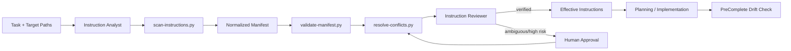

# Repository Instruction Conflict Resolver

## Problem
AI coding agents increasingly read multiple repository instruction systems at once: `AGENTS.md`, `CLAUDE.md`, Cursor rules, Copilot instructions, repository-specific guidance, and task-local files. These sources can overlap or contradict each other. Without an explicit resolution layer, an agent may silently choose whichever rule is easiest, miss a nested rule, weaken a safety requirement, or apply guidance outside its intended path scope.

This kit turns repository instructions into a traceable, reviewable contract before planning or editing begins.

## Purpose
- Discover applicable instruction files.
- Bind each source to path scope, authority rank, and content hash.
- Normalize prose into atomic rules.
- Detect contradictory instructions.
- Resolve conflicts deterministically where policy is sufficient.
- Escalate ambiguous/high-risk conflicts instead of guessing.
- Emit an effective instruction set that downstream agents can consume.
- Detect instruction drift before task completion.

## When to use
Use this kit when a repository has more than one agent/tool instruction mechanism, nested instruction files, multiple coding assistants, or high-risk rules around production, secrets, database work, Git, security, testing, and approvals.

It is especially useful for long-running or multi-agent workflows where a planner, implementer, and reviewer must operate under the same resolved instruction set.

## When not to use
Do not use it as a replacement for platform/system safety instructions or organizational policy. Do not assign arbitrary authority ranks to external/untrusted content just to make it executable. For a tiny repository with one unambiguous instruction file, the kit may be unnecessary overhead.

## Architecture



The **Instruction Analyst** owns discovery and normalization. The **Instruction Reviewer** independently verifies precedence/scope decisions. Deterministic scripts handle discovery, hashing, manifest validation, and conflict ranking. Human approval is required when policy cannot safely decide a material conflict.

## Package structure

```text
repository-instruction-conflict-resolver/
├── README.md
├── skills/
│   ├── instruction-discovery.md
│   └── conflict-resolution.md
├── rules/
│   └── instruction-governance.md
├── subagents/
│   ├── instruction-analyst.md
│   └── instruction-reviewer.md
├── workflows/
│   └── instruction-resolution-workflow.md
├── hooks/
│   └── hooks.md
├── scripts/
│   ├── scan-instructions.py
│   ├── validate-manifest.py
│   └── resolve-conflicts.py
├── config/
│   └── instruction-policy.json
├── schemas/
│   └── instruction-manifest.schema.json
├── templates/
│   └── instruction-manifest.json
├── examples/
│   └── conflict-manifest.json
└── tests/
    └── smoke-test.py
```

## Installation
Copy this folder into the target repository, for example under `.ai/repository-instruction-conflict-resolver/`, or keep it at repository root. Python 3.10+ is sufficient; runtime scripts use only the standard library.

If installed under another directory, invoke commands from the kit directory or update hook paths consistently.

## Configuration
Edit `config/instruction-policy.json`.

Key fields:
- `instruction_files`: known instruction filename/pattern, source type, authority rank, and inheritance behavior.
- `scope_rules.nested_more_specific_when_equal_authority`: whether a more-specific nested rule may win at equal authority.
- `high_risk_subjects`: subjects that must fail closed when precedence is unresolved.
- `max_revision_cycles`: reviewer correction limit.

Authority numbers are repository policy, not universal truth. Configure them deliberately. Unknown instruction sources must not silently gain authority.

## Input contract
The workflow requires:
- repository root;
- one or more target paths;
- task summary;
- policy file;
- normalized manifest based on `templates/instruction-manifest.json`.

Each source records `path`, `source_type`, `authority`, `scope`, and `sha256`. Each atomic statement records `subject`, `action`, `modality`, `scope`, source, and original text.

## Usage

### 1. Discover applicable instruction files

```bash
python scripts/scan-instructions.py \
  --root /path/to/repo \
  --policy config/instruction-policy.json \
  --targets src/api/orders \
  --out .agent/instruction-sources.json
```

The scanner searches configured patterns, filters them by path scope, verifies readability, and records SHA-256 hashes.

### 2. Normalize instructions
Use `skills/instruction-discovery.md` and `skills/conflict-resolution.md` to convert applicable normative text into atomic statements. Start from:

```text
templates/instruction-manifest.json
```

Store the task-specific result as `.agent/instruction-manifest.json`.

### 3. Validate the manifest

```bash
python scripts/validate-manifest.py .agent/instruction-manifest.json
```

Exit code `0` means the structural/semantic minimum is valid. Exit code `2` means the workflow must stop and fix the manifest.

### 4. Resolve conflicts

```bash
python scripts/resolve-conflicts.py \
  --manifest .agent/instruction-manifest.json \
  --policy config/instruction-policy.json \
  --out .agent/effective-instructions.json
```

The resolver compares statements with the same subject/action in overlapping scopes. Higher authority wins first. At equal authority, narrower scope can win only when policy permits. Remaining conflicts require human review; high-risk unresolved conflicts are blocked.

### 5. Independent review
The Instruction Reviewer verifies that source evidence, path scope, authority, and safety handling are correct. Implementation may begin only after reviewer status is `verified`.

## Example
`examples/conflict-manifest.json` contains two conflicts:
- integration testing guidance where the higher-authority root instruction wins;
- production deployment guidance where the higher-authority prohibition wins.

Run:

```bash
python tests/smoke-test.py
```

The smoke test validates the example and checks deterministic winners.

## Workflow
The canonical lifecycle is defined in `workflows/instruction-resolution-workflow.md`:

1. Discover sources.
2. Normalize statements.
3. Validate manifest.
4. Resolve deterministic conflicts.
5. Run independent review.
6. Stop for human approval when required.
7. Emit verified effective instructions.
8. Plan/implement under that instruction set.
9. Re-scan before completion to detect instruction drift.

## Hooks
`hooks/hooks.md` defines four useful integration points:
- `PreTask`: source discovery.
- `PrePlan`: manifest validation and conflict resolution.
- `ScopeChange`: re-resolve when work moves to a new path scope.
- `PreComplete`: verify source hashes and applicable instruction set did not change.

These hooks are tool-neutral; wire them into the coding-agent or CI environment you actually use.

## Safety and approval boundaries
The kit never executes commands discovered inside instruction files. Instruction text is governance data until explicitly interpreted within the workflow.

Human approval is mandatory when policy cannot resolve equal-authority conflicts involving:
- security or secrets;
- permissions;
- production actions;
- destructive operations;
- database data loss;
- Git history rewriting;
- verification requirements;
- breaking API/contracts.

A lower-authority rule cannot weaken a higher-authority MUST/MUST NOT merely because it is more convenient or more local.

## Failure and recovery
- **Filesystem/tool transient error:** retry once; then stop with evidence.
- **Unreadable applicable instruction source:** block workflow.
- **Malformed manifest:** one correction pass.
- **Reviewer revision:** one revision cycle, matching policy.
- **Same unresolved conflict after revision:** stop and escalate.
- **Instruction file hash drift after verification:** invalidate effective instruction set and repeat discovery/resolution.
- **Unknown potentially authoritative source:** require human review.

No retry loop is unbounded.

## Verification
A task is not instruction-verified merely because an effective file was generated.

Verification requires:
1. scanner completed successfully;
2. applicable sources are hash-bound;
3. manifest validates;
4. deterministic conflict resolution completed;
5. reviewer independently confirms precedence/scope;
6. required human decisions exist;
7. no blocking conflict remains;
8. pre-complete drift check passes.

**Task executed** and **instruction set verified** are separate statuses.

## Definition of Done
This kit's workflow is done only when:
- all applicable instruction sources are discovered;
- source hashes and scopes are recorded;
- all normative statements needed for the task are normalized;
- manifest validation passes;
- conflicts are resolved or explicitly approved;
- reviewer verdict is `verified`;
- effective instruction output exists;
- no high-risk unresolved conflict remains;
- source hashes still match at completion.

## Customization
The easiest customization points are:
- add/remove instruction filename patterns in `config/instruction-policy.json`;
- change repository-specific authority rankings;
- extend `high_risk_subjects`;
- add normalization conventions to the skills;
- wire hooks into a preferred agent/CI system;
- extend `resolve-conflicts.py` with explicit organization-specific override relationships if they are documented and deterministic.

Keep product-specific adapters outside the core precedence logic so the kit remains portable across Codex, Claude Code, Cursor, ChatGPT, Copilot, OpenCode, and other coding agents.
