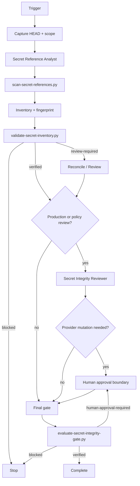

# Repository Secret Reference Integrity Gate

A reusable AI-engineering package for verifying that repository, CI/CD, deployment, and application secret *references* remain consistent without reading secret values.

## Problem

AI coding agents frequently edit workflows, configuration readers, deployment manifests, `.env.example`, infrastructure bindings, or application code that refers to secret names. A one-character rename can leave CI or production broken. More dangerous failures happen when one consumer is renamed while another still expects the old name, a provider-side secret is assumed to exist, an alias becomes permanent, or an agent tries to solve a mismatch by creating/rotating/renaming real secrets without explicit approval.

Traditional secret scanners focus on leaked secret **values**. This kit solves a different problem: integrity of secret **names, sources, scopes, consumers, aliases, and provisioning contracts**.

## Purpose

Use this package to build a value-free contract between secret producers/sources and repository consumers, scan code/config deterministically, classify dangling or renamed references, require independent review for production-sensitive cases, and fail closed before merge/release when the contract cannot be proven.

```text
repository / CI / deployment change
        ↓
scan secret-name references
        ↓
value-free inventory + fingerprint
        ↓
validate canonical contracts
        ↓
resolve repository-only mismatches
        ↓
independent review where required
        ↓
human approval before provider mutation
        ↓
final HEAD + fingerprint gate
        ↓
verified / human-approval-required / blocked
```

## When to use

Use when:
- adding, removing, or renaming environment/secret references;
- editing GitHub Actions or other CI workflows;
- changing application code that reads environment variables;
- modifying deployment configuration or secret bindings;
- migrating from one secret name to another;
- diagnosing missing-secret deployment failures;
- reviewing a PR that changes configuration/security-sensitive integration points;
- preparing a release where secret-reference consistency matters.

## When not to use

This package does not retrieve or validate secret values, rotate credentials, replace IAM, replace provider-native secret management, or prove that a secret contains the correct credential. It also does not authorize production/provider mutation. It verifies reference integrity and evidence boundaries only.

## Architecture



## Package tree

```text
repository-secret-reference-integrity-gate/
├── README.md
├── config/
│   └── secret-reference-policy.json
├── examples/
│   └── secret-review.example.json
├── hooks/
│   └── secret-reference-hooks.md
├── rules/
│   └── secret-reference-governance.md
├── schemas/
│   ├── secret-inventory.schema.json
│   └── secret-review.schema.json
├── scripts/
│   ├── evaluate-secret-integrity-gate.py
│   ├── scan-secret-references.py
│   └── validate-secret-inventory.py
├── skills/
│   ├── discover-secret-references.md
│   └── reconcile-secret-contracts.md
├── subagents/
│   ├── secret-integrity-reviewer.md
│   └── secret-reference-analyst.md
├── templates/
│   ├── secret-contracts.example.json
│   └── secret-inventory.example.json
├── tests/
│   └── smoke-test.py
└── workflows/
    └── secret-reference-integrity-workflow.md
```

## Component responsibilities

- `skills/discover-secret-references.md` defines the safe discovery procedure and evidence model.
- `skills/reconcile-secret-contracts.md` defines how to resolve typos, unknown references, aliases, stale contracts, and source mismatches without touching secret values.
- `rules/secret-reference-governance.md` contains enforceable MUST/MUST NOT/SHOULD rules.
- `subagents/secret-reference-analyst.md` is a read-only evidence collector and contract analyst.
- `subagents/secret-integrity-reviewer.md` independently reviews production/alias/conflict cases.
- `workflows/secret-reference-integrity-workflow.md` defines the complete bounded workflow.
- `hooks/secret-reference-hooks.md` maps lifecycle checkpoints to deterministic commands.
- `config/secret-reference-policy.json` configures scan patterns, source hints, blocking behavior, review triggers, retry limits, and approval-required actions.
- `schemas/secret-inventory.schema.json` documents the value-free inventory contract.
- `schemas/secret-review.schema.json` documents reviewer output and optional approval evidence.
- `scripts/scan-secret-references.py` scans repository text files for configured reference patterns and emits file/line/name evidence.
- `scripts/validate-secret-inventory.py` validates canonical contracts, unknown references, aliases, required source metadata, and the inventory fingerprint.
- `scripts/evaluate-secret-integrity-gate.py` binds validation and independent review to the exact inventory fingerprint and HEAD.
- `templates/secret-contracts.example.json` is the direct scanner input template.
- `templates/secret-inventory.example.json` illustrates the complete inventory shape.
- `examples/secret-review.example.json` illustrates reviewer evidence.
- `tests/smoke-test.py` verifies the major safety branches without network access or real secrets.

## Dependencies

- Python 3.9+
- Git on `PATH` when HEAD binding is desired
- Python standard library only
- Read access to the repository

No provider SDK, token, or real secret value is required by the core package.

## Installation

Copy the directory into the target repository. Create a project-specific contract file from:

```text
templates/secret-contracts.example.json
```

Customize `config/secret-reference-policy.json` for repository file types, secret-name hints, reference syntaxes, and approval requirements.

## Contract model

A contract describes **metadata**, never a value:

```json
{
  "name": "PAYMENTS_API_KEY",
  "source_kind": "github-actions-secret",
  "scope": "production",
  "required": true,
  "consumers": [".github/workflows/deploy.yml"],
  "aliases": [],
  "provisioning_reference": "runbook://payments-api-key"
}
```

Supported `source_kind` values are:
- `github-actions-secret`
- `environment`
- `key-vault`
- `secret-manager`
- `ci-variable`
- `manual-runtime`
- `unknown`

A required contract with `source_kind: unknown` is blocked by the default policy.

## Reference discovery

The default policy recognizes examples such as:

```text
${{ secrets.PAYMENTS_API_KEY }}
${PAYMENTS_API_KEY}
$PAYMENTS_API_KEY
Environment.GetEnvironmentVariable("PAYMENTS_API_KEY")
os.getenv("PAYMENTS_API_KEY")
```

Generic environment expansion patterns are filtered by secret-name hints so ordinary variables are not automatically treated as secrets. Extend `reference_patterns` for repository-specific frameworks instead of adding ad-hoc LLM-only parsing rules.

The scanner does not resolve or print environment values. It emits only names and locations.

## Usage

### 1. Create project contracts

Copy the template:

```bash
cp templates/secret-contracts.example.json secret-contracts.json
```

Edit only names, source metadata, scope, consumers, aliases, and runbook/provisioning references. Do not put real values in this file.

### 2. Scan repository references

```bash
python scripts/scan-secret-references.py \
  --repo . \
  --policy config/secret-reference-policy.json \
  --contracts secret-contracts.json \
  --repository-name owner/repo \
  --output artifacts/secret-inventory.json
```

The output contains the inventory and `inventory_fingerprint`.

### 3. Validate integrity

```bash
python scripts/validate-secret-inventory.py \
  --inventory artifacts/secret-inventory.json \
  --policy config/secret-reference-policy.json \
  --output artifacts/secret-validation.json
```

Exit behavior:
- `0`: `verified`
- `2`: `blocked`
- `3`: `review-required`

Default blocked cases include unknown references, required contracts with unknown source, malformed records, conflicting aliases/contracts, and fingerprint mismatch.

Aliases intentionally require review by default because aliases are common places for stale migration state to hide.

### 4. Reconcile mismatches

Use `skills/reconcile-secret-contracts.md`.

Repository-only corrections are allowed only when the canonical name is evidenced. Provider-side create/delete/rotate/rename/rebind/permission changes must stop before execution and require explicit human approval.

After any repository edit, regenerate the inventory. Do not reuse a pre-edit inventory or review.

### 5. Independent review

For production contracts or policy-triggered findings, use `subagents/secret-integrity-reviewer.md`. The reviewer output must match `schemas/secret-review.schema.json` and contain:
- exact `inventory_fingerprint`;
- exact `reviewed_head`;
- independent `reviewer_id` where required;
- `verified`, `human-approval-required`, or `blocked`;
- evidence-backed findings.

### 6. Final gate

```bash
python scripts/evaluate-secret-integrity-gate.py \
  --inventory artifacts/secret-inventory.json \
  --validation artifacts/secret-validation.json \
  --review artifacts/secret-review.json \
  --policy config/secret-reference-policy.json \
  --implementation-owner implementation-agent \
  --output artifacts/secret-gate.json
```

Final states:
- `verified` — current HEAD and inventory fingerprint are consistent, blocking findings are absent, and required review is valid.
- `human-approval-required` — a protected provider/secret-management action must be explicitly approved.
- `blocked` — evidence is inconsistent, stale, unknown, malformed, or unsafe.

## Approval boundaries

Explicit human approval is required before:
- creating a secret;
- deleting a secret;
- rotating a secret;
- renaming a secret in the provider;
- changing production secret bindings;
- increasing secret-read permissions;
- weakening secret protections.

The approval must identify the exact action, secret name, scope, approver, and expiry. It does not authorize reading the secret value or any unrelated action.

The broader safety rule also remains: production deployment, destructive SQL, schema/infra/secret/security changes, breaking API changes, irreversible migrations, force push/history rewriting, and large dependency upgrades require explicit human approval in their applicable workflows.

## Retry and recovery

- **Transient file/Git/provider-metadata read failure:** retry at most once and preserve the original failure.
- **Validation failure:** no automatic retry; fix the contract/reference or escalate.
- **Permission failure:** stop; never broaden permissions automatically.
- **Unknown reference:** fail closed until authoritative contract evidence exists.
- **Alias finding:** independent review; migrate intentionally rather than normalizing it away.
- **HEAD changed after scan/review:** invalidate old evidence and rescan.
- **Fingerprint mismatch:** block; never patch fingerprints manually.
- **Conflicting authoritative evidence:** block and escalate.
- **Provider mutation needed:** stop for explicit approval.

The scan→reconcile cycle is bounded to two reconciliation iterations in the workflow. Repeated unresolved mismatch stops instead of looping indefinitely.

## Verification

This kit distinguishes:

**Task executed:** scanning/validation/review commands ran.

**Task verified successfully:** the current repository HEAD is bound to an inventory whose references match value-free contracts, required source/scope/consumer metadata is known, required independent review is valid, dangerous provider mutations were not performed without approval, and the final gate returns `verified`.

Run the included smoke test:

```bash
python tests/smoke-test.py
```

It proves four important branches:
1. a canonical production GitHub Actions secret reference validates and gates successfully;
2. an uncontracted renamed reference is blocked;
3. an alias is not silently accepted and requires review;
4. a stale reviewer fingerprint blocks final verification.

The test uses a temporary Git repository and contains no real secrets or network calls.

## Security model

- Secret values are outside the package contract.
- Provider metadata access must use existing least privilege and should retrieve names/existence/bindings only.
- Do not log environment values when debugging the scanner.
- Treat inventory/review artifacts as configuration/security metadata even though they contain no values.
- Existing secret-value scanners should still run independently; this package complements rather than replaces them.

## Definition of Done

The workflow is complete only when:
- current HEAD is captured;
- all in-scope secret references have been scanned;
- every relevant reference maps to a canonical contract;
- required contracts have known source kind, scope, and expected consumers;
- no secret values were collected or persisted;
- unknown/conflicting blocking findings are resolved;
- aliases are explicitly reviewed and migration intent is documented;
- production review is independent when policy requires it;
- approval-required provider mutations remain stopped until approved;
- validation evidence matches the exact inventory fingerprint;
- review evidence matches the exact inventory fingerprint and HEAD;
- final gate returns `verified`;
- unresolved risks are explicit and non-blocking.

## Customization

Common project-specific extensions:
- add patterns for Azure Key Vault references, AWS Secrets Manager variable wiring, Kubernetes `secretKeyRef`, Terraform/Vault naming conventions, Helm templates, or custom config wrappers;
- add file globs for repository languages/config formats;
- add canonical source kinds or scopes if needed, updating validator semantics consistently;
- integrate provider-specific **metadata-only** adapters outside the core package;
- integrate the hooks into CI, pre-PR checks, agent tool interceptors, or release workflows.

Do not customize by weakening the core invariants: no secret values, canonical reference contracts, current HEAD/fingerprint binding, fail-closed unknowns, bounded retries, independent production review, and explicit approval for real secret-management actions.

## Portability

The package is tool-neutral. OpenAI Codex, Claude Code, Cursor, ChatGPT, GitHub Copilot, OpenCode, custom agents, and CI orchestrators can all use the Markdown procedures and invoke the deterministic Python scripts. Tool/provider-specific integrations should remain adapters around the value-free core contract.
