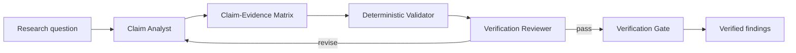

# Research Claim Verification Pipeline

## Problem
AI-assisted research often fails in a subtle way: a response contains citations, but the cited evidence does not actually support the claim. Other failures include using stale sources, mixing observation with inference, hiding contradictions, and turning weak evidence into confident implementation or architecture decisions.

This kit creates a reusable claim-verification gate. Every material research claim is decomposed, linked to evidence, checked for entailment and contradiction, assigned confidence, and independently reviewed before it can be marked verified.

## When to use
Use when an AI agent researches technical decisions, library capabilities, API behavior, security guidance, architecture choices, production incidents, product comparisons, regulations, benchmarks, vendor claims, or any task where incorrect external information could affect code or decisions.

## Architecture


- Skills define how to decompose claims and evaluate evidence.
- Rules control sourcing, confidence, contradiction handling, and approval boundaries.
- Claim Analyst owns claim construction and evidence mapping.
- Verification Reviewer independently challenges support quality.
- Scripts validate the machine-readable matrix and calculate gate readiness.
- Hooks ensure checks run before findings are consumed by implementation or publication.

## Package structure
```text
research-claim-verification-pipeline/
├── README.md
├── skills/
│   ├── claim-decomposition.md
│   └── evidence-assessment.md
├── rules/research-verification-rules.md
├── subagents/
│   ├── claim-analyst.md
│   └── verification-reviewer.md
├── workflows/research-verification-workflow.md
├── hooks/research-hooks.md
├── scripts/
│   ├── validate-claim-matrix.py
│   └── check-verification-gate.py
├── schemas/claim-matrix.schema.json
└── templates/claim-matrix.example.json
```

## Installation
Copy the folder into the target repository. Python 3.10+ is sufficient for the included scripts. No third-party packages are required.

## Configuration
The workflow expects a claim matrix JSON file conforming to `schemas/claim-matrix.schema.json`. Adapters may add tool-specific search/fetch commands, but the core workflow remains tool-neutral.

## Usage
Example research request: “Can library X safely replace library Y in our .NET service?”

The Claim Analyst decomposes this into atomic claims such as runtime support, licensing, feature parity, performance characteristics, migration limitations, and known breaking differences. Each claim receives one or more evidence records with source URL/identifier, source type, publication date when known, evidence excerpt or summary, relationship (`supports`, `contradicts`, `context`), and confidence.

Run validation:
```bash
python scripts/validate-claim-matrix.py research/claim-matrix.json
```

Run the final gate:
```bash
python scripts/check-verification-gate.py research/claim-matrix.json
```

## Workflow
1. Define decision scope and what must be proven.
2. Decompose broad statements into atomic, falsifiable claims.
3. Gather primary sources first; use secondary sources only when they add independent evidence or interpretation.
4. Map evidence to claims explicitly.
5. Record contradictions rather than suppressing them.
6. Assign confidence based on evidence strength, recency, independence, and directness.
7. Validate schema and mechanical completeness.
8. Verification Reviewer challenges unsupported, overstated, stale, circular, or contradictory claims.
9. Revise at most twice for fixable evidence gaps.
10. Gate outputs as `verified`, `partially-verified`, or `blocked`.

## Safety
Research output does not authorize dangerous actions. Explicit human approval is still required for production deployment/configuration, database schema changes, security-control changes, secrets, infrastructure modifications, breaking public API changes, force push/delete actions, or large dependency upgrades. A verified factual claim is evidence for a decision, not permission to execute it.

## Failure and recovery
- Source unavailable: retry at most twice if likely transient; otherwise mark evidence unavailable and reduce confidence.
- Conflicting authoritative sources: stop automatic verification for that claim and surface the conflict.
- No primary source: claim may remain provisional if secondary evidence is strong, but must not be marked fully verified when policy requires primary evidence.
- Same reviewer objection after two revisions: stop and escalate with unresolved evidence gaps.
- Script/runtime failure: treat as operational failure, never as a passed verification gate.

## Verification
`Task completed` means research artifacts were produced. `Task verified` means all high-impact claims pass schema validation, contain adequate evidence, have no unresolved blocking contradiction, meet confidence thresholds, and pass independent review.

The gate must not infer success merely because citations exist.

## Customization
Adjust source-quality policies, confidence thresholds, required evidence counts, and high-impact claim categories in your agent adapter or by extending the schema. Keep semantic judgments in skills/subagents and deterministic completeness checks in scripts.