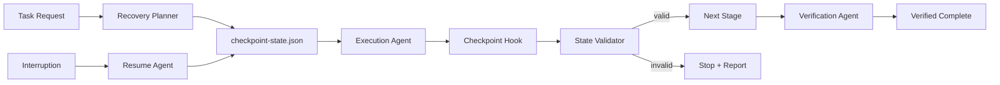

# Resumable Agent Checkpoint Recovery

A reusable framework for long-running AI engineering tasks that must survive interruption, tool failure, context resets, rate limits, or partial execution without restarting from scratch or inventing prior state.

## Problem

Long-running coding and operations tasks often span many tool calls and several execution phases. An agent can be interrupted after modifying files, running migrations in a sandbox, collecting evidence, or partially verifying a change. If recovery relies on conversational memory alone, the resumed agent may repeat work, skip required verification, lose failure evidence, or perform a dangerous action twice.

This kit introduces explicit checkpoint state, deterministic validation, bounded retry rules, resume planning, and human approval boundaries.

## When to use

Use this kit for tasks that:

- may take many tool calls or execution stages;
- modify multiple files or components;
- depend on external APIs or flaky tools;
- include test-fix-retest loops;
- require human approval at specific boundaries;
- may be resumed by another agent or session;
- involve CI diagnosis, repository refactors, migrations, release preparation, QA automation, research pipelines, or incident investigation.

For trivial one-step tasks, the overhead is unnecessary.

## Architecture



The package combines:

- **Skills** for checkpoint design and safe resume analysis.
- **Rules** that define what state must be persisted and what must never be inferred.
- **Subagents** for execution recovery and independent verification.
- **Workflow** for plan → execute → checkpoint → resume → verify.
- **Hooks** that save state after material transitions and before dangerous actions.
- **Scripts** that validate checkpoint structure and compute a deterministic resume summary.
- **Schemas/Templates** for portable checkpoint state.

## Package structure

```text
resumable-agent-checkpoint-recovery/
├── README.md
├── skills/
│   ├── checkpoint-state-management.md
│   └── safe-resume-analysis.md
├── rules/
│   └── recovery-safety.md
├── subagents/
│   ├── recovery-planner.md
│   └── verification-agent.md
├── workflows/
│   └── resumable-execution.md
├── hooks/
│   └── hooks.md
├── scripts/
│   ├── validate-checkpoint.py
│   └── build-resume-summary.py
├── schemas/
│   └── checkpoint-state.schema.json
└── templates/
    └── checkpoint-state.example.json
```

## Installation

Copy this directory into a repository, for example:

```text
.ai/resumable-agent-checkpoint-recovery/
```

Requirements:

- Python 3.9+ for helper scripts;
- Git when repository state is included in checkpoints;
- an AI agent that can read/write local files and run approved commands.

The core design is tool-neutral and can be adapted to Codex, Claude Code, Cursor, ChatGPT, GitHub Copilot, OpenCode, or other agent environments.

## Configuration

The default checkpoint file is:

```text
.agent-state/checkpoint-state.json
```

Optional environment variables:

- `AGENT_CHECKPOINT_PATH` — override checkpoint path.
- `AGENT_MAX_RETRIES` — transient retry limit; default `2`.
- `AGENT_REQUIRE_CLEAN_GIT` — set `1` to require a clean working tree before task start.

Repository-specific customization should define:

- build/test commands;
- protected paths;
- actions requiring approval;
- external systems that must never be called twice without idempotency evidence.

## Usage

Example task:

> Upgrade a shared dependency, adapt three services, run tests, and prepare the pull request.

Before modification, create a checkpoint containing the objective, baseline commit, planned stages, approval boundaries, known risks, and next action.

After every material transition, update the checkpoint. If execution stops after service 2 is changed, the next session validates the checkpoint and repository state before continuing.

Validate the checkpoint:

```bash
python .ai/resumable-agent-checkpoint-recovery/scripts/validate-checkpoint.py \
  --checkpoint .agent-state/checkpoint-state.json
```

Build a compact resume summary:

```bash
python .ai/resumable-agent-checkpoint-recovery/scripts/build-resume-summary.py \
  --checkpoint .agent-state/checkpoint-state.json
```

## Workflow

1. **Initialize** — establish objective, baseline, constraints, approvals, and retry budget.
2. **Plan** — split work into bounded stages with explicit completion evidence.
3. **Execute one stage** — perform only the next approved unit of work.
4. **Checkpoint** — persist results, files touched, commands run, evidence, failures, and next action.
5. **Validate checkpoint** — deterministic structural checks must pass.
6. **Continue or interrupt** — proceed only when state is valid.
7. **Resume** — compare persisted state with current repository/environment state; never assume they still match.
8. **Reconcile** — classify differences as expected, external drift, or unsafe ambiguity.
9. **Verify** — independently prove completion using tests, diff review, contract checks, and acceptance criteria.
10. **Close** — mark status `verified` only after verification evidence exists.

## Safety

Human approval is required before:

- production deployment;
- database schema or destructive data changes;
- deleting files or resources;
- modifying secrets or production configuration;
- force pushing or rewriting Git history;
- breaking public contracts;
- retrying a non-idempotent external action when prior completion is uncertain.

A resumed agent must stop rather than repeat an irreversible action whose prior outcome cannot be proven.

## Failure and recovery

### Tool/API transient failure

Retry at most `AGENT_MAX_RETRIES` times when the operation is safe and idempotent. Persist each failure. If the same failure remains, stop and record evidence.

### Checkpoint is missing or invalid

Do not infer prior execution state. Reconstruct only from verifiable repository/tool evidence. If dangerous actions may already have occurred, require human review.

### Repository drift after interruption

Compare the baseline and recorded changed files with current state. If unrelated changes exist, update the checkpoint only after determining ownership and impact.

### Non-idempotent action has unknown outcome

Do not retry automatically. Mark the checkpoint `blocked` and require evidence or human approval.

### Verification fails

Create a new stage for diagnosis/fix and allow at most two fix-retest iterations for the same root failure. Persistent failures stop the workflow.

## Verification

**Task completed** means execution stages have been performed.

**Task verified** requires:

- checkpoint schema validation succeeds;
- checkpoint status and stage history are internally consistent;
- current repository state matches the recorded state or drift is explained;
- relevant build/tests pass;
- expected files and contracts are reviewed;
- no pending approval remains;
- no unresolved failure is hidden;
- final verification evidence is recorded.

## Customization

Extend the framework by:

- adding domain-specific checkpoint evidence such as migration IDs, API response hashes, CI run IDs, or deployment identifiers;
- adding specialized subagents for database, security, or release verification;
- integrating checkpoint validation into CI;
- adding adapters for product-specific hooks while keeping the core state schema portable.
